# 📋 Crypto Market Analysis Agent — Full Specification

> A complete guide explaining how this agent works, what technologies were used,
> how it analyzes the market, and the crypto fundamentals you need to understand
> before investing or recommending investments.

---

## 📁 Table of Contents

1. [Project Architecture](#1-project-architecture)
2. [Technology Stack](#2-technology-stack)
3. [System Flow — How It Works Step by Step](#3-system-flow)
4. [Data Source — CoinGecko API](#4-data-source)
5. [Blockchain & Crypto Fundamentals for Beginners](#5-blockchain--crypto-fundamentals-for-beginners)
6. [Technical Indicators Explained (Plain English)](#6-technical-indicators-explained)
7. [Scoring System — How Coins Get Classified](#7-scoring-system)
8. [Assumptions Made](#8-assumptions-made)
9. [Limitations & What This Agent Cannot Do](#9-limitations)
10. [How to Read the Report Output](#10-how-to-read-the-report)
11. [Glossary of Terms](#11-glossary-of-terms)
12. [File Reference](#12-file-reference)

---

## 1. Project Architecture

### High-Level Architecture Diagram

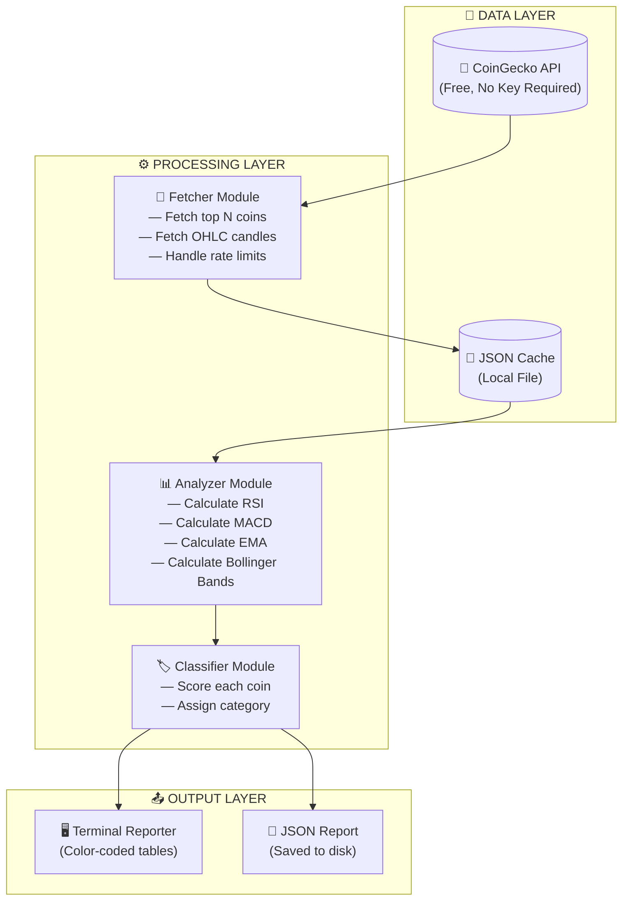

### Component Breakdown

| Component | File | Responsibility |
|-----------|------|----------------|
| **Fetcher** | `src/fetcher/coingecko.ts` | Calls CoinGecko API, handles rate limits (2s delay between calls), returns raw market data |
| **Cache** | `src/database/db.ts` | Saves/loads data to JSON file so you don't re-fetch within 24 hours |
| **Analyzer** | `src/analyzer/indicators.ts` | Calculates all technical indicators from OHLC price data |
| **Classifier** | `src/analyzer/classifier.ts` | Scores each coin (-100 to +100) and assigns BUY/WATCHLIST/AVOID |
| **Reporter** | `src/output/reporter.ts` | Formats the colored terminal output and writes JSON reports |
| **Scheduler** | `src/scheduler.ts` | Runs the agent automatically on a schedule (e.g., daily at 8am) |

---

## 2. Technology Stack

| Layer | Technology | Why Chosen | What It Does |
|-------|------------|------------|--------------|
| **Language** | TypeScript | Type safety = fewer bugs, better IDE support, easier to maintain | Compiles to JavaScript, runs on Node.js |
| **Runtime** | Node.js + ts-node | Run TypeScript directly without a build step | Executes the code on your machine |
| **Market Data** | CoinGecko API (free) | No API key needed, reliable, covers 1000+ coins | Provides price data, market cap, OHLC candles |
| **HTTP Client** | Axios | Handles retries, timeouts, and errors cleanly | Makes HTTP requests to CoinGecko |
| **Technical Analysis** | `technicalindicators` npm package | Battle-tested library used by thousands of projects | Calculates RSI, MACD, EMA, Bollinger Bands |
| **Local Storage** | JSON file | Simple, no database setup, works everywhere | Caches data so you don't hit API limits |
| **Terminal UI** | `chalk` + `cli-table3` | Beautiful color-coded output in terminal | Makes the report readable and pretty |
| **Scheduler** | `node-cron` | Standard cron syntax, no external tools needed | Runs the agent on a schedule |

---

## 3. System Flow

### Complete Execution Flow

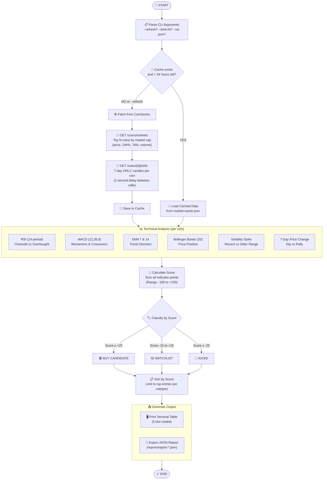

### Data Fetching Detail

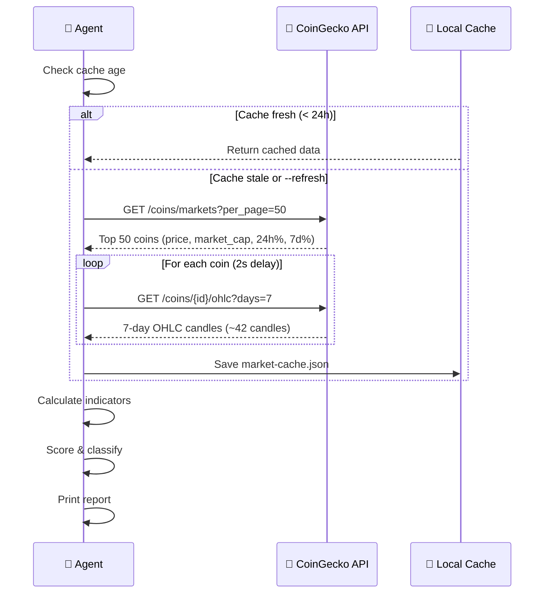

---

## 4. Data Source

### CoinGecko API Endpoints Used

| Endpoint | What It Returns | How We Use It |
|----------|-----------------|---------------|
| `GET /coins/markets` | Top coins ranked by market cap | Gets symbol, name, current price, 24h% change, 7d% change, volume |
| `GET /coins/{id}/ohlc?days=7` | 7 days of OHLC candles | Gets Open/High/Low/Close data for technical analysis |

### What is OHLC Data?

**OHLC** = **O**pen, **H**igh, **L**ow, **C**lose — the standard format for price data in trading.

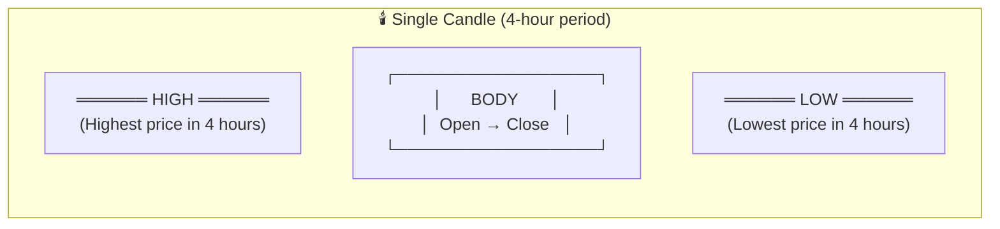

**Example**: If Bitcoin between 8am-12noon went:
- Opened at $67,000
- Reached $68,500 at highest
- Dropped to $66,200 at lowest  
- Closed at $67,800

Then the OHLC candle = `[timestamp, 67000, 68500, 66200, 67800]`

**For 7-day analysis**: CoinGecko gives ~42 candles (one per 4 hours × 7 days × 6 per day = 42)

---

## 5. Blockchain & Crypto Fundamentals for Beginners

### What is Blockchain?

Imagine a **shared notebook** that everyone can see but no one can erase:

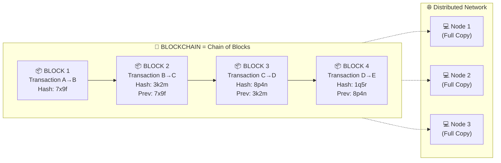

**Key Concepts:**

| Term | Simple Explanation | Analogy |
|------|-------------------|---------|
| **Block** | A group of transactions bundled together | A page in a notebook |
| **Chain** | Blocks linked together in order, each referencing the previous | Pages numbered and stapled |
| **Hash** | A unique "fingerprint" of data — change one bit, hash completely changes | A tamper-evident seal |
| **Node** | A computer running the blockchain software, storing a full copy | A person with a copy of the notebook |
| **Decentralized** | No single authority controls it — all nodes have equal say | A group decision vs. a boss decision |

### Why Can't You Fake Blockchain Data?

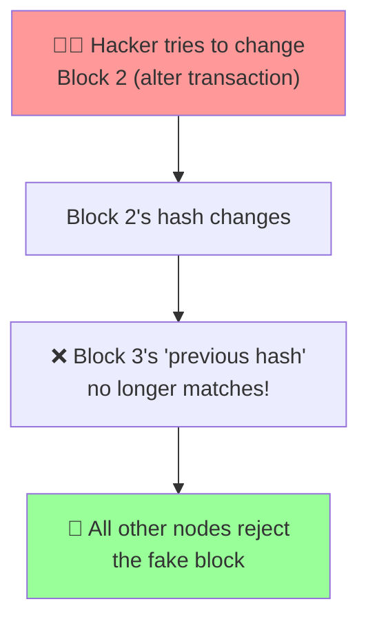

**The math makes it impossible** — if you change even one transaction in an old block, the hash changes, breaking the chain. To "fake" it, you'd need to recompute ALL subsequent blocks faster than the entire network combined.

### What is Cryptocurrency?

**Cryptocurrency** = Digital money that lives on a blockchain.

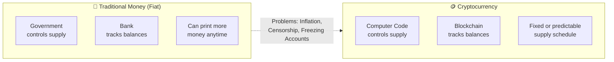

### How Does a Crypto Transaction Work?

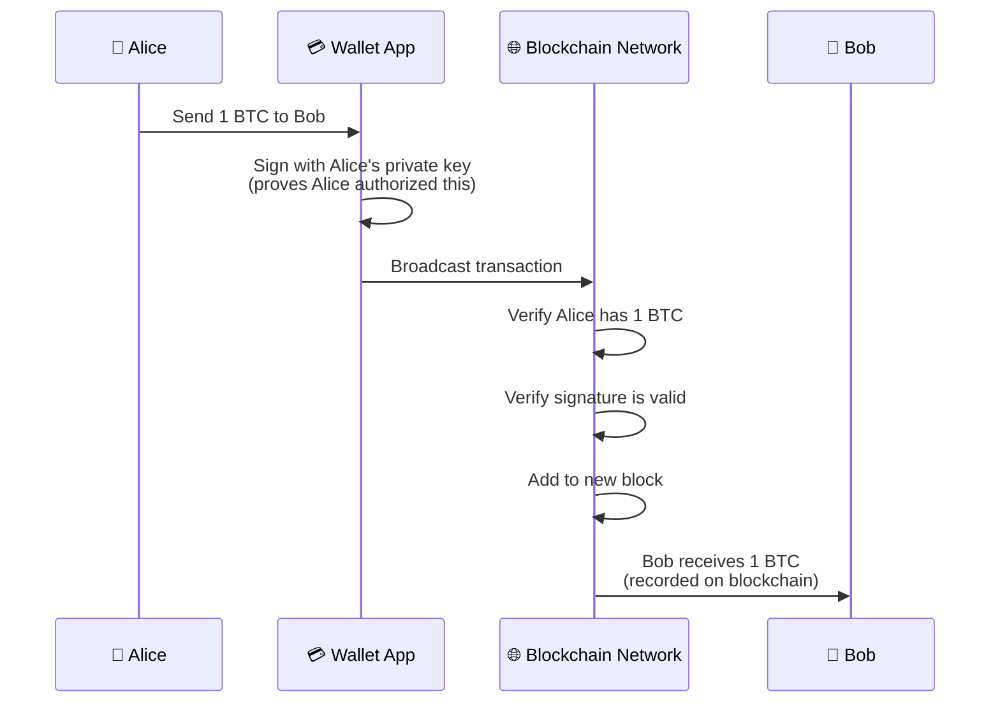

### Key Crypto Concepts Explained Simply

| Term | What It Is | Real-World Analogy | Why It Matters |
|------|------------|-------------------|----------------|
| **Bitcoin (BTC)** | First cryptocurrency, launched 2009 | Digital gold | Store of value, limited to 21 million coins ever |
| **Ethereum (ETH)** | Programmable blockchain (runs code) | A global computer | Powers DeFi, NFTs, smart contracts |
| **Altcoin** | Any crypto that isn't Bitcoin | Any stock that isn't Apple | Higher risk, potentially higher reward |
| **Stablecoin** | Crypto pegged to $1 USD | Digital dollars | Avoids volatility, used for trading |
| **Token** | A crypto built on another blockchain | Gift card vs. cash | Different use cases per project |
| **Market Cap** | Price × Total Supply | Company's total value | Helps compare coin sizes |
| **Volume** | How much was traded in 24h | Store foot traffic | Higher = more liquid (easier to buy/sell) |
| **Wallet** | Stores your private keys | A keychain, not the money itself | You control your funds |
| **Private Key** | Secret password to your crypto | The actual key to your house | NEVER share this! |
| **Exchange** | Website to buy/sell crypto | A currency exchange booth | Easiest way to get started |

### Types of Cryptocurrencies

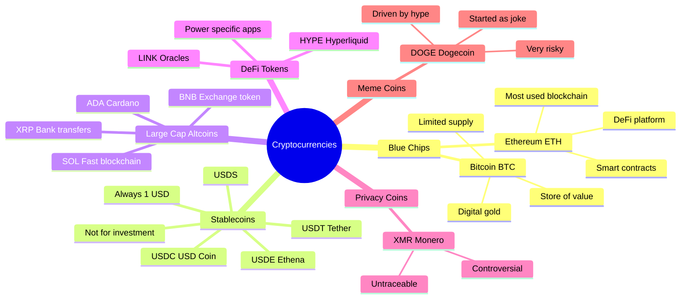

### ⚠️ Critical Beginner Warning: Stablecoins

**Stablecoins (USDT, USDC, USDE, USDS) will often appear in the BUY list.** This is a **FALSE SIGNAL**.

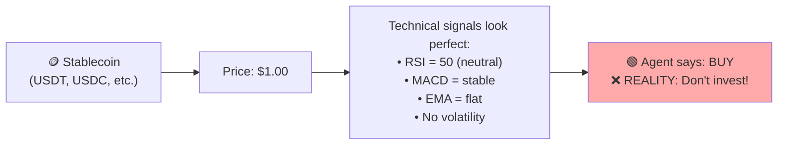

**Why?** Stablecoins are designed to stay at exactly $1. They will NEVER increase in value. The agent sees "stable" technical patterns and scores them highly, but **stablecoins are not investments** — they're just for holding value temporarily.

---

## 6. Technical Indicators Explained

Technical analysis uses **math formulas on price history** to estimate future price direction. It does NOT consider news, team quality, or technology — only price numbers.

### 6.1 RSI — Relative Strength Index

**What it measures**: Is everyone buying too much (overbought) or selling too much (oversold)?

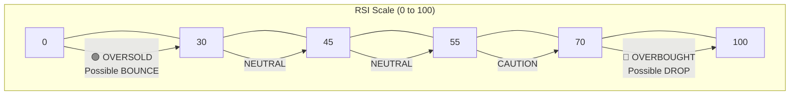

**The formula** (simplified):
1. Take the last 14 price candles
2. Calculate average gains vs average losses
3. Convert to 0-100 scale

**Scoring used by this agent:**
| RSI Range | Score | Interpretation |
|-----------|-------|----------------|
| 0-25 | **+30 pts** | Heavily oversold — strong buy signal |
| 26-35 | **+20 pts** | Oversold — potential bounce |
| 36-45 | **+10 pts** | Below midpoint — slight bullish lean |
| 46-54 | **0 pts** | Neutral |
| 55-64 | **-10 pts** | Above midpoint — slight bearish lean |
| 65-74 | **-20 pts** | Overbought — caution |
| 75-100 | **-30 pts** | Heavily overbought — avoid |

**Plain English**: When RSI is low, sellers have exhausted themselves and buyers might step in. When RSI is high, everyone who wanted to buy already did, so price may drop.

---

### 6.2 MACD — Moving Average Convergence Divergence

**What it measures**: Momentum — is the price gaining or losing speed?

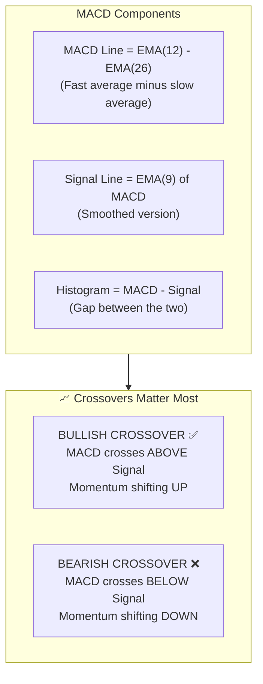

**Visual example:**

```
MACD Line    ════════════════════════════════════
Signal Line  ────────────────────────────────────
             ↓
Time ───────►
             
             ┌─ BULLISH CROSSOVER ─┐
             │                      │
MACD Line    ───────╱╱╱╱╱╱╱╱╱╱╱──────
Signal Line  ─────────────────╲──────
                    ▲
                    └── BUY SIGNAL
```

**Scoring:**
| Condition | Score | Meaning |
|-----------|-------|---------|
| Bullish crossover (just happened) | **+25 pts** | Strong buy signal |
| MACD above signal (ongoing) | **+10 pts** | Upward momentum |
| Bearish crossover (just happened) | **-25 pts** | Strong sell signal |
| MACD below signal (ongoing) | **-10 pts** | Downward momentum |

---

### 6.3 EMA — Exponential Moving Average (7 & 14)

**What it measures**: Is the price trending up or down in the short term?

**EMA** = Average price, but recent prices count MORE than old prices.

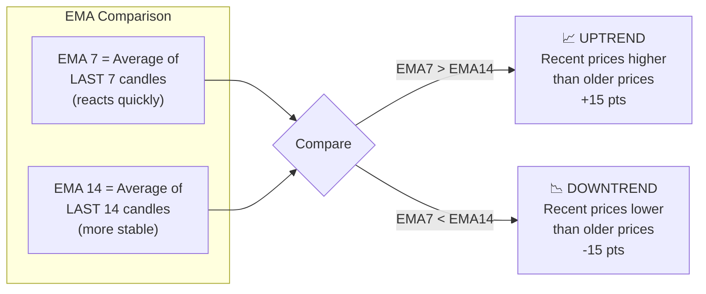

**Plain English**: If the 7-candle average is ABOVE the 14-candle average, it means prices have been rising recently — a good sign.

---

### 6.4 Bollinger Bands

**What it measures**: How "stretched" the price is from its normal range.

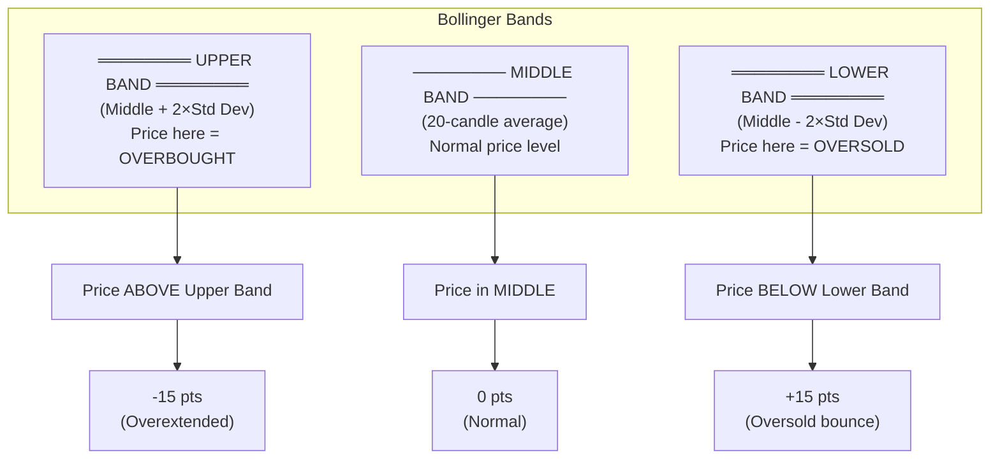

**Plain English**: Bollinger Bands are like a rubber band. When price stretches too far above the band, it might snap back down. When it stretches below, it might bounce up.

---

### 6.5 7-Day Price Change

**What it measures**: Has the price already moved a lot this week?

| Price Change | Score | Reasoning |
|--------------|-------|-----------|
| Dropped ≥20% | **+10 pts** | Deep dip — potential bargain |
| Dropped 10-20% | **+5 pts** | Moderate dip — possible opportunity |
| Rose 10-20% | **-5 pts** | Already rallied — some risk |
| Rose ≥20% | **-10 pts** | Overextended — pullback likely |

**Plain English**: Buy when there's "blood in the streets" (big drops). Be careful when everyone's already bought (big rallies).

---

### 6.6 Volatility Spike Detection

**What it measures**: Is trading activity suddenly much higher than normal?

Since CoinGecko doesn't give us volume per candle, we use **price range** (high - low) as a proxy.

| Condition | Score | Meaning |
|-----------|-------|---------|
| Volatility spike + price UP | **+10 pts** | Strong buying pressure |
| Volatility spike + price DOWN | **-10 pts** | Strong selling pressure |

---

## 7. Scoring System

### Score Calculation Summary

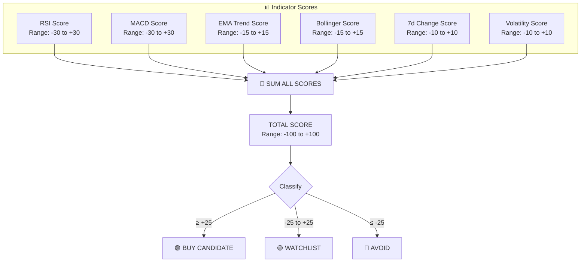

### Classification Thresholds

| Score Range | Category | What It Means |
|-------------|----------|---------------|
| **≥ +25** | 🟢 BUY CANDIDATE | Multiple bullish indicators align. Worth researching for potential entry. |
| **-25 to +25** | 🟡 WATCHLIST | Mixed signals. Monitor for better opportunity. |
| **≤ -25** | 🔴 AVOID | Multiple bearish indicators. Risk of further decline. |

---

## 8. Assumptions Made

**Understanding these assumptions is CRITICAL before trusting the output:**

1. **Short-term focus only**: All indicators use 7-day data. This is for **swing trading** (days to weeks), NOT long-term investing.

2. **Technical analysis only**: No news, no team quality, no technology assessment, no regulatory considerations. A "BUY" signal doesn't mean the project is good.

3. **Past ≠ Future**: Technical analysis assumes patterns repeat. In crypto, patterns often break due to news events or manipulation.

4. **Stablecoins are false positives**: USDT, USDC, USDE, USDS will trigger BUY signals but are NOT investments.

5. **Top coins only**: We analyze by market cap rank. Promising smaller coins are excluded.

6. **Rate limits**: Free CoinGecko API has ~30 requests/minute. We add 2s delays. Fetching 50 coins takes ~5-6 minutes.

7. **No volume data per candle**: We approximate "activity" using price range instead of actual trading volume.

8. **No correlation analysis**: If Bitcoin crashes 10%, most altcoins follow regardless of their individual signals. We don't account for this.

9. **No exit strategy**: The agent says BUY or AVOID, but not WHEN to sell or how much to invest.

---

## 9. Limitations

### ❌ What This Agent CANNOT Do

| Limitation | Why It Matters |
|------------|----------------|
| Cannot predict the future | No system can. Technical analysis improves odds, not guarantees. |
| Ignores news & fundamentals | A coin with perfect technicals might crash from a hack or regulation. |
| Ignores Bitcoin correlation | ~80% of altcoins move with BTC. If BTC drops, "BUY" picks likely drop too. |
| Doesn't know your risk tolerance | A volatile coin might be fine for one person, terrible for another. |
| 7-day window is short | Long-term investors need months of data. |
| Free API limits data quality | Professional traders use paid data feeds with real volume data. |
| Cannot detect manipulation | Crypto markets have pump-and-dump schemes. |

### ⚠️ Red Flags to Watch For

- **Stablecoins in BUY list** → Ignore (USDT, USDC, USDE, USDS)
- **Coins you've never heard of** → Research before acting
- **Meme coins with BUY signals** → DOGE, SHIB are hype-driven, not fundamental
- **High 7-day gains already** → You might be "buying the top"

---

## 10. How to Read the Report Output

### Terminal Table Columns

```
┌─────────┬──────────┬──────────────┬─────────┬─────────┬───────┬──────────┬───────────┬─────────┐
│ Symbol  │ Name     │ Price        │ 24h %   │ 7d %    │ RSI   │ MACD     │ EMA Trend │ Score   │
└─────────┴──────────┴──────────────┴─────────┴─────────┴───────┴──────────┴───────────┴─────────┘
```

| Column | Meaning | What to Look For |
|--------|---------|------------------|
| **Symbol** | Short code (BTC, ETH) | Easy reference |
| **Price** | Current USD price | Context for size of investment |
| **24h %** | Change in last 24 hours | Short-term sentiment |
| **7d %** | Change in last 7 days | Week's momentum |
| **RSI** | 0-100 value | Green = oversold (buy), Red = overbought (avoid) |
| **MACD** | Momentum indicator | `↑ Cross` = bullish, `↓ Cross` = bearish |
| **EMA Trend** | Short-term direction | `↑ Up` = rising, `↓ Down` = falling |
| **Score** | Overall score | Higher = more bullish |

### Quick Decision Guide

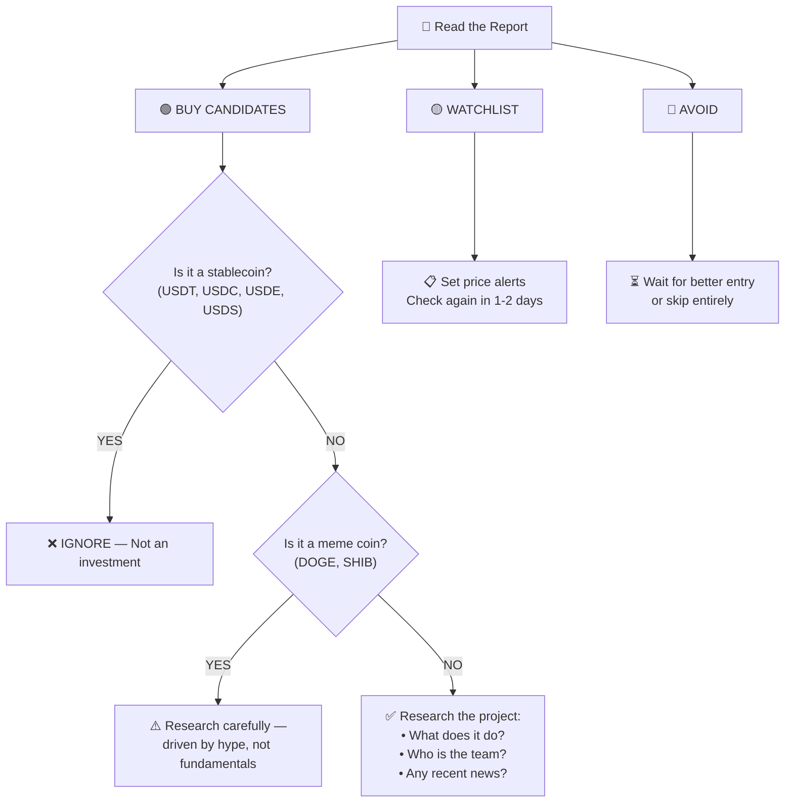

---

## 11. Glossary of Terms

| Term | Definition |
|------|------------|
| **Blockchain** | A distributed, tamper-proof ledger of transactions maintained by a network of computers |
| **Cryptocurrency** | Digital money secured by cryptography, running on a blockchain |
| **Bitcoin (BTC)** | The first cryptocurrency, launched 2009; "digital gold" |
| **Ethereum (ETH)** | A programmable blockchain that runs smart contracts |
| **Altcoin** | Any cryptocurrency that isn't Bitcoin |
| **Stablecoin** | A crypto pegged to $1 USD (USDT, USDC, etc.) |
| **Market Cap** | Total value of all coins = Price × Total Supply |
| **Volume** | Total amount traded in a time period |
| **Liquidity** | How easily you can buy/sell without affecting price |
| **Volatility** | How much the price swings up and down |
| **Bull Market** | Prices rising overall; optimism |
| **Bear Market** | Prices falling overall; pessimism |
| **RSI** | Relative Strength Index — measures overbought/oversold |
| **MACD** | Moving Average Convergence Divergence — measures momentum |
| **EMA** | Exponential Moving Average — weighted average of recent prices |
| **Bollinger Bands** | Price envelope showing normal vs extreme levels |
| **OHLC** | Open, High, Low, Close — standard candlestick data format |
| **Candle** | A visual representation of price movement over a time period |
| **Crossover** | When two lines on a chart cross — signals potential trend change |
| **Support** | A price level where buying pressure tends to stop declines |
| **Resistance** | A price level where selling pressure tends to stop advances |
| **Pump & Dump** | Manipulative scheme to inflate then crash a price |
| **HODL** | "Hold On for Dear Life" — don't sell during volatility |
| **DYOR** | "Do Your Own Research" — verify before investing |

---

## 12. File Reference

```
crypto-agent/
│
├── src/
│   ├── types.ts              → TypeScript interfaces (data structures)
│   │
│   ├── fetcher/
│   │   └── coingecko.ts      → API calls, rate limiting, data fetching
│   │
│   ├── database/
│   │   └── db.ts             → JSON file cache (save/load market data)
│   │
│   ├── analyzer/
│   │   ├── indicators.ts     → Calculate RSI, MACD, EMA, Bollinger, volatility
│   │   └── classifier.ts     → Score coins and assign categories
│   │
│   ├── output/
│   │   └── reporter.ts       → Terminal tables, colors, JSON export
│   │
│   ├── index.ts              → Main entry point
│   └── scheduler.ts          → Cron scheduler for automated runs
│
├── data/
│   └── market-cache.json     → Cached market data (auto-created)
│
├── reports/
│   └── report-*.json         → JSON reports (auto-created)
│
├── package.json              → Dependencies and scripts
├── tsconfig.json             → TypeScript configuration
├── README.md                 → Quick start guide
└── SPEC.md                   → This file
```

---

## Final Reminder

```
╔══════════════════════════════════════════════════════════════╗
║                    ⚠️  IMPORTANT                             ║
║                                                              ║
║  This agent uses TECHNICAL ANALYSIS ONLY.                   ║
║                                                              ║
║  Before investing:                                           ║
║  1. Research what the project DOES (not just the price)     ║
║  2. Check recent news (hacks, regulation, partnerships)     ║
║  3. Never invest more than you can afford to lose           ║
║  4. Crypto is highly volatile — 30–50% drops are common     ║
║  5. Past performance does NOT predict future results        ║
║                                                              ║
║  This is NOT financial advice.                              ║
╚══════════════════════════════════════════════════════════════╝