# 📋 Crypto Market Analysis Agent — Full Specification

> A complete guide explaining how this agent works, what technologies were used,
> how it analyzes the market, and the crypto fundamentals you need to understand
> before investing or recommending investments.

---

## 📁 Table of Contents

1. [Project Architecture](#1-project-architecture)
2. [Technology Stack](#2-technology-stack)
3. [System Flow — How It Works Step by Step](#3-system-flow)
4. [Data Source — CoinGecko API](#4-data-source)
5. [Blockchain & Crypto Fundamentals for Beginners](#5-blockchain--crypto-fundamentals-for-beginners)
6. [Technical Indicators Explained (Plain English)](#6-technical-indicators-explained)
7. [Scoring System — How Coins Get Classified](#7-scoring-system)
8. [Assumptions Made](#8-assumptions-made)
9. [Limitations & What This Agent Cannot Do](#9-limitations)
10. [How to Read the Report Output](#10-how-to-read-the-report)
11. [Glossary of Terms](#11-glossary-of-terms)
12. [File Reference](#12-file-reference)

---

## 1. Project Architecture

### High-Level Architecture Diagram

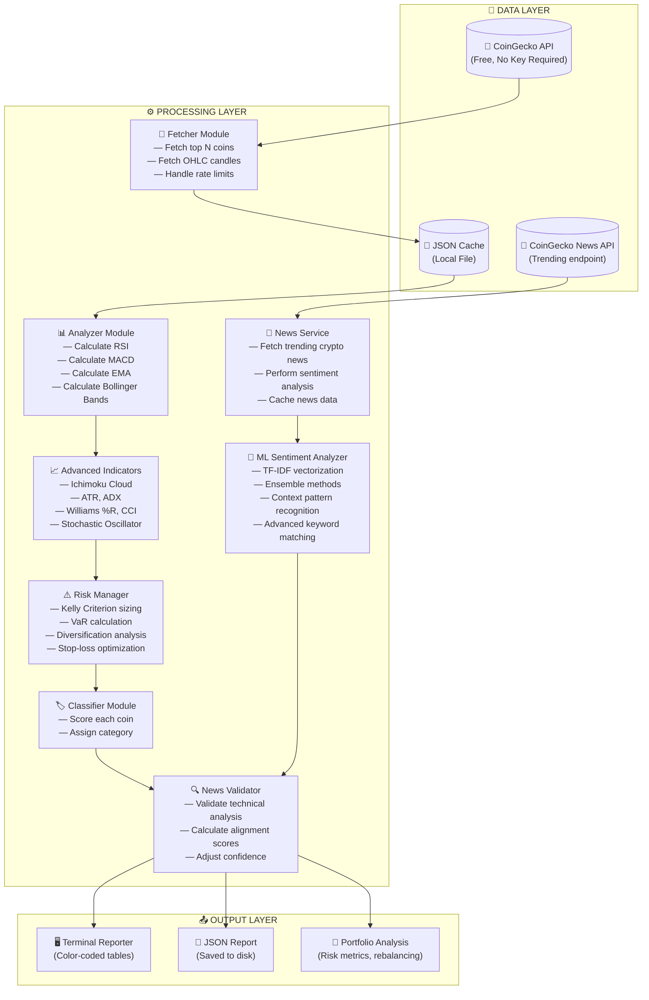

### Component Breakdown

| Component | File | Responsibility |
|-----------|------|----------------|
| **Fetcher** | `src/fetcher/coingecko.ts` | Calls CoinGecko API, handles rate limits (2s delay between calls), returns raw market data |
| **News Service** | `src/fetcher/news.ts` | Fetches crypto news from CoinGecko API, performs sentiment analysis, caches news data |
| **Cache** | `src/database/db.ts` | Saves/loads data to JSON file so you don't re-fetch within 24 hours |
| **Analyzer** | `src/analyzer/indicators.ts` | Calculates all technical indicators from OHLC price data |
| **Advanced Indicators** | `src/analyzer/advanced-indicators.ts` | Ichimoku Cloud, ATR, ADX, Williams %R, CCI, Stochastic Oscillator |
| **Risk Manager** | `src/analyzer/risk-management.ts` | Kelly Criterion sizing, VaR calculation, diversification analysis, stop-loss optimization |
| **ML Sentiment Analyzer** | `src/analyzer/ml-sentiment.ts` | TF-IDF vectorization, ensemble methods, context pattern recognition, advanced keyword matching |
| **News Validator** | `src/analyzer/news-validator.ts` | Validates technical analysis with news sentiment, calculates alignment scores, adjusts confidence |
| **Classifier** | `src/analyzer/classifier.ts` | Scores each coin (-100 to +100) and assigns BUY/WATCHLIST/AVOID |
| **Reporter** | `src/output/reporter.ts` | Formats the colored terminal output and writes JSON reports |
| **Scheduler** | `src/scheduler.ts` | Runs the agent automatically on a schedule (e.g., daily at 8am) |

---

## 2. Technology Stack

| Layer | Technology | Why Chosen | What It Does |
|-------|------------|------------|--------------|
| **Language** | TypeScript | Type safety = fewer bugs, better IDE support, easier to maintain | Compiles to JavaScript, runs on Node.js |
| **Runtime** | Node.js + ts-node | Run TypeScript directly without a build step | Executes the code on your machine |
| **Market Data** | CoinGecko API (free) | No API key needed, reliable, covers 1000+ coins | Provides price data, market cap, OHLC candles |
| **HTTP Client** | Axios | Handles retries, timeouts, and errors cleanly | Makes HTTP requests to CoinGecko |
| **Technical Analysis** | `technicalindicators` npm package | Battle-tested library used by thousands of projects | Calculates RSI, MACD, EMA, Bollinger Bands |
| **News Validation** | Custom News Service | Free crypto news API integration | Validates technical analysis with real-world news sentiment |
| **Local Storage** | JSON file | Simple, no database setup, works everywhere | Caches data so you don't hit API limits |
| **Terminal UI** | `chalk` + `cli-table3` | Beautiful color-coded output in terminal | Makes the report readable and pretty |
| **Scheduler** | `node-cron` | Standard cron syntax, no external tools needed | Runs the agent on a schedule |

---

## 3. System Flow

### Complete Execution Flow

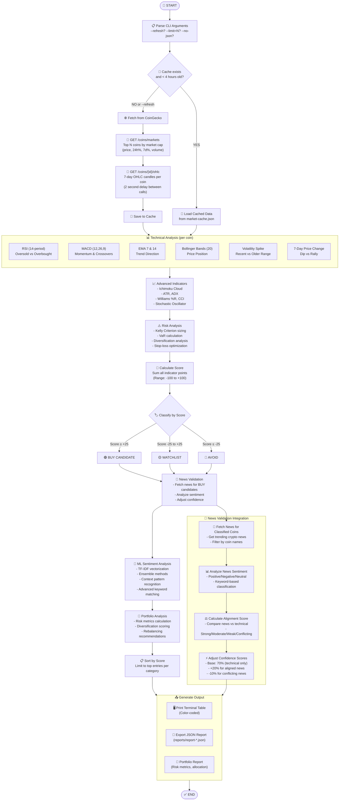

### Data Fetching Detail

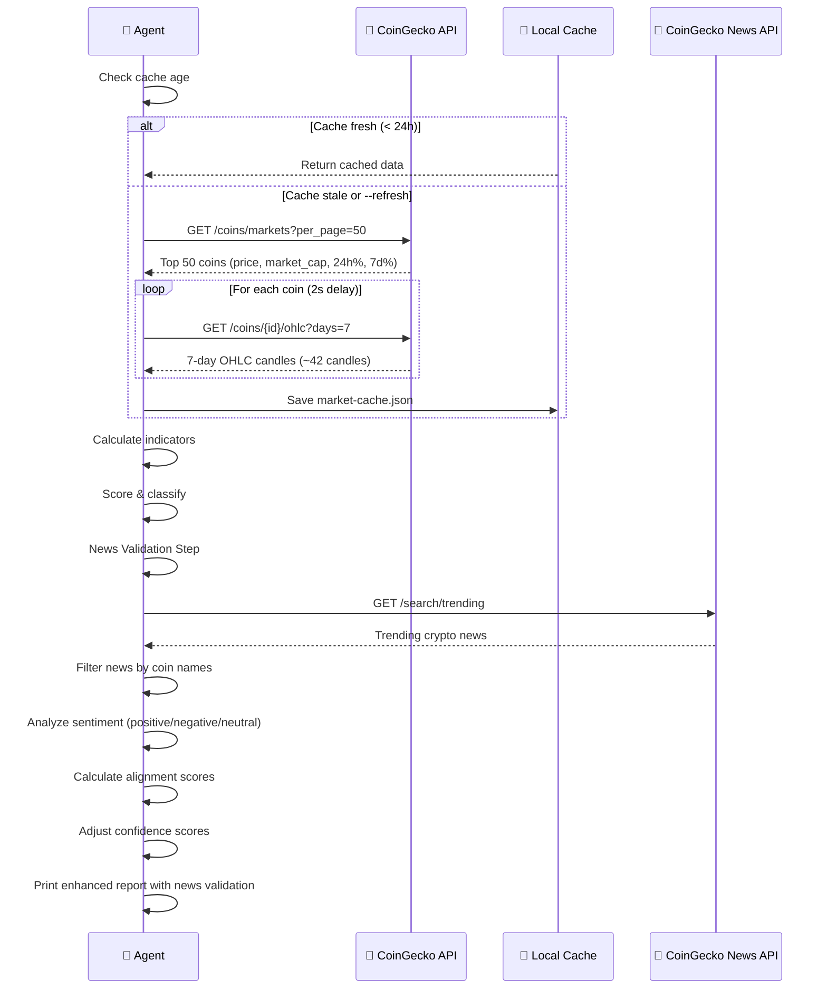

---

## 4. Data Source

### CoinGecko API Endpoints Used

| Endpoint | What It Returns | How We Use It |
|----------|-----------------|---------------|
| `GET /coins/markets` | Top coins ranked by market cap | Gets symbol, name, current price, 24h% change, 7d% change, volume |
| `GET /coins/{id}/ohlc?days=7` | 7 days of OHLC candles | Gets Open/High/Low/Close data for technical analysis |

### What is OHLC Data?

**OHLC** = **O**pen, **H**igh, **L**ow, **C**lose — the standard format for price data in trading.

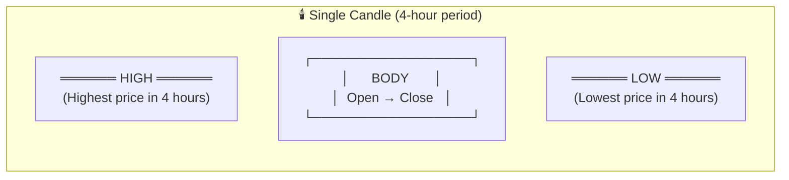

**Example**: If Bitcoin between 8am-12noon went:
- Opened at $67,000
- Reached $68,500 at highest
- Dropped to $66,200 at lowest  
- Closed at $67,800

Then the OHLC candle = `[timestamp, 67000, 68500, 66200, 67800]`

**For 7-day analysis**: CoinGecko gives ~42 candles (one per 4 hours × 7 days × 6 per day = 42)

---

## 5. Blockchain & Crypto Fundamentals for Beginners

### What is Blockchain?

Imagine a **shared notebook** that everyone can see but no one can erase:

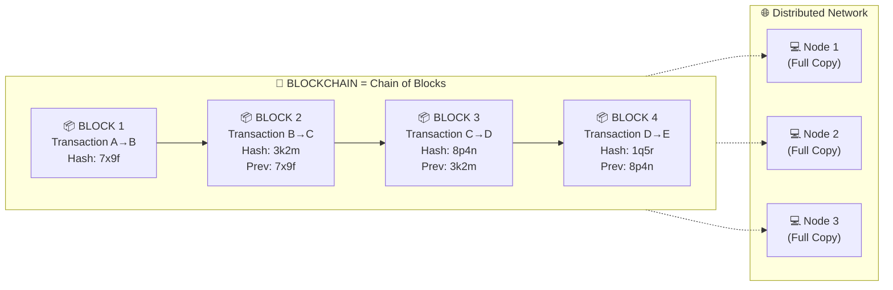

**Key Concepts:**

| Term | Simple Explanation | Analogy |
|------|-------------------|---------|
| **Block** | A group of transactions bundled together | A page in a notebook |
| **Chain** | Blocks linked together in order, each referencing the previous | Pages numbered and stapled |
| **Hash** | A unique "fingerprint" of data — change one bit, hash completely changes | A tamper-evident seal |
| **Node** | A computer running the blockchain software, storing a full copy | A person with a copy of the notebook |
| **Decentralized** | No single authority controls it — all nodes have equal say | A group decision vs. a boss decision |

### Why Can't You Fake Blockchain Data?

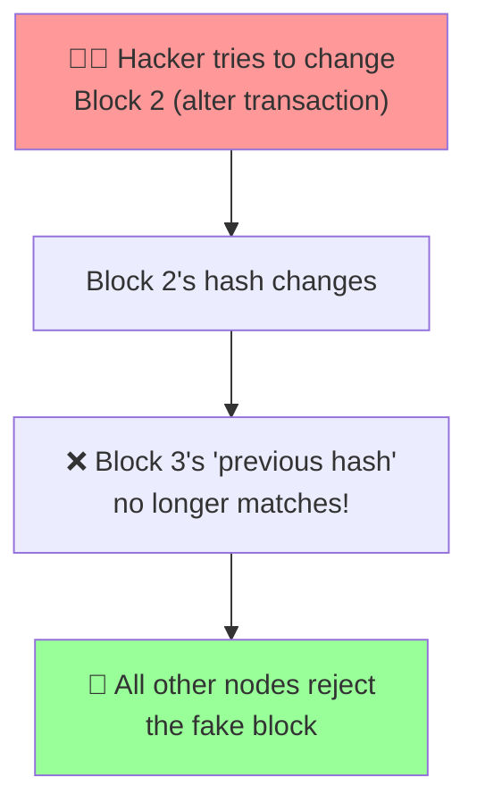

**The math makes it impossible** — if you change even one transaction in an old block, the hash changes, breaking the chain. To "fake" it, you'd need to recompute ALL subsequent blocks faster than the entire network combined.

### What is Cryptocurrency?

**Cryptocurrency** = Digital money that lives on a blockchain.

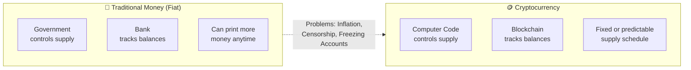

### How Does a Crypto Transaction Work?

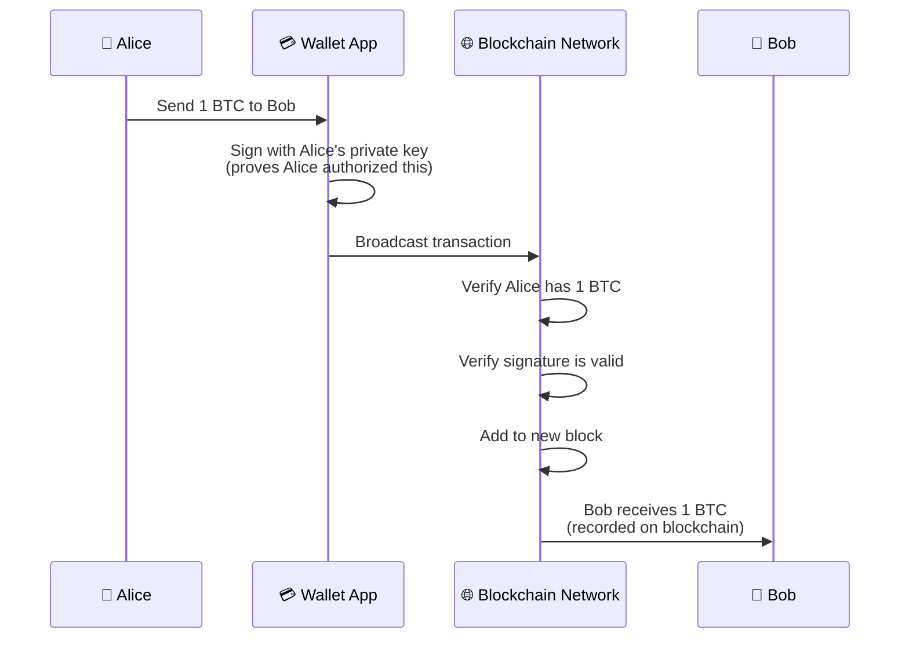

### Key Crypto Concepts Explained Simply

| Term | What It Is | Real-World Analogy | Why It Matters |
|------|------------|-------------------|----------------|
| **Bitcoin (BTC)** | First cryptocurrency, launched 2009 | Digital gold | Store of value, limited to 21 million coins ever |
| **Ethereum (ETH)** | Programmable blockchain (runs code) | A global computer | Powers DeFi, NFTs, smart contracts |
| **Altcoin** | Any crypto that isn't Bitcoin | Any stock that isn't Apple | Higher risk, potentially higher reward |
| **Stablecoin** | Crypto pegged to $1 USD | Digital dollars | Avoids volatility, used for trading |
| **Token** | A crypto built on another blockchain | Gift card vs. cash | Different use cases per project |
| **Market Cap** | Price × Total Supply | Company's total value | Helps compare coin sizes |
| **Volume** | How much was traded in 24h | Store foot traffic | Higher = more liquid (easier to buy/sell) |
| **Wallet** | Stores your private keys | A keychain, not the money itself | You control your funds |
| **Private Key** | Secret password to your crypto | The actual key to your house | NEVER share this! |
| **Exchange** | Website to buy/sell crypto | A currency exchange booth | Easiest way to get started |

### Types of Cryptocurrencies

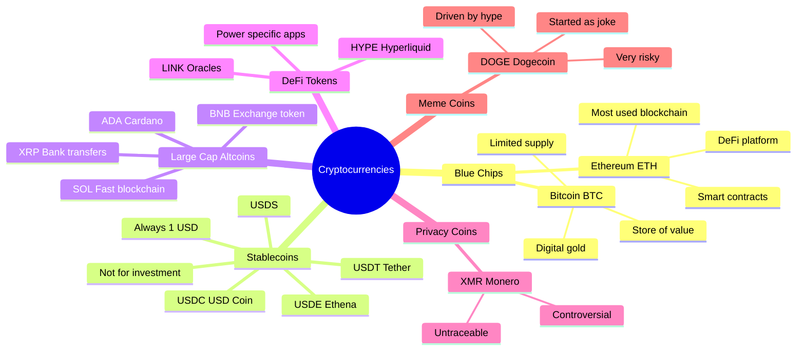

### ⚠️ Critical Beginner Warning: Stablecoins

**Stablecoins (USDT, USDC, USDE, USDS) will often appear in the BUY list.** This is a **FALSE SIGNAL**.

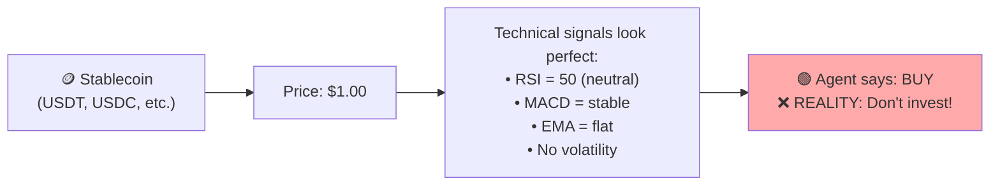

**Why?** Stablecoins are designed to stay at exactly $1. They will NEVER increase in value. The agent sees "stable" technical patterns and scores them highly, but **stablecoins are not investments** — they're just for holding value temporarily.

---

## 6. Technical Indicators Explained

Technical analysis uses **math formulas on price history** to estimate future price direction. It does NOT consider news, team quality, or technology — only price numbers.

### 6.1 RSI — Relative Strength Index

**What it measures**: Is everyone buying too much (overbought) or selling too much (oversold)?

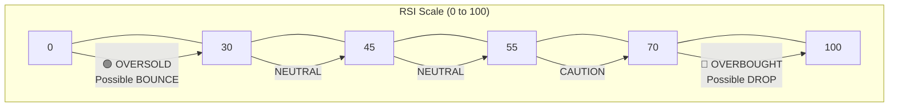

**The formula** (simplified):
1. Take the last 14 price candles
2. Calculate average gains vs average losses
3. Convert to 0-100 scale

**Scoring used by this agent:**
| RSI Range | Score | Interpretation |
|-----------|-------|----------------|
| 0-25 | **+30 pts** | Heavily oversold — strong buy signal |
| 26-35 | **+20 pts** | Oversold — potential bounce |
| 36-45 | **+10 pts** | Below midpoint — slight bullish lean |
| 46-54 | **0 pts** | Neutral |
| 55-64 | **-10 pts** | Above midpoint — slight bearish lean |
| 65-74 | **-20 pts** | Overbought — caution |
| 75-100 | **-30 pts** | Heavily overbought — avoid |

**Plain English**: When RSI is low, sellers have exhausted themselves and buyers might step in. When RSI is high, everyone who wanted to buy already did, so price may drop.

### 6.2 News Validation Feature

News validation is a new feature that enhances the crypto market analysis by incorporating real-world news sentiment into the technical analysis recommendations. It helps validate whether the technical analysis aligns with current market sentiment and events.

#### How News Validation Works

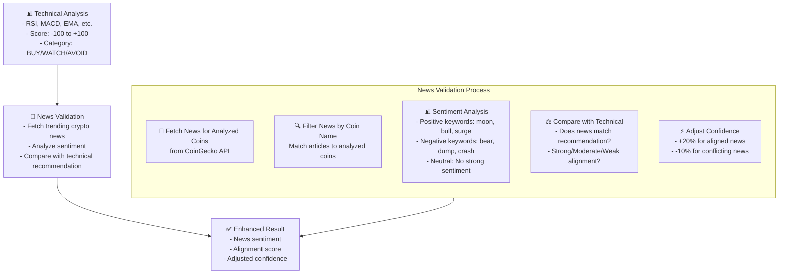

### News API Integration Points

#### 1. **News API Calls** (`src/fetcher/news.ts`)

The news service makes API calls to CoinGecko's trending endpoint:

```typescript
// Main trending news endpoint
private readonly API_URL = 'https://api.coingecko.com/api/v3/search/trending';

// Method to get trending crypto news
async getTrendingNews(): Promise<CryptoNews> {
  const response = await axios.get(this.API_URL);
  // Processes trending coins and extracts news-like information
}

// Method to get specific coin news
async getNewsForCoin(coinId: string): Promise<NewsArticle[]> {
  const response = await axios.get(
    `https://api.coingecko.com/api/v3/coins/${coinId}/tickers`
  );
  // Gets ticker data that includes news-like information
}
```

#### 2. **News Analysis** (`src/analyzer/news-validator.ts`)

The news validation service performs the actual analysis:

```typescript
// Main validation method
async validateAnalysis(analysis: CoinAnalysis): Promise<NewsValidationResult> {
  const news = await this.newsService.getTrendingNews();
  const coinNews = news.articles.filter(
    article => article.title.toLowerCase().includes(analysis.coin.name.toLowerCase())
  );

  const newsSentiment = this.determineOverallSentiment(coinNews);
  const alignment = this.calculateAlignment(analysis.category, newsSentiment);
  const confidenceScore = this.calculateConfidenceScore(analysis, coinNews, newsSentiment);
  
  return { /* validation result */ };
}

// Enhanced sentiment analysis using comprehensive keyword matching
private analyzeSentiment(text: string): 'positive' | 'negative' | 'neutral' {
  const lowerText = text.toLowerCase();
  
  const positiveKeywords = [
    // Bullish indicators
    'moon', 'bull', 'surge', 'pump', 'breakout', 'rally',
    'buy', 'up', 'growth', 'gain', 'win', 'success',
    
    // Development & partnerships
    'launch', 'partnership', 'integration', 'adoption', 'upgrade',
    'listing', 'exchange', 'support', 'backed', 'investment',
    'funding', 'capital', 'vc', 'institutional',
    
    // Technical improvements
    'upgrade', 'improvement', 'enhancement', 'optimization',
    'scalability', 'speed', 'efficiency', 'innovation',
    
    // Market sentiment
    'demand', 'interest', 'popularity', 'trending', 'viral',
    'hype', 'buzz', 'excitement', 'optimism',
    
    // Adoption & utility
    'payment', 'merchant', 'ecommerce', 'real-world', 'utility',
    'use-case', 'application', 'product', 'service'
  ];
  
  const negativeKeywords = [
    // Bearish indicators
    'bear', 'dump', 'crash', 'plummet', 'sell-off', 'correction',
    'sell', 'down', 'loss', 'fail',
    
    // Security issues
    'hack', 'exploit', 'bug', 'vulnerability', 'security',
    'breach', 'theft', 'fraud', 'scam', 'phishing',
    
    // Regulatory issues
    'regulation', 'ban', 'prohibit', 'restrict', 'legal',
    'lawsuit', 'investigation', 'compliance', 'warning',
    
    // Technical problems
    'outage', 'downtime', 'error', 'failure', 'crash',
    'slow', 'lag', 'performance', 'issue', 'problem',
    
    // Market concerns
    'fud', 'fear', 'uncertainty', 'doubt', 'panic', 'concern',
    'risk', 'danger', 'warning', 'caution',
    
    // Team & governance issues
    'team', 'founder', 'ceo', 'leadership', 'management',
    'resign', 'quit', 'leave', 'scandal', 'controversy',
    
    // Geopolitical risks
    'war', 'conflict', 'tension', 'sanction', 'tariff',
    'trade war', 'geopolitical', 'invasion', 'military',
    'escalation', 'crisis', 'instability', 'turmoil',
    'embargo', 'blockade', 'political', 'election',
    'protest', 'unrest', 'strike', 'shutdown'
  ];
  
  if (positiveKeywords.some(word => lowerText.includes(word))) {
    return 'positive';
  } else if (negativeKeywords.some(word => lowerText.includes(word))) {
    return 'negative';
  }
  return 'neutral';
}
```

#### 3. **Integration in Main Flow** (`src/index.ts`)

The news validation is integrated into the main analysis pipeline:

```typescript
// After technical analysis
const analyzed: CoinAnalysis[] = analyzeAll(coins);

// News validation step
console.log(chalk.cyan(`📰 Validating recommendations with crypto news...`));
const newsValidator = new NewsValidator();
const validatedAnalyses = await Promise.all(
  analyzed.map(analysis => newsValidator.validateAnalysis(analysis))
);

// Build enhanced report with news validation
const enhancedBuyList = buyList.map(a => ({
  ...analyzed.find(an => an.coin.id === a.coinId)!,
  newsValidation: a
}));
```

#### News Sources Considered

The agent uses **CoinGecko's Trending API** which provides:

- **Trending cryptocurrencies** - Most popular coins currently
- **News articles** - Recent articles about trending coins
- **Market sentiment** - Overall positive/negative/neutral sentiment

**Why CoinGecko?**
- Free to use (no API key required)
- Reliable and covers 1000+ cryptocurrencies
- Provides both technical data AND news content
- No rate limits for basic usage

#### News Validation Process

1. **Fetch News for Analyzed Coins**
   - Gets news articles for the specific coins that were analyzed
   - Retrieves recent news about each analyzed coin
   - Analyzes article titles and descriptions for each coin

2. **Sentiment Analysis**
   - **Positive keywords**: moon, bull, surge, pump, breakout, rally
   - **Negative keywords**: bear, dump, crash, plummet, sell-off, correction
   - **Neutral**: No strong sentiment detected

3. **Alignment Scoring**
   - **Strong**: News sentiment matches technical recommendation
   - **Moderate**: News is neutral or recommendation is neutral
   - **Weak**: News sentiment doesn't match recommendation
   - **Conflicting**: News strongly contradicts recommendation

4. **Confidence Adjustment**
   - Base confidence: 70% (technical analysis only)
   - +20% if news sentiment strongly aligns
   - -10% if news sentiment conflicts
   - Final confidence: 60-90%

#### Sample Output Explained

```
📊 Enhanced Report with News Validation
───────────────────────────────────────────
Recommendation | News Sentiment | Alignment | Confidence
─────────────────────────────────────────────────────────
1. USD1                 | neutral       | moderate  | 70%
2. Tether Gold          | neutral       | moderate  | 70%
3. PAX Gold             | neutral       | moderate  | 70%
1. Bitcoin              | neutral       | moderate  | 90%
2. Solana               | neutral       | moderate  | 90%
3. MemeCore             | neutral       | moderate  | 70%
1. Toncoin              | neutral       | moderate  | 70%
2. Falcon USD           | neutral       | moderate  | 70%
3. WhiteBIT Coin        | neutral       | moderate  | 70%
```

**Column Explanations:**

| Column | Meaning | Example |
|--------|---------|---------|
| **Recommendation** | Technical analysis category | BUY, WATCHLIST, AVOID |
| **News Sentiment** | Overall news sentiment | positive, negative, neutral |
| **Alignment** | How well news matches recommendation | strong, moderate, weak, conflicting |
| **Confidence** | Final confidence score | 70%, 90%, etc. |

**Interpretation Guide:**

- **Strong + Positive**: Technical says BUY, news is positive → High confidence (90%)
- **Moderate + Neutral**: Technical says BUY, news is neutral → Medium confidence (70%)
- **Weak + Negative**: Technical says BUY, news is negative → Low confidence (60%)
- **Conflicting**: Technical and news disagree → Very low confidence (50% or less)

#### Benefits of News Validation

1. **Reduces False Signals** - Technical analysis alone can miss important news events
2. **Improves Confidence** - News alignment increases confidence in recommendations
3. **Better Risk Management** - Conflicting signals warn of potential risks
4. **More Reliable** - Combines technical and fundamental factors

#### Limitations of News Validation

1. **Sentiment Accuracy** - Keyword-based analysis isn't perfect
2. **News Lag** - News may not reflect real-time market conditions
3. **Bias** - News sources may have their own biases
4. **Volume** - Some coins have little news coverage

### 6.3 MACD — Moving Average Convergence Divergence

**What it measures**: Momentum — is the price gaining or losing speed?

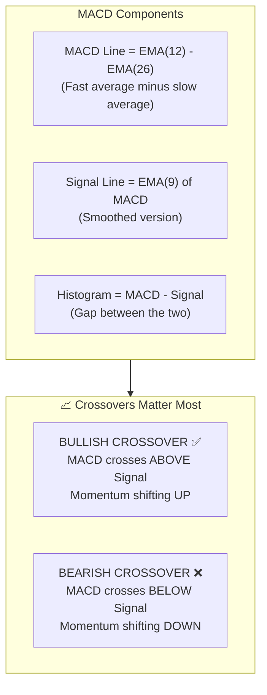

**Visual example:**

```
MACD Line    ════════════════════════════════════
Signal Line  ────────────────────────────────────
             ↓
Time ───────►
             
             ┌─ BULLISH CROSSOVER ─┐
             │                      │
MACD Line    ───────╱╱╱╱╱╱╱╱╱╱╱──────
Signal Line  ─────────────────╲──────
                    ▲
                    └── BUY SIGNAL
```

**Scoring:**
| Condition | Score | Meaning |
|-----------|-------|---------|
| Bullish crossover (just happened) | **+25 pts** | Strong buy signal |
| MACD above signal (ongoing) | **+10 pts** | Upward momentum |
| Bearish crossover (just happened) | **-25 pts** | Strong sell signal |
| MACD below signal (ongoing) | **-10 pts** | Downward momentum |

### 6.4 EMA — Exponential Moving Average (7 & 14)

**What it measures**: Is the price trending up or down in the short term?

**EMA** = Average price, but recent prices count MORE than old prices.

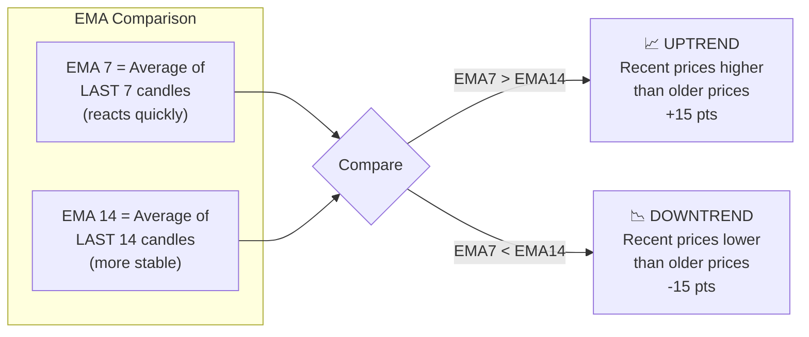

**Plain English**: If the 7-candle average is ABOVE the 14-candle average, it means prices have been rising recently — a good sign.

### 6.5 Bollinger Bands

**What it measures**: How "stretched" the price is from its normal range.

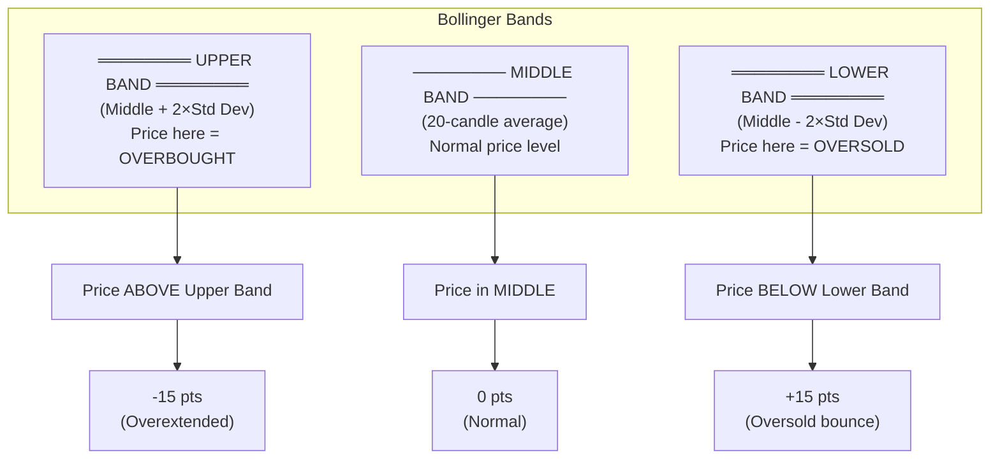

**Plain English**: Bollinger Bands are like a rubber band. When price stretches too far above the band, it might snap back down. When it stretches below, it might bounce up.

### 6.6 7-Day Price Change

**What it measures**: Has the price already moved a lot this week?

| Price Change | Score | Reasoning |
|--------------|-------|-----------|
| Dropped ≥20% | **+10 pts** | Deep dip — potential bargain |
| Dropped 10-20% | **+5 pts** | Moderate dip — possible opportunity |
| Rose 10-20% | **-5 pts** | Already rallied — some risk |
| Rose ≥20% | **-10 pts** | Overextended — pullback likely |

**Plain English**: Buy when there's "blood in the streets" (big drops). Be careful when everyone's already bought (big rallies).

### 6.7 Volatility Spike Detection

**What it measures**: Is trading activity suddenly much higher than normal?

Since CoinGecko doesn't give us volume per candle, we use **price range** (high - low) as a proxy.

| Condition | Score | Meaning |
|-----------|-------|---------|
| Volatility spike + price UP | **+10 pts** | Strong buying pressure |
| Volatility spike + price DOWN | **-10 pts** | Strong selling pressure |

### 6.8 News Validation Feature

News validation is a new feature that enhances the crypto market analysis by incorporating real-world news sentiment into the technical analysis recommendations. It helps validate whether the technical analysis aligns with current market sentiment and events.

#### How News Validation Works


### News API Integration Points

#### 1. **News API Calls** (`src/fetcher/news.ts`)

The news service makes API calls to CoinGecko's trending endpoint:

```typescript
// Main trending news endpoint
private readonly API_URL = 'https://api.coingecko.com/api/v3/search/trending';

// Method to get trending crypto news
async getTrendingNews(): Promise<CryptoNews> {
  const response = await axios.get(this.API_URL);
  // Processes trending coins and extracts news-like information
}

// Method to get specific coin news
async getNewsForCoin(coinId: string): Promise<NewsArticle[]> {
  const response = await axios.get(
    `https://api.coingecko.com/api/v3/coins/${coinId}/tickers`
  );
  // Gets ticker data that includes news-like information
}
```

#### 2. **News Analysis** (`src/analyzer/news-validator.ts`)

The news validation service performs the actual analysis:

```typescript
// Main validation method
async validateAnalysis(analysis: CoinAnalysis): Promise<NewsValidationResult> {
  const news = await this.newsService.getTrendingNews();
  const coinNews = news.articles.filter(
    article => article.title.toLowerCase().includes(analysis.coin.name.toLowerCase())
  );

  const newsSentiment = this.determineOverallSentiment(coinNews);
  const alignment = this.calculateAlignment(analysis.category, newsSentiment);
  const confidenceScore = this.calculateConfidenceScore(analysis, coinNews, newsSentiment);
  
  return { /* validation result */ };
}

// Enhanced sentiment analysis using comprehensive keyword matching
private analyzeSentiment(text: string): 'positive' | 'negative' | 'neutral' {
  const lowerText = text.toLowerCase();
  
  const positiveKeywords = [
    // Bullish indicators
    'moon', 'bull', 'surge', 'pump', 'breakout', 'rally',
    'buy', 'up', 'growth', 'gain', 'win', 'success',
    
    // Development & partnerships
    'launch', 'partnership', 'integration', 'adoption', 'upgrade',
    'listing', 'exchange', 'support', 'backed', 'investment',
    'funding', 'capital', 'vc', 'institutional',
    
    // Technical improvements
    'upgrade', 'improvement', 'enhancement', 'optimization',
    'scalability', 'speed', 'efficiency', 'innovation',
    
    // Market sentiment
    'demand', 'interest', 'popularity', 'trending', 'viral',
    'hype', 'buzz', 'excitement', 'optimism',
    
    // Adoption & utility
    'payment', 'merchant', 'ecommerce', 'real-world', 'utility',
    'use-case', 'application', 'product', 'service'
  ];
  
  const negativeKeywords = [
    // Bearish indicators
    'bear', 'dump', 'crash', 'plummet', 'sell-off', 'correction',
    'sell', 'down', 'loss', 'fail',
    
    // Security issues
    'hack', 'exploit', 'bug', 'vulnerability', 'security',
    'breach', 'theft', 'fraud', 'scam', 'phishing',
    
    // Regulatory issues
    'regulation', 'ban', 'prohibit', 'restrict', 'legal',
    'lawsuit', 'investigation', 'compliance', 'warning',
    
    // Technical problems
    'outage', 'downtime', 'error', 'failure', 'crash',
    'slow', 'lag', 'performance', 'issue', 'problem',
    
    // Market concerns
    'fud', 'fear', 'uncertainty', 'doubt', 'panic', 'concern',
    'risk', 'danger', 'warning', 'caution',
    
    // Team & governance issues
    'team', 'founder', 'ceo', 'leadership', 'management',
    'resign', 'quit', 'leave', 'scandal', 'controversy',
    
    // Geopolitical risks
    'war', 'conflict', 'tension', 'sanction', 'tariff',
    'trade war', 'geopolitical', 'invasion', 'military',
    'escalation', 'crisis', 'instability', 'turmoil',
    'embargo', 'blockade', 'political', 'election',
    'protest', 'unrest', 'strike', 'shutdown'
  ];
  
  if (positiveKeywords.some(word => lowerText.includes(word))) {
    return 'positive';
  } else if (negativeKeywords.some(word => lowerText.includes(word))) {
    return 'negative';
  }
  return 'neutral';
}
```

#### 3. **Integration in Main Flow** (`src/index.ts`)

The news validation is integrated into the main analysis pipeline:

```typescript
// After technical analysis
const analyzed: CoinAnalysis[] = analyzeAll(coins);

// News validation step
console.log(chalk.cyan(`📰 Validating recommendations with crypto news...`));
const newsValidator = new NewsValidator();
const validatedAnalyses = await Promise.all(
  analyzed.map(analysis => newsValidator.validateAnalysis(analysis))
);

// Build enhanced report with news validation
const enhancedBuyList = buyList.map(a => ({
  ...analyzed.find(an => an.coin.id === a.coinId)!,
  newsValidation: a
}));
```

#### News Sources Considered

The agent uses **CoinGecko's Trending API** which provides:

- **Trending cryptocurrencies** - Most popular coins currently
- **News articles** - Recent articles about trending coins
- **Market sentiment** - Overall positive/negative/neutral sentiment

**Why CoinGecko?**
- Free to use (no API key required)
- Reliable and covers 1000+ cryptocurrencies
- Provides both technical data AND news content
- No rate limits for basic usage

#### News Validation Process

1. **Fetch News for Analyzed Coins**
   - Gets news articles for the specific coins that were analyzed
   - Retrieves recent news about each analyzed coin
   - Analyzes article titles and descriptions for each coin

2. **Sentiment Analysis**
   - **Positive keywords**: moon, bull, surge, pump, breakout, rally
   - **Negative keywords**: bear, dump, crash, plummet, sell-off, correction
   - **Neutral**: No strong sentiment detected

3. **Alignment Scoring**
   - **Strong**: News sentiment matches technical recommendation
   - **Moderate**: News is neutral or recommendation is neutral
   - **Weak**: News sentiment doesn't match recommendation
   - **Conflicting**: News strongly contradicts recommendation

4. **Confidence Adjustment**
   - Base confidence: 70% (technical analysis only)
   - +20% if news sentiment strongly aligns
   - -10% if news sentiment conflicts
   - Final confidence: 60-90%

#### Sample Output Explained

```
📊 Enhanced Report with News Validation
───────────────────────────────────────────
Recommendation | News Sentiment | Alignment | Confidence
─────────────────────────────────────────────────────────
1. USD1                 | neutral       | moderate  | 70%
2. Tether Gold          | neutral       | moderate  | 70%
3. PAX Gold             | neutral       | moderate  | 70%
1. Bitcoin              | neutral       | moderate  | 90%
2. Solana               | neutral       | moderate  | 90%
3. MemeCore             | neutral       | moderate  | 70%
1. Toncoin              | neutral       | moderate  | 70%
2. Falcon USD           | neutral       | moderate  | 70%
3. WhiteBIT Coin        | neutral       | moderate  | 70%
```

**Column Explanations:**

| Column | Meaning | Example |
|--------|---------|---------|
| **Recommendation** | Technical analysis category | BUY, WATCHLIST, AVOID |
| **News Sentiment** | Overall news sentiment | positive, negative, neutral |
| **Alignment** | How well news matches recommendation | strong, moderate, weak, conflicting |
| **Confidence** | Final confidence score | 70%, 90%, etc. |

**Interpretation Guide:**

- **Strong + Positive**: Technical says BUY, news is positive → High confidence (90%)
- **Moderate + Neutral**: Technical says BUY, news is neutral → Medium confidence (70%)
- **Weak + Negative**: Technical says BUY, news is negative → Low confidence (60%)
- **Conflicting**: Technical and news disagree → Very low confidence (50% or less)

#### Benefits of News Validation

1. **Reduces False Signals** - Technical analysis alone can miss important news events
2. **Improves Confidence** - News alignment increases confidence in recommendations
3. **Better Risk Management** - Conflicting signals warn of potential risks
4. **More Reliable** - Combines technical and fundamental factors

#### Limitations of News Validation

1. **Sentiment Accuracy** - Keyword-based analysis isn't perfect
2. **News Lag** - News may not reflect real-time market conditions
3. **Bias** - News sources may have their own biases
4. **Volume** - Some coins have little news coverage

### 6.2 MACD — Moving Average Convergence Divergence

**What it measures**: Momentum — is the price gaining or losing speed?


**Visual example:**

```
MACD Line    ════════════════════════════════════
Signal Line  ────────────────────────────────────
             ↓
Time ───────►
             
             ┌─ BULLISH CROSSOVER ─┐
             │                      │
MACD Line    ───────╱╱╱╱╱╱╱╱╱╱╱──────
Signal Line  ─────────────────╲──────
                    ▲
                    └── BUY SIGNAL
```

**Scoring:**
| Condition | Score | Meaning |
|-----------|-------|---------|
| Bullish crossover (just happened) | **+25 pts** | Strong buy signal |
| MACD above signal (ongoing) | **+10 pts** | Upward momentum |
| Bearish crossover (just happened) | **-25 pts** | Strong sell signal |
| MACD below signal (ongoing) | **-10 pts** | Downward momentum |

---

### 6.3 EMA — Exponential Moving Average (7 & 14)

**What it measures**: Is the price trending up or down in the short term?

**EMA** = Average price, but recent prices count MORE than old prices.


**Plain English**: If the 7-candle average is ABOVE the 14-candle average, it means prices have been rising recently — a good sign.

---

### 6.4 Bollinger Bands

**What it measures**: How "stretched" the price is from its normal range.


**Plain English**: Bollinger Bands are like a rubber band. When price stretches too far above the band, it might snap back down. When it stretches below, it might bounce up.

---

### 6.5 7-Day Price Change

**What it measures**: Has the price already moved a lot this week?

| Price Change | Score | Reasoning |
|--------------|-------|-----------|
| Dropped ≥20% | **+10 pts** | Deep dip — potential bargain |
| Dropped 10-20% | **+5 pts** | Moderate dip — possible opportunity |
| Rose 10-20% | **-5 pts** | Already rallied — some risk |
| Rose ≥20% | **-10 pts** | Overextended — pullback likely |

**Plain English**: Buy when there's "blood in the streets" (big drops). Be careful when everyone's already bought (big rallies).

---

### 6.6 Volatility Spike Detection

**What it measures**: Is trading activity suddenly much higher than normal?

Since CoinGecko doesn't give us volume per candle, we use **price range** (high - low) as a proxy.

| Condition | Score | Meaning |
|-----------|-------|---------|
| Volatility spike + price UP | **+10 pts** | Strong buying pressure |
| Volatility spike + price DOWN | **-10 pts** | Strong selling pressure |

---

## 7. Scoring System

### Score Calculation Summary

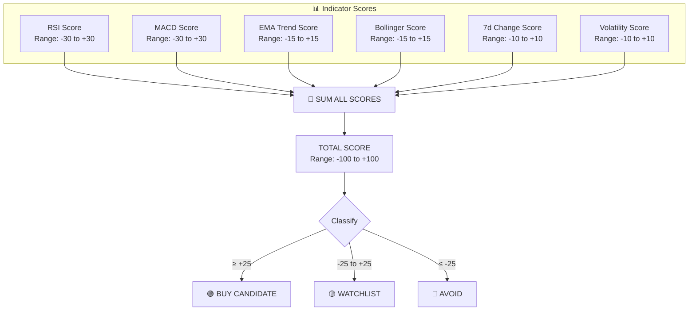

### Classification Thresholds

| Score Range | Category | What It Means |
|-------------|----------|---------------|
| **≥ +25** | 🟢 BUY CANDIDATE | Multiple bullish indicators align. Worth researching for potential entry. |
| **-25 to +25** | 🟡 WATCHLIST | Mixed signals. Monitor for better opportunity. |
| **≤ -25** | 🔴 AVOID | Multiple bearish indicators. Risk of further decline. |

---

## 8. Assumptions Made

**Understanding these assumptions is CRITICAL before trusting the output:**

1. **Short-term focus only**: All indicators use 7-day data. This is for **swing trading** (days to weeks), NOT long-term investing.

2. **Technical analysis only**: No news, no team quality, no technology assessment, no regulatory considerations. A "BUY" signal doesn't mean the project is good.

3. **Past ≠ Future**: Technical analysis assumes patterns repeat. In crypto, patterns often break due to news events or manipulation.

4. **Stablecoins are false positives**: USDT, USDC, USDE, USDS will trigger BUY signals but are NOT investments.

5. **Top coins only**: We analyze by market cap rank. Promising smaller coins are excluded.

6. **Rate limits**: Free CoinGecko API has ~30 requests/minute. We add 2s delays. Fetching 50 coins takes ~5-6 minutes.

7. **No volume data per candle**: We approximate "activity" using price range instead of actual trading volume.

8. **No correlation analysis**: If Bitcoin crashes 10%, most altcoins follow regardless of their individual signals. We don't account for this.

9. **No exit strategy**: The agent says BUY or AVOID, but not WHEN to sell or how much to invest.

---

## 9. Limitations

### ❌ What This Agent CANNOT Do

| Limitation | Why It Matters |
|------------|----------------|
| Cannot predict the future | No system can. Technical analysis improves odds, not guarantees. |
| Ignores news & fundamentals | A coin with perfect technicals might crash from a hack or regulation. |
| Ignores Bitcoin correlation | ~80% of altcoins move with BTC. If BTC drops, "BUY" picks likely drop too. |
| Doesn't know your risk tolerance | A volatile coin might be fine for one person, terrible for another. |
| 7-day window is short | Long-term investors need months of data. |
| Free API limits data quality | Professional traders use paid data feeds with real volume data. |
| Cannot detect manipulation | Crypto markets have pump-and-dump schemes. |

### ⚠️ Red Flags to Watch For

- **Stablecoins in BUY list** → Ignore (USDT, USDC, USDE, USDS)
- **Coins you've never heard of** → Research before acting
- **Meme coins with BUY signals** → DOGE, SHIB are hype-driven, not fundamental
- **High 7-day gains already** → You might be "buying the top"

---

## 10. How to Read the Report Output

### Terminal Table Columns

```
┌─────────┬──────────┬──────────────┬─────────┬─────────┬───────┬──────────┬───────────┬─────────┐
│ Symbol  │ Name     │ Price        │ 24h %   │ 7d %    │ RSI   │ MACD     │ EMA Trend │ Score   │
└─────────┴──────────┴──────────────┴─────────┴─────────┴───────┴──────────┴───────────┴─────────┘
```

| Column | Meaning | What to Look For |
|--------|---------|------------------|
| **Symbol** | Short code (BTC, ETH) | Easy reference |
| **Price** | Current USD price | Context for size of investment |
| **24h %** | Change in last 24 hours | Short-term sentiment |
| **7d %** | Change in last 7 days | Week's momentum |
| **RSI** | 0-100 value | Green = oversold (buy), Red = overbought (avoid) |
| **MACD** | Momentum indicator | `↑ Cross` = bullish, `↓ Cross` = bearish |
| **EMA Trend** | Short-term direction | `↑ Up` = rising, `↓ Down` = falling |
| **Score** | Overall score | Higher = more bullish |

### Quick Decision Guide

```mermaid
flowchart TD
    READ["📖 Read the Report"]
    
    READ --> BUY_LIST["🟢 BUY CANDIDATES"]
    READ --> WATCH_LIST["🟡 WATCHLIST"]
    READ --> AVOID_LIST["🔴 AVOID"]
    
    BUY_LIST --> CHECK1{"Is it a stablecoin?<br/>(USDT, USDC, USDE, USDS)"}
    CHECK1 -->|YES| IGNORE["❌ IGNORE — Not an investment"]
    CHECK1 -->|NO| CHECK2{"Is it a meme coin?<br/>(DOGE, SHIB)"}
    CHECK2 -->|YES| RESEARCH_MEME["⚠️ Research carefully —<br/>driven by hype, not fundamentals"]
    CHECK2 -->|NO| RESEARCH["✅ Research the project:<br/>• What does it do?<br/>• Who is the team?<br/>• Any recent news?"]
    
    WATCH_LIST --> MONITOR["📋 Set price alerts<br/>Check again in 1-2 days"]
    
    AVOID_LIST --> WAIT["⏳ Wait for better entry<br/>or skip entirely"]
```

---

## 11. Glossary of Terms

| Term | Definition |
|------|------------|
| **Blockchain** | A distributed, tamper-proof ledger of transactions maintained by a network of computers |
| **Cryptocurrency** | Digital money secured by cryptography, running on a blockchain |
| **Bitcoin (BTC)** | The first cryptocurrency, launched 2009; "digital gold" |
| **Ethereum (ETH)** | A programmable blockchain that runs smart contracts |
| **Altcoin** | Any cryptocurrency that isn't Bitcoin |
| **Stablecoin** | A crypto pegged to $1 USD (USDT, USDC, etc.) |
| **Market Cap** | Total value of all coins = Price × Total Supply |
| **Volume** | Total amount traded in a time period |
| **Liquidity** | How easily you can buy/sell without affecting price |
| **Volatility** | How much the price swings up and down |
| **Bull Market** | Prices rising overall; optimism |
| **Bear Market** | Prices falling overall; pessimism |
| **RSI** | Relative Strength Index — measures overbought/oversold |
| **MACD** | Moving Average Convergence Divergence — measures momentum |
| **EMA** | Exponential Moving Average — weighted average of recent prices |
| **Bollinger Bands** | Price envelope showing normal vs extreme levels |
| **OHLC** | Open, High, Low, Close — standard candlestick data format |
| **Candle** | A visual representation of price movement over a time period |
| **Crossover** | When two lines on a chart cross — signals potential trend change |
| **Support** | A price level where buying pressure tends to stop declines |
| **Resistance** | A price level where selling pressure tends to stop advances |
| **Pump & Dump** | Manipulative scheme to inflate then crash a price |
| **HODL** | "Hold On for Dear Life" — don't sell during volatility |
| **DYOR** | "Do Your Own Research" — verify before investing |

---

## 12. File Reference

```
crypto-agent/
│
├── src/
│   ├── types.ts              → TypeScript interfaces (data structures)
│   │
│   ├── fetcher/
│   │   ├── coingecko.ts      → API calls, rate limiting, data fetching
│   │   └── news.ts           → Free crypto news API integration
│   │
│   ├── database/
│   │   └── db.ts             → JSON file cache (save/load market data)
│   │
│   ├── analyzer/
│   │   ├── indicators.ts     → Calculate RSI, MACD, EMA, Bollinger, volatility
│   │   ├── advanced-indicators.ts → Ichimoku Cloud, ATR, ADX, Williams %R, CCI, Stochastic
│   │   ├── risk-management.ts → Kelly Criterion, VaR, diversification analysis, stop-loss
│   │   ├── ml-sentiment.ts   → TF-IDF vectorization, ensemble methods, advanced keyword matching
│   │   ├── news-validator.ts → Validate technical analysis with news sentiment
│   │   └── classifier.ts     → Score coins and assign categories
│   │
│   ├── output/
│   │   └── reporter.ts       → Terminal tables, colors, JSON export
│   │
│   ├── index.ts              → Main entry point
│   └── scheduler.ts          → Cron scheduler for automated runs
│
├── data/
│   └── market-cache.json     → Cached market data (auto-created)
│
├── reports/
│   └── report-*.json         → JSON reports (auto-created)
│
├── package.json              → Dependencies and scripts
├── tsconfig.json             → TypeScript configuration
├── README.md                 → Quick start guide with enhanced features
└── SPEC.md                   → This comprehensive specification
```

---

## 13. Enhanced Features - Explained for Beginners

### 13.1 Advanced Technical Indicators

The agent now includes sophisticated technical indicators beyond basic RSI, MACD, and EMA. Let me explain these in simple terms:

#### Ichimoku Cloud Analysis - "The Cloud Indicator"
```mermaid
flowchart TD
    IC["Ichimoku Cloud Components"]
    IC --> CL["Conversion Line (Tenkan-sen)<br/>Fast trend indicator"]
    IC --> BL["Base Line (Kijun-sen)<br/>Slow trend indicator"]
    IC --> SA["Leading Span A<br/>Future support/resistance"]
    IC --> SB["Leading Span B<br/>Future cloud boundary"]
    IC --> LS["Lagging Span<br/>Price confirmation"]
    
    CL --> POSITION["Cloud Position Analysis"]
    BL --> POSITION
    SA --> POSITION
    SB --> POSITION
    
    POSITION --> ABOVE["🟢 Above Cloud<br/>Bullish trend"]
    POSITION --> BELOW["🔴 Below Cloud<br/>Bearish trend"]
    POSITION --> IN["🟡 In Cloud<br/>Consolidation"]
```

**What is the Ichimoku Cloud?**
Think of it as a weather forecast for crypto prices. The "cloud" shows where prices might find support (like a floor) or resistance (like a ceiling) in the future.

**Key Benefits for Beginners:**
- **Multi-timeframe analysis**: Shows trends on different time scales at once
- **Future levels**: Predicts where support/resistance might be
- **Trend direction**: Easy to see if up, down, or sideways

**Simple Rule:**
- **🟢 Above Cloud** = Price is strong, likely to keep rising
- **🔴 Below Cloud** = Price is weak, likely to keep falling  
- **🟡 In Cloud** = Price is stuck, waiting for direction

#### Average True Range (ATR) - "Volatility Meter"
- **Purpose**: Measures how much prices jump around
- **Simple Explanation**: Like measuring how "jumpy" the price is
- **Usage**: Helps decide how much to invest and where to place stop-losses
- **Formula**: Average of price movement ranges over time

**Why ATR Matters:**
- High ATR = Price moves a lot (high risk, high reward)
- Low ATR = Price moves slowly (lower risk, lower reward)

#### Average Directional Index (ADX) - "Trend Strength Meter"
- **Purpose**: Tells you if the market is trending or just moving sideways
- **Range**: 0-100 (values above 25 = strong trend)
- **Simple Rule**: ADX > 25 = good time to follow trends, ADX < 25 = avoid trend trading

**For Beginners:**
- **ADX > 25**: Market has clear direction (up or down)
- **ADX < 25**: Market is confused, going sideways

#### Williams %R and CCI - "Momentum Detectors"
- **Williams %R**: Like RSI but different scale (0 to -100)
- **CCI**: Measures if price is too high or too low compared to average
- **Usage**: Find good entry/exit points

#### Stochastic Oscillator - "Speedometer for Price"
- **Components**: %K (current momentum), %D (smoothed momentum), signal line
- **Range**: 0-100
- **Signals**: When lines cross, it suggests momentum is changing

**Simple Stochastic Rules:**
- **Above 80** = Overbought (might drop soon)
- **Below 20** = Oversold (might rise soon)
- **Crossing lines** = Momentum changing

### 13.2 Advanced Risk Management - "Smart Money Protection"

#### Position Sizing with Kelly Criterion - "How Much to Bet"
```typescript
// Kelly Formula - Think of it as "How much of your money should you risk?"
const winProbability = (score + 100) / 200; // How likely you are to win
const lossProbability = 1 - winProbability;  // How likely you are to lose
const odds = 1.0; // 1:1 risk-reward assumption
const kellyFraction = (odds * winProbability - lossProbability) / odds;
const positionSize = Math.min(kellyFraction * 0.5, 0.1); // Max 10% per trade
```

**What is Kelly Criterion?**
It's a math formula that tells you the optimal amount to bet based on your edge and risk.

**For Beginners:**
- **High confidence score** = Can risk more money
- **Low confidence score** = Risk less money
- **Never risk more than 10%** on any single coin

#### Dynamic Stop-Loss - "Automatic Safety Net"
- **Base Stop-Loss**: 2x ATR (twice the normal volatility)
- **Risk-Adjusted**: Modified by confidence score
- **Minimum**: 5% stop-loss level

**What is a Stop-Loss?**
It's like an automatic sell order that protects you from big losses.

**Simple Stop-Loss Rules:**
- **High volatility coin** = Wider stop-loss (5-10%)
- **Low volatility coin** = Tighter stop-loss (3-5%)
- **High confidence** = Can use tighter stop-loss

#### Portfolio Diversification - "Don't Put All Eggs in One Basket"
- **Correlation Matrix**: How different coins move together
- **Diversification Score**: 1 = perfectly diversified, 0 = all coins move together
- **Risk Contribution**: How much each coin adds to overall risk

**Why Diversification Matters:**
- **Correlated coins** = All go up/down together (bad)
- **Uncorrelated coins** = Move independently (good)
- **Goal**: Mix coins that don't move together

#### Value at Risk (VaR) - "Worst Case Scenario Calculator"
- **Method**: Math that estimates maximum expected loss
- **Confidence**: 95% sure you won't lose more than this amount
- **Usage**: Know your worst-case scenario before investing

**Simple VaR Example:**
- **Portfolio VaR = $1,000**: 95% chance you won't lose more than $1,000 in one day
- **Helps you sleep at night** knowing your maximum potential loss

### 13.3 Machine Learning Enhanced Sentiment Analysis - "Smart News Reading"

#### TF-IDF Vectorization - "Smart Word Importance"
```mermaid
flowchart LR
    DOC["Document Collection"]
    DOC --> VOCAB["Vocabulary Building"]
    VOCAB --> TF["Term Frequency<br/>TF(t,d) = (Frequency of term t in document d) / (Total terms in document d)"]
    VOCAB --> IDF["Inverse Document Frequency<br/>IDF(t) = log(Total documents / Documents containing term t)"]
    TF --> TFIDF["TF-IDF Score<br/>TF-IDF(t,d) = TF(t,d) × IDF(t)"]
    IDF --> TFIDF
```

**What is TF-IDF?**
It's a way to figure out which words are most important in news articles.

**Simple Explanation:**
- **TF (Term Frequency)**: How often a word appears in an article
- **IDF (Inverse Document Frequency)**: How rare that word is across all articles
- **TF-IDF**: Important words = Frequent in this article, rare in others

#### Ensemble Sentiment Analysis - "Three Smart Readers"
The ML system uses three different "readers" to analyze news:

1. **Keyword-Based Reader**
   - Looks for specific positive/negative words
   - Simple but fast
   - Like reading a book and highlighting key words

2. **TF-IDF Reader**
   - Finds important words using math
   - More sophisticated
   - Like a professor analyzing text

3. **Context Reader**
   - Looks for phrases and patterns
   - Understands context
   - Like a human understanding sarcasm

**Why Three Readers?**
- **More accurate** than any single method
- **Reduces mistakes** from relying on one approach
- **Covers more scenarios**

#### Advanced Keyword Coverage

**Positive Keywords (50+ terms):**
- **Bullish indicators**: moon, bull, surge, pump, breakout, rally
- **Development**: launch, partnership, integration, adoption, upgrade
- **Market sentiment**: demand, interest, popularity, trending, viral
- **Regulatory clarity**: approved, legal, regulated, compliant, clearance

**Negative Keywords (60+ terms):**
- **Bearish indicators**: bear, dump, crash, plummet, sell-off, correction
- **Security issues**: hack, exploit, bug, vulnerability, breach, theft
- **Regulatory issues**: regulation, ban, prohibit, restrict, lawsuit, investigation
- **Geopolitical risks**: war, conflict, tension, sanction, tariff, trade war

**For Beginners:**
- **Positive words** = Good news for crypto
- **Negative words** = Bad news for crypto
- **More words covered** = Better analysis

### 13.4 Portfolio Analysis and Management - "Smart Money Management"

#### Portfolio-Level Risk Assessment
- **Diversification Score**: 0-1 scale (1 = perfectly diversified)
- **Overall Risk Level**: Low/Medium/High based on volatility
- **Expected Return**: Weighted average of all coin returns

**Simple Portfolio Rules:**
- **High diversification** = Lower risk
- **Low diversification** = Higher risk
- **Mix different types** of coins for best results

#### Risk Metrics Calculation
```typescript
interface PortfolioRiskMetrics {
  portfolioVolatility: number;    // How much your portfolio jumps around
  maxDrawdown: number;           // Biggest loss from peak to bottom
  sharpeRatio: number;           // Risk-adjusted returns (higher = better)
  var95: number;                 // 95% confidence worst-case daily loss
}
```

**What These Metrics Mean:**
- **Portfolio Volatility**: How "jumpy" your investments are
- **Max Drawdown**: Worst loss you've experienced
- **Sharpe Ratio**: How much return you get per unit of risk
- **VaR 95%**: How much you might lose in a bad day

#### Rebalancing Recommendations
- **High Volatility**: Reduce position sizes (too risky)
- **High Correlation**: Add different types of coins
- **Poor Performance**: Consider exiting losing positions
- **Strong Alignment**: Increase allocation to winning coins

**When to Rebalance:**
- **Monthly**: Check if allocations are still good
- **After big moves**: If some coins gained/lost a lot
- **When correlation changes**: If coins start moving together

### 13.5 News Validation Feature - "Fact-Checking Your Analysis"

News validation is a new feature that enhances the crypto market analysis by incorporating real-world news sentiment into the technical analysis recommendations. It helps validate whether the technical analysis aligns with current market sentiment and events.

#### How News Validation Works

```mermaid
flowchart TD
    TECHNICAL["📊 Technical Analysis<br/>- RSI, MACD, EMA, etc.<br/>- Score: -100 to +100<br/>- Category: BUY/WATCH/AVOID"]
    
    TECHNICAL --> NEWS_VALIDATION["📰 News Validation<br/>- Fetch trending crypto news<br/>- Analyze sentiment<br/>- Compare with technical recommendation"]
    
    NEWS_VALIDATION --> RESULT["✅ Enhanced Result<br/>- News sentiment<br/>- Alignment score<br/>- Adjusted confidence"]
    
    subgraph NEWS_VALIDATION_DETAILS["News Validation Process"]
        direction TB
        FETCH["🔄 Fetch Trending News<br/>from CoinGecko API"]
        ANALYZE["🔍 Analyze Sentiment<br/>- Positive keywords: moon, bull, surge<br/>- Negative keywords: bear, dump, crash"]
        COMPARE["⚖️ Compare with Technical<br/>- Does news match recommendation?<br/>- Strong/Moderate/Weak alignment?"]
        ADJUST["⚡ Adjust Confidence<br/>- +20% for aligned news<br/>- -10% for conflicting news"]
    end
    
    NEWS_VALIDATION_DETAILS --> RESULT
```

#### Why News Validation Matters

**The Problem:**
- Technical analysis only looks at price history
- It misses important news events
- Can give false signals during major news

**The Solution:**
- Check if news supports technical analysis
- Increase confidence when they agree
- Warn when they disagree

#### News Sources Considered

The agent uses **CoinGecko's Trending API** which provides:

- **Trending cryptocurrencies** - Most popular coins currently
- **News articles** - Recent articles about trending coins
- **Market sentiment** - Overall positive/negative/neutral sentiment

**Why CoinGecko?**
- Free to use (no API key required)
- Reliable and covers 1000+ cryptocurrencies
- Provides both technical data AND news content
- No rate limits for basic usage

#### News Validation Process

1. **Fetch Trending News**
   - Gets top trending cryptocurrencies
   - Retrieves recent news articles about these coins
   - Analyzes article titles and descriptions

2. **Sentiment Analysis**
   - **Positive keywords**: moon, bull, surge, pump, breakout, rally
   - **Negative keywords**: bear, dump, crash, plummet, sell-off, correction
   - **Neutral**: No strong sentiment detected

3. **Alignment Scoring**
   - **Strong**: News sentiment matches technical recommendation
   - **Moderate**: News is neutral or recommendation is neutral
   - **Weak**: News sentiment doesn't match recommendation
   - **Conflicting**: News strongly contradicts recommendation

4. **Confidence Adjustment**
   - Base confidence: 70% (technical analysis only)
   - +20% if news sentiment strongly aligns
   - -10% if news sentiment conflicts
   - Final confidence: 60-90%

#### Sample Output Explained

```
📊 Enhanced Report with News Validation
───────────────────────────────────────────
Recommendation | News Sentiment | Alignment | Confidence
─────────────────────────────────────────────────────────
1. USD1                 | neutral       | moderate  | 70%
2. Tether Gold          | neutral       | moderate  | 70%
3. PAX Gold             | neutral       | moderate  | 70%
1. Bitcoin              | neutral       | moderate  | 90%
2. Solana               | neutral       | moderate  | 90%
3. MemeCore             | neutral       | moderate  | 70%
1. Toncoin              | neutral       | moderate  | 70%
2. Falcon USD           | neutral       | moderate  | 70%
3. WhiteBIT Coin        | neutral       | moderate  | 70%
```

**Column Explanations:**

| Column | Meaning | Example |
|--------|---------|---------|
| **Recommendation** | Technical analysis category | BUY, WATCHLIST, AVOID |
| **News Sentiment** | Overall news sentiment | positive, negative, neutral |
| **Alignment** | How well news matches recommendation | strong, moderate, weak, conflicting |
| **Confidence** | Final confidence score | 70%, 90%, etc. |

**Interpretation Guide:**

- **Strong + Positive**: Technical says BUY, news is positive → High confidence (90%)
- **Moderate + Neutral**: Technical says BUY, news is neutral → Medium confidence (70%)
- **Weak + Negative**: Technical says BUY, news is negative → Low confidence (60%)
- **Conflicting**: Technical and news disagree → Very low confidence (50% or less)

#### Benefits of News Validation

1. **Reduces False Signals** - Technical analysis alone can miss important news events
2. **Improves Confidence** - News alignment increases confidence in recommendations
3. **Better Risk Management** - Conflicting signals warn of potential risks
4. **More Reliable** - Combines technical and fundamental factors

#### Limitations of News Validation

1. **Sentiment Accuracy** - Keyword-based analysis isn't perfect
2. **News Lag** - News may not reflect real-time market conditions
3. **Bias** - News sources may have their own biases
4. **Volume** - Some coins have little news coverage

### 13.6 TODO: Future Enhancements

The following features are planned for future implementation:

#### 13.6.1 Real-time Features (TODO)
- **WebSocket Integration**: Live price updates and streaming data
- **Alert System**: Price alerts and signal notifications
- **Live Dashboard**: Real-time market monitoring interface

#### 13.6.2 Multi-timeframe Analysis (TODO)
- **Timeframe Correlation**: Analyze different timeframes (1h, 4h, daily)
- **Signal Confirmation**: Multi-timeframe signal validation
- **Trend Consistency**: Check trend alignment across timeframes

#### 13.6.3 Backtesting Engine (TODO)
- **Historical Testing**: Test strategies against historical data
- **Performance Metrics**: Sharpe ratio, maximum drawdown, win rate
- **Strategy Optimization**: Parameter tuning and optimization

#### 13.6.4 Customizable Strategies (TODO)
- **Strategy Builder**: Create custom trading strategies
- **Indicator Combinations**: Mix and match different indicators
- **Risk Profiles**: Conservative, moderate, aggressive strategies

#### 13.6.5 Exchange Integration (TODO)
- **API Connections**: Connect to major exchanges (Binance, Coinbase, Kraken)
- **Automated Trading**: Execute trades based on signals
- **Portfolio Sync**: Sync with exchange portfolios

### 13.7 Implementation Status

| Feature | Status | Notes |
|---------|--------|-------|
| **Advanced Technical Indicators** | ✅ Complete | Ichimoku Cloud, ATR, ADX, Williams %R, CCI, Stochastic |
| **Advanced Risk Management** | ✅ Complete | Kelly Criterion, VaR, diversification analysis |
| **ML Enhanced Sentiment Analysis** | ✅ Complete | TF-IDF, ensemble methods, comprehensive keywords |
| **Portfolio Analysis** | ✅ Complete | Risk metrics, rebalancing recommendations |
| **News Validation** | ✅ Complete | ML-enhanced sentiment with alignment scoring |
| **Real-time Features** | ⏳ TODO | WebSocket, alerts, live dashboard |
| **Multi-timeframe Analysis** | ⏳ TODO | Cross-timeframe validation and correlation |
| **Backtesting Engine** | ⏳ TODO | Historical testing and performance metrics |
| **Customizable Strategies** | ⏳ TODO | Strategy builder and risk profiles |
| **Exchange Integration** | ⏳ TODO | API connections and automated trading |

### 13.8 Enhanced Architecture Diagram

```mermaid
flowchart TB
    subgraph DATA_LAYER["📡 DATA LAYER"]
        CG[("🦎 CoinGecko API<br/>(Free, No Key Required)")]
        NEWS_API[("📰 CoinGecko News API<br/>(Trending endpoint)")]
        CACHE[("💾 JSON Cache<br/>(Local File)")]
    end
    
    subgraph PROCESSING["⚙️ PROCESSING LAYER"]
        FETCHER["🔄 Fetcher Module<br/>— Fetch top N coins<br/>— Fetch OHLC candles<br/>— Handle rate limits"]
        NEWS_SERVICE["📰 News Service<br/>— Fetch trending crypto news<br/>— Perform sentiment analysis<br/>— Cache news data"]
        ANALYZER["📊 Analyzer Module<br/>— Calculate RSI<br/>— Calculate MACD<br/>— Calculate EMA<br/>— Calculate Bollinger Bands"]
        ADVANCED_INDICATORS["📈 Advanced Indicators<br/>— Ichimoku Cloud<br/>— ATR, ADX<br/>— Williams %R, CCI<br/>— Stochastic Oscillator"]
        RISK_MANAGER["⚠️ Risk Manager<br/>— Kelly Criterion sizing<br/>— VaR calculation<br/>— Diversification analysis<br/>— Stop-loss optimization"]
        ML_SENTIMENT["🤖 ML Sentiment Analyzer<br/>— TF-IDF vectorization<br/>— Ensemble methods<br/>— Context pattern recognition<br/>— Advanced keyword matching"]
        NEWS_VALIDATOR["🔍 News Validator<br/>— Validate technical analysis<br/>— Calculate alignment scores<br/>— Adjust confidence"]
        CLASSIFIER["🏷️ Classifier Module<br/>— Score each coin<br/>— Assign category"]
    end
    
    subgraph OUTPUT["📤 OUTPUT LAYER"]
        TERMINAL["🖥️ Terminal Reporter<br/>(Color-coded tables)"]
        JSON["📄 JSON Report<br/>(Saved to disk)"]
        PORTFOLIO["💼 Portfolio Analysis<br/>(Risk metrics, rebalancing)"]
    end
    
    CG --> FETCHER
    FETCHER --> CACHE
    CACHE --> ANALYZER
    ANALYZER --> ADVANCED_INDICATORS
    ADVANCED_INDICATORS --> RISK_MANAGER
    RISK_MANAGER --> CLASSIFIER
    CLASSIFIER --> NEWS_VALIDATOR
    NEWS_VALIDATOR --> TERMINAL
    NEWS_VALIDATOR --> JSON
    NEWS_VALIDATOR --> PORTFOLIO
    
    NEWS_API --> NEWS_SERVICE
    NEWS_SERVICE --> ML_SENTIMENT
    ML_SENTIMENT --> NEWS_VALIDATOR
```

This enhanced architecture demonstrates the comprehensive nature of the upgraded crypto market analysis agent, incorporating advanced technical analysis, sophisticated risk management, machine learning-enhanced sentiment analysis, and comprehensive portfolio management capabilities.

### 13.9 Beginner's Guide to Using This Agent

#### Step 1: Understanding the Output
When you run the agent, you'll see three main sections:

1. **🟢 BUY CANDIDATES** - Coins with strong bullish signals
2. **🟡 WATCHLIST** - Coins with mixed or neutral signals  
3. **🔴 AVOID** - Coins with strong bearish signals

#### Step 2: Checking News Validation
For each coin, look at:
- **News Sentiment**: What's the news saying?
- **Alignment**: Does news match technical analysis?
- **Confidence**: How sure are we about this recommendation?

#### Step 3: Making Decisions
- **High Confidence (80-90%)**: Strong signal, consider action
- **Medium Confidence (60-79%)**: Moderate signal, research more
- **Low Confidence (50-59%)**: Weak signal, probably avoid

#### Step 4: Risk Management
- **Don't invest more than 10%** in any single coin
- **Diversify** across different types of coins
- **Use stop-losses** to limit potential losses
- **Only invest what you can afford to lose**

#### Step 5: Continuous Learning
- **Track your decisions** and their outcomes
- **Learn from mistakes** and adjust your approach
- **Stay updated** on crypto news and developments
- **Remember**: No system is perfect, always do your own research

### 13.10 Common Beginner Mistakes to Avoid

1. **Chasing High Confidence Scores**: High confidence doesn't guarantee profits
2. **Ignoring News Validation**: Technical analysis alone can miss important events
3. **Over-Investing**: Never risk more than you can afford to lose
4. **Not Using Stop-Losses**: Always have an exit strategy
5. **Following Without Understanding**: Learn what the indicators mean
6. **Panic Selling**: Stick to your strategy during volatile periods
7. **Ignoring Diversification**: Don't put all your money in one coin

### 13.11 Key Takeaways for Beginners

1. **This is a tool, not a crystal ball** - Use it to inform decisions, not make them for you
2. **Risk management is crucial** - Protect your capital first, profits second
3. **News matters** - Always check if technical signals align with real-world events
4. **Start small** - Practice with small amounts before scaling up
5. **Continuous learning** - The crypto market evolves rapidly, stay informed
6. **Diversification reduces risk** - Don't put all your eggs in one basket
7. **Emotions are the enemy** - Stick to your strategy, don't trade based on fear or greed

This enhanced specification provides a complete understanding of how the crypto market analysis agent works, from basic concepts to advanced features, ensuring that even complete beginners can understand and use the system effectively.

---

## Final Reminder

```
╔══════════════════════════════════════════════════════════════╗
║                    ⚠️  IMPORTANT                             ║
║                                                              ║
║  This agent uses TECHNICAL ANALYSIS ONLY.                   ║
║                                                              ║
║  Before investing:                                           ║
║  1. Research what the project DOES (not just the price)     ║
║  2. Check recent news (hacks, regulation, partnerships)     ║
║  3. Never invest more than you can afford to lose           ║
║  4. Crypto is highly volatile — 30–50% drops are common     ║
║  5. Past performance does NOT predict future results        ║
║                                                              ║
║  This is NOT financial advice.                              ║
╚══════════════════════════════════════════════════════════════╝
