# 📋 Crypto Market Analysis Agent — Full Specification

> A complete guide explaining how this agent works, what technologies were used,
> how it analyzes the market, and the crypto fundamentals you need to understand
> before investing or recommending investments.

**Spec version 2.0** — synced with the current implementation (30-day OHLC data,
ATR-based stop-loss, portfolio analysis, walk-forward backtesting, test suite).
Where this document and `src/` disagree, the code wins.

---

## 📁 Table of Contents

1. [Project Architecture](#1-project-architecture)
2. [Technology Stack](#2-technology-stack)
3. [System Flow — How It Works Step by Step](#3-system-flow)
4. [Data Source — CoinGecko API](#4-data-source)
5. [Blockchain & Crypto Fundamentals for Beginners](#5-blockchain--crypto-fundamentals-for-beginners)
6. [Technical Indicators Explained (Plain English)](#6-technical-indicators-explained)
7. [Scoring System — How Coins Get Classified](#7-scoring-system)
8. [Assumptions Made](#8-assumptions-made)
9. [Limitations & What This Agent Cannot Do](#9-limitations)
10. [How to Read the Report Output](#10-how-to-read-the-report)
11. [Glossary of Terms](#11-glossary-of-terms)
12. [File Reference](#12-file-reference)
13. [Enhanced Features — Explained for Beginners](#13-enhanced-features---explained-for-beginners)
14. [Testing, CI & Configuration](#14-testing-ci--configuration)

---

## 1. Project Architecture

### High-Level Architecture Diagram

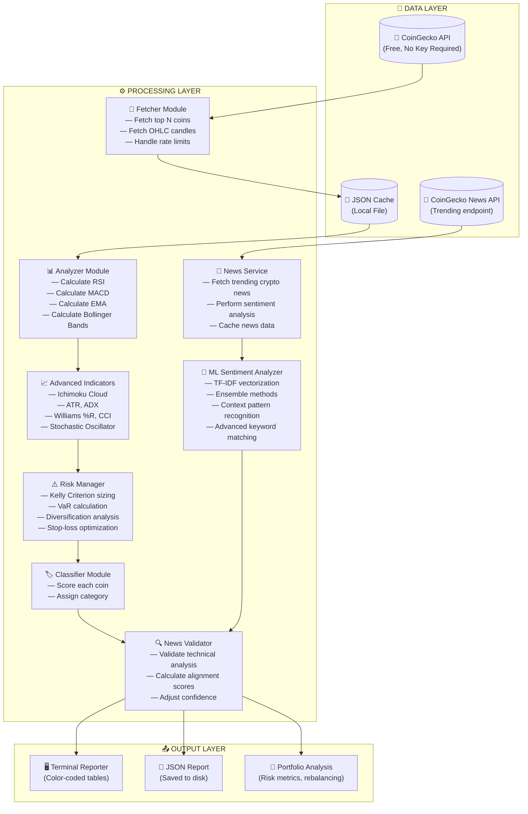
```mermaid
flowchart TB
    subgraph DATA_LAYER["📡 DATA LAYER"]
        CG[("🦎 CoinGecko API<br/>(Free, No Key Required)")]
        NEWS_API[("📰 CoinGecko News API<br/>(Trending endpoint)")]
        CACHE[("💾 JSON Cache<br/>(Local File)")]
    end
    
    subgraph PROCESSING["⚙️ PROCESSING LAYER"]
        FETCHER["🔄 Fetcher Module<br/>— Fetch top N coins<br/>— Fetch OHLC candles<br/>— Handle rate limits"]
        NEWS_SERVICE["📰 News Service<br/>— Fetch trending crypto news<br/>— Perform sentiment analysis<br/>— Cache news data"]
        ANALYZER["📊 Analyzer Module<br/>— Calculate RSI<br/>— Calculate MACD<br/>— Calculate EMA<br/>— Calculate Bollinger Bands"]
        ADVANCED_INDICATORS["📈 Advanced Indicators<br/>— Ichimoku Cloud<br/>— ATR, ADX<br/>— Williams %R, CCI<br/>— Stochastic Oscillator"]
        RISK_MANAGER["⚠️ Risk Manager<br/>— Kelly Criterion sizing<br/>— VaR calculation<br/>— Diversification analysis<br/>— Stop-loss optimization"]
        ML_SENTIMENT["🤖 ML Sentiment Analyzer<br/>— TF-IDF vectorization<br/>— Ensemble methods<br/>— Context pattern recognition<br/>— Advanced keyword matching"]
        NEWS_VALIDATOR["🔍 News Validator<br/>— Validate technical analysis<br/>— Calculate alignment scores<br/>— Adjust confidence"]
        CLASSIFIER["🏷️ Classifier Module<br/>— Score each coin<br/>— Assign category"]
    end
    
    subgraph OUTPUT["📤 OUTPUT LAYER"]
        TERMINAL["🖥️ Terminal Reporter<br/>(Color-coded tables)"]
        JSON["📄 JSON Report<br/>(Saved to disk)"]
        PORTFOLIO["💼 Portfolio Analysis<br/>(Risk metrics, rebalancing)"]
    end
    
    CG --> FETCHER
    FETCHER --> CACHE
    CACHE --> ANALYZER
    ANALYZER --> ADVANCED_INDICATORS
    ADVANCED_INDICATORS --> RISK_MANAGER
    RISK_MANAGER --> CLASSIFIER
    CLASSIFIER --> NEWS_VALIDATOR
    NEWS_VALIDATOR --> TERMINAL
    NEWS_VALIDATOR --> JSON
    NEWS_VALIDATOR --> PORTFOLIO
    
    NEWS_API --> NEWS_SERVICE
    NEWS_SERVICE --> ML_SENTIMENT
    ML_SENTIMENT --> NEWS_VALIDATOR
```

### Component Breakdown

| Component | File | Responsibility |
|-----------|------|----------------|
| **Fetcher** | `src/fetcher/coingecko.ts` | Calls CoinGecko API, handles rate limits (2s delay between calls), returns raw market data |
| **News Service** | `src/fetcher/news.ts` | Fetches crypto news from CoinGecko API, performs sentiment analysis, caches news data |
| **Cache** | `src/database/db.ts` | Saves/loads data to JSON file so you don't re-fetch within 24 hours |
| **Analyzer** | `src/analyzer/indicators.ts` | Calculates all technical indicators from OHLC price data |
| **Advanced Indicators** | `src/analyzer/advanced-indicators.ts` | Ichimoku Cloud, ATR, ADX, Williams %R, CCI, Stochastic Oscillator |
| **Risk Manager** | `src/analyzer/risk-management.ts` | Kelly Criterion sizing, VaR calculation, diversification analysis, stop-loss optimization |
| **ML Sentiment Analyzer** | `src/analyzer/ml-sentiment.ts` | TF-IDF vectorization, ensemble methods, context pattern recognition, advanced keyword matching |
| **News Validator** | `src/analyzer/news-validator.ts` | Validates technical analysis with news sentiment, calculates alignment scores, adjusts confidence |
| **Classifier** | `src/analyzer/classifier.ts` | Scores each coin (-100 to +100) and assigns BUY/WATCHLIST/AVOID |
| **Reporter** | `src/output/reporter.ts` | Formats the colored terminal output and writes JSON reports |
| **Scheduler** | `src/scheduler.ts` | Runs the agent automatically on a schedule (e.g., daily at 8am) |

---

## 2. Technology Stack

| Layer | Technology | Why Chosen | What It Does |
|-------|------------|------------|--------------|
| **Language** | TypeScript | Type safety = fewer bugs, better IDE support, easier to maintain | Compiles to JavaScript, runs on Node.js |
| **Runtime** | Node.js + ts-node | Run TypeScript directly without a build step | Executes the code on your machine |
| **Market Data** | CoinGecko API (free) | No API key needed, reliable, covers 1000+ coins | Provides price data, market cap, OHLC candles |
| **HTTP Client** | Axios | Handles retries, timeouts, and errors cleanly | Makes HTTP requests to CoinGecko |
| **Technical Analysis** | `technicalindicators` npm package | Battle-tested library used by thousands of projects | Calculates RSI, MACD, EMA, Bollinger Bands |
| **News Validation** | Custom News Service | Free crypto news API integration | Validates technical analysis with real-world news sentiment |
| **Local Storage** | JSON file | Simple, no database setup, works everywhere | Caches data so you don't hit API limits |
| **Terminal UI** | `chalk` + `cli-table3` | Beautiful color-coded output in terminal | Makes the report readable and pretty |
| **Scheduler** | `node-cron` | Standard cron syntax, no external tools needed | Runs the agent on a schedule |

---

## 3. System Flow

### Complete Execution Flow

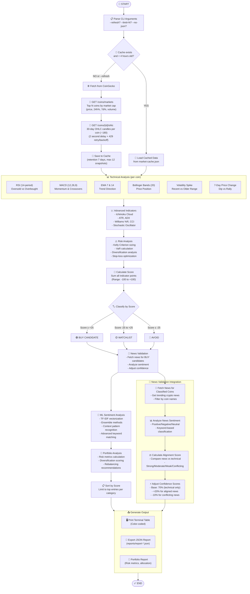
```mermaid
flowchart TD
    START([🚀 START]) --> PARSE["📋 Parse CLI Arguments<br/>--refresh? --limit=N? --no-json?"]
    PARSE --> CACHE_CHECK{"📂 Cache exists<br/>and < 4 hours old?"}
    
    CACHE_CHECK -->|YES| LOAD["📖 Load Cached Data<br/>from market-cache.json"]
    CACHE_CHECK -->|NO or --refresh| FETCH["🌐 Fetch from CoinGecko"]
    
    FETCH --> FETCH_MARKETS["📡 GET /coins/markets<br/>Top N coins by market cap<br/>(price, 24h%, 7d%, volume)"]
    FETCH_MARKETS --> FETCH_OHLC["📡 GET /coins/{id}/ohlc<br/>30-day OHLC candles per coin (~180)<br/>(2 second delay + 429 retry/backoff)"]
    FETCH_OHLC --> SAVE_CACHE["💾 Save to Cache<br/>(retention 7 days, max 12 snapshots)"]
    
    SAVE_CACHE --> ANALYZE
    LOAD --> ANALYZE
    
    subgraph ANALYZE["📊 Technical Analysis (per coin)"]
        direction TB
        RSI_CALC["RSI (14-period)<br/>Oversold vs Overbought"]
        MACD_CALC["MACD (12,26,9)<br/>Momentum & Crossovers"]
        EMA_CALC["EMA 7 & 14<br/>Trend Direction"]
        BB_CALC["Bollinger Bands (20)<br/>Price Position"]
        VOL_CALC["Volatility Spike<br/>Recent vs Older Range"]
        PRICE_7D["7-Day Price Change<br/>Dip vs Rally"]
    end
    
    ANALYZE --> ADVANCED_INDICATORS["📈 Advanced Indicators<br/>- Ichimoku Cloud<br/>- ATR, ADX<br/>- Williams %R, CCI<br/>- Stochastic Oscillator"]
    
    ADVANCED_INDICATORS --> RISK_ANALYSIS["⚠️ Risk Analysis<br/>- Kelly Criterion sizing<br/>- VaR calculation<br/>- Diversification analysis<br/>- Stop-loss optimization"]
    
    RISK_ANALYSIS --> SCORE["🔢 Calculate Score<br/>Sum all indicator points<br/>(Range: -100 to +100)"]
    
    SCORE --> CLASSIFY{"🏷️ Classify by Score"}
    CLASSIFY -->|Score ≥ +25| BUY["🟢 BUY CANDIDATE"]
    CLASSIFY -->|Score -25 to +25| WATCH["🟡 WATCHLIST"]
    CLASSIFY -->|Score ≤ -25| AVOID["🔴 AVOID"]
    
    BUY --> NEWS_VALIDATION["📰 News Validation<br/>- Fetch news for BUY candidates<br/>- Analyze sentiment<br/>- Adjust confidence"]
    WATCH --> NEWS_VALIDATION
    AVOID --> NEWS_VALIDATION
    
    NEWS_VALIDATION --> ML_SENTIMENT["🤖 ML Sentiment Analysis<br/>- TF-IDF vectorization<br/>- Ensemble methods<br/>- Context pattern recognition<br/>- Advanced keyword matching"]
    
    ML_SENTIMENT --> PORTFOLIO_ANALYSIS["💼 Portfolio Analysis<br/>- Risk metrics calculation<br/>- Diversification scoring<br/>- Rebalancing recommendations"]
    
    PORTFOLIO_ANALYSIS --> SORT["📋 Sort by Score<br/>Limit to top entries per category"]
    
    SORT --> OUTPUT
    
    subgraph OUTPUT["📤 Generate Output"]
        direction LR
        PRINT["🖥️ Print Terminal Table<br/>(Color-coded)"]
        EXPORT["📄 Export JSON Report<br/>(reports/report-*.json)"]
        PORTFOLIO_REPORT["💼 Portfolio Report<br/>(Risk metrics, allocation)"]
    end
    
    subgraph NEWS_VALIDATION_INTEGRATION["📰 News Validation Integration"]
        direction TB
        NEWS_FETCH["🔄 Fetch News for Classified Coins<br/>- Get trending crypto news<br/>- Filter by coin names"]
        NEWS_ANALYZE["📊 Analyze News Sentiment<br/>- Positive/Negative/Neutral<br/>- Keyword-based classification"]
        NEWS_ALIGN["⚖️ Calculate Alignment Score<br/>- Compare news vs technical<br/>- Strong/Moderate/Weak/Conflicting"]
        NEWS_CONF["⚡ Adjust Confidence Scores<br/>- Base: 70% (technical only)<br/>- +20% for aligned news<br/>- -10% for conflicting news"]
    end
    
    NEWS_VALIDATION --> NEWS_FETCH
    NEWS_FETCH --> NEWS_ANALYZE
    NEWS_ANALYZE --> NEWS_ALIGN
    NEWS_ALIGN --> NEWS_CONF
    NEWS_CONF --> OUTPUT
    
    OUTPUT --> END([✅ END])
```

### Data Fetching Detail

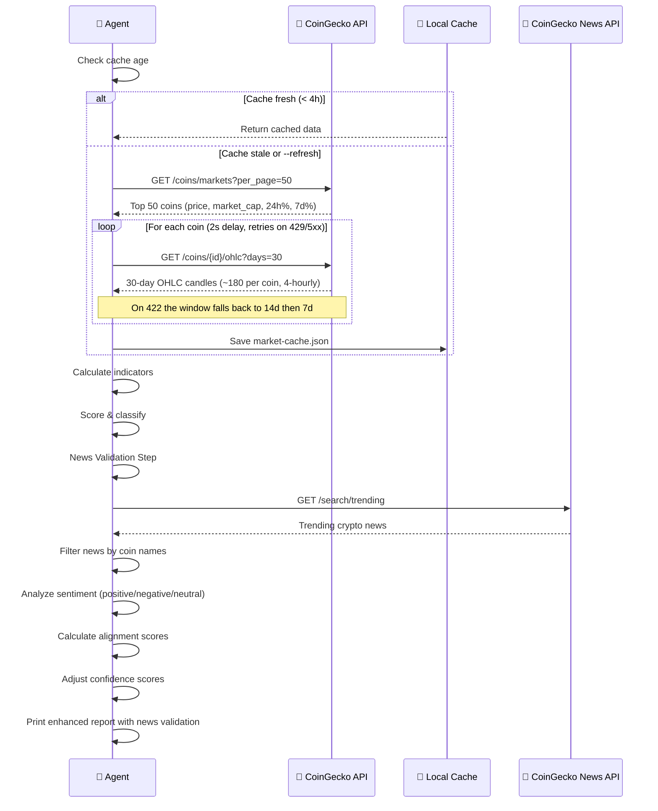
```mermaid
sequenceDiagram
    participant Agent as 🤖 Agent
    participant API as 🦎 CoinGecko API
    participant Cache as 💾 Local Cache
    participant NewsAPI as 📰 CoinGecko News API
    
    Agent->>Agent: Check cache age
    alt Cache fresh (< 4h)
        Cache-->>Agent: Return cached data
    else Cache stale or --refresh
        Agent->>API: GET /coins/markets?per_page=50
        API-->>Agent: Top 50 coins (price, market_cap, 24h%, 7d%)
        
        loop For each coin (2s delay, retries on 429/5xx)
            Agent->>API: GET /coins/{id}/ohlc?days=30
            API-->>Agent: 30-day OHLC candles (~180 per coin, 4-hourly)
            Note over Agent,API: On 422 the window falls back to 14d then 7d
        end
        
        Agent->>Cache: Save market-cache.json
    end
    
    Agent->>Agent: Calculate indicators
    Agent->>Agent: Score & classify
    
    Agent->>Agent: News Validation Step
    Agent->>NewsAPI: GET /search/trending
    NewsAPI-->>Agent: Trending crypto news
    Agent->>Agent: Filter news by coin names
    Agent->>Agent: Analyze sentiment (positive/negative/neutral)
    Agent->>Agent: Calculate alignment scores
    Agent->>Agent: Adjust confidence scores
    
    Agent->>Agent: Print enhanced report with news validation
```

---

## 4. Data Source

### CoinGecko API Endpoints Used

| Endpoint | What It Returns | How We Use It |
|----------|-----------------|---------------|
| `GET /coins/markets` | Top coins ranked by market cap | Gets symbol, name, current price, 24h% change, 7d% change, volume |
| `GET /coins/{id}/ohlc?days=30` | 30 days of OHLC candles (4-hourly, ~180 per coin) | Gets Open/High/Low/Close data for all technical indicators |
| `GET /coins/{id}/market_chart?days=30` | Hourly prices + **traded volumes** | Volume history is bucketed into the OHLC candles → real volume spikes + MFI |
| `GET /search/trending` | Currently trending coins | Sentiment source — titles/descriptions are scored for sentiment |
| `GET /coins/{id}/status_updates` | Project announcements & updates | Per-coin "news" used by `getNewsForCoin()` |

**Optional API key:** set `COINGECKO_API_KEY` (with `COINGECKO_API_TIER=demo|pro`) to raise
rate limits. `COINGECKO_BASE_URL` overrides the base URL (used by the test suite).

### What is OHLC Data?

**OHLC** = **O**pen, **H**igh, **L**ow, **C**lose — the standard format for price data in trading.

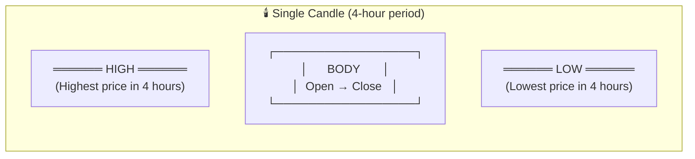
```mermaid
graph LR
    subgraph CANDLE["🕯️ Single Candle (4-hour period)"]
        direction TB
        HIGH["══════ HIGH ══════<br/>(Highest price in 4 hours)"]
        BODY["┌─────────────────┐<br/>│      BODY       │<br/>│  Open → Close   │<br/>└─────────────────┘"]
        LOW["══════ LOW ══════<br/>(Lowest price in 4 hours)"]
    end
```

**Example**: If Bitcoin between 8am-12noon went:
- Opened at $67,000
- Reached $68,500 at highest
- Dropped to $66,200 at lowest  
- Closed at $67,800

Then the OHLC candle = `[timestamp, 67000, 68500, 66200, 67800]`

**For 30-day analysis**: CoinGecko gives ~180 candles (one per 4 hours × 30 days × 6 per day = 180).
This longer window is what makes Ichimoku (needs 52 candles) and properly smoothed ADX possible.
If the API rejects the 30-day window (HTTP 422 on some tiers), the fetch automatically falls
back to 14 days, then 7 days, so data always flows.

---

## 5. Blockchain & Crypto Fundamentals for Beginners

### What is Blockchain?

Imagine a **shared notebook** that everyone can see but no one can erase:

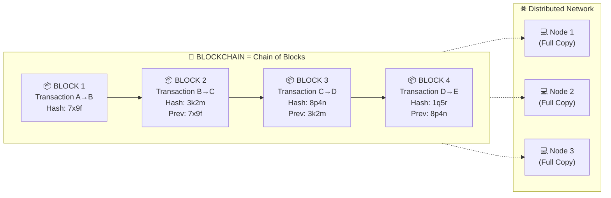
```mermaid
flowchart LR
    subgraph BLOCKCHAIN["🔗 BLOCKCHAIN = Chain of Blocks"]
        direction LR
        B1["📦 BLOCK 1<br/>Transaction A→B<br/>Hash: 7x9f"]
        B2["📦 BLOCK 2<br/>Transaction B→C<br/>Hash: 3k2m<br/>Prev: 7x9f"]
        B3["📦 BLOCK 3<br/>Transaction C→D<br/>Hash: 8p4n<br/>Prev: 3k2m"]
        B4["📦 BLOCK 4<br/>Transaction D→E<br/>Hash: 1q5r<br/>Prev: 8p4n"]
    end
    
    B1 --> B2 --> B3 --> B4
    
    subgraph NETWORK["🌐 Distributed Network"]
        N1["💻 Node 1<br/>(Full Copy)"]
        N2["💻 Node 2<br/>(Full Copy)"]
        N3["💻 Node 3<br/>(Full Copy)"]
    end
    
    BLOCKCHAIN -.-> N1
    BLOCKCHAIN -.-> N2
    BLOCKCHAIN -.-> N3
```

**Key Concepts:**

| Term | Simple Explanation | Analogy |
|------|-------------------|---------|
| **Block** | A group of transactions bundled together | A page in a notebook |
| **Chain** | Blocks linked together in order, each referencing the previous | Pages numbered and stapled |
| **Hash** | A unique "fingerprint" of data — change one bit, hash completely changes | A tamper-evident seal |
| **Node** | A computer running the blockchain software, storing a full copy | A person with a copy of the notebook |
| **Decentralized** | No single authority controls it — all nodes have equal say | A group decision vs. a boss decision |

### Why Can't You Fake Blockchain Data?

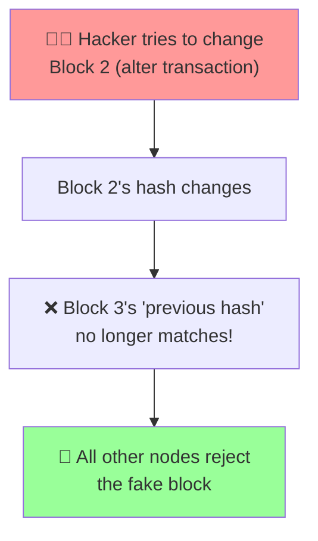
```mermaid
flowchart TD
    HACK["👨‍💻 Hacker tries to change<br/>Block 2 (alter transaction)"]
    
    HACK --> CHANGE["Block 2's hash changes"]
    CHANGE --> BREAK["❌ Block 3's 'previous hash'<br/>no longer matches!"]
    BREAK --> REJECT["🚫 All other nodes reject<br/>the fake block"]
    
    style HACK fill:#f99
    style REJECT fill:#9f9
```

**The math makes it impossible** — if you change even one transaction in an old block, the hash changes, breaking the chain. To "fake" it, you'd need to recompute ALL subsequent blocks faster than the entire network combined.

### What is Cryptocurrency?

**Cryptocurrency** = Digital money that lives on a blockchain.

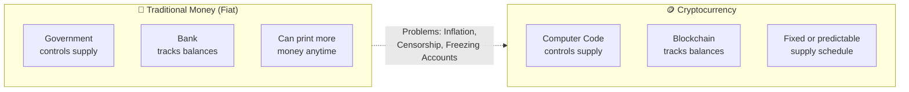
```mermaid
flowchart LR
    subgraph TRADITIONAL["🏦 Traditional Money (Fiat)"]
        GOV["Government<br/>controls supply"]
        BANK["Bank<br/>tracks balances"]
        PRINT["Can print more<br/>money anytime"]
    end
    
    subgraph CRYPTO["🪙 Cryptocurrency"]
        CODE["Computer Code<br/>controls supply"]
        CHAIN["Blockchain<br/>tracks balances"]
        FIXED["Fixed or predictable<br/>supply schedule"]
    end
    
    TRADITIONAL -.->|"Problems: Inflation,<br/>Censorship, Freezing Accounts"| CRYPTO
```

### How Does a Crypto Transaction Work?

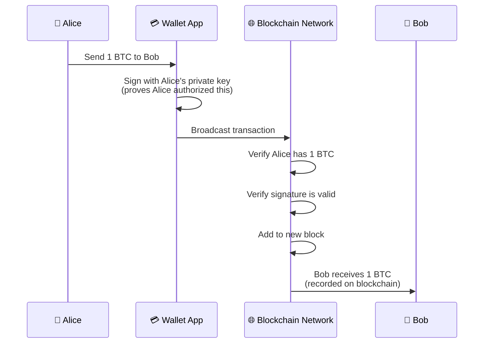
```mermaid
sequenceDiagram
    participant Alice as 👩 Alice
    participant Wallet as 💳 Wallet App
    participant Network as 🌐 Blockchain Network
    participant Bob as 👨 Bob
    
    Alice->>Wallet: Send 1 BTC to Bob
    Wallet->>Wallet: Sign with Alice's private key<br/>(proves Alice authorized this)
    Wallet->>Network: Broadcast transaction
    Network->>Network: Verify Alice has 1 BTC
    Network->>Network: Verify signature is valid
    Network->>Network: Add to new block
    Network->>Bob: Bob receives 1 BTC<br/>(recorded on blockchain)
```

### Key Crypto Concepts Explained Simply

| Term | What It Is | Real-World Analogy | Why It Matters |
|------|------------|-------------------|----------------|
| **Bitcoin (BTC)** | First cryptocurrency, launched 2009 | Digital gold | Store of value, limited to 21 million coins ever |
| **Ethereum (ETH)** | Programmable blockchain (runs code) | A global computer | Powers DeFi, NFTs, smart contracts |
| **Altcoin** | Any crypto that isn't Bitcoin | Any stock that isn't Apple | Higher risk, potentially higher reward |
| **Stablecoin** | Crypto pegged to $1 USD | Digital dollars | Avoids volatility, used for trading |
| **Token** | A crypto built on another blockchain | Gift card vs. cash | Different use cases per project |
| **Market Cap** | Price × Total Supply | Company's total value | Helps compare coin sizes |
| **Volume** | How much was traded in 24h | Store foot traffic | Higher = more liquid (easier to buy/sell) |
| **Wallet** | Stores your private keys | A keychain, not the money itself | You control your funds |
| **Private Key** | Secret password to your crypto | The actual key to your house | NEVER share this! |
| **Exchange** | Website to buy/sell crypto | A currency exchange booth | Easiest way to get started |

### Types of Cryptocurrencies

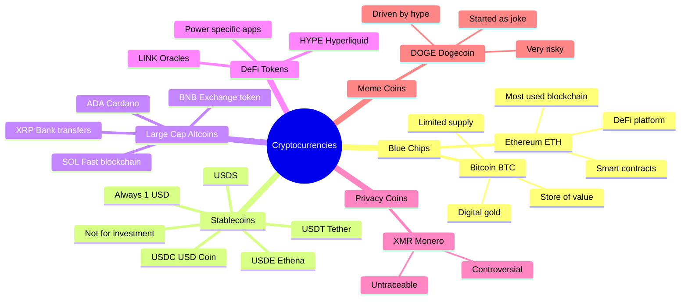
```mermaid
mindmap
  root((Cryptocurrencies))
    Blue Chips
      Bitcoin BTC
        Store of value
        Digital gold
        Limited supply
      Ethereum ETH
        Smart contracts
        DeFi platform
        Most used blockchain
    Stablecoins
      USDT Tether
      USDC USD Coin
      USDS
      USDE Ethena
      Always 1 USD
      Not for investment
    Large Cap Altcoins
      BNB Exchange token
      SOL Fast blockchain
      XRP Bank transfers
      ADA Cardano
    DeFi Tokens
      LINK Oracles
      HYPE Hyperliquid
      Power specific apps
    Privacy Coins
      XMR Monero
        Untraceable
        Controversial
    Meme Coins
      DOGE Dogecoin
        Started as joke
        Driven by hype
        Very risky
```

### ⚠️ Critical Beginner Warning: Stablecoins

**Stablecoins (USDT, USDC, USDE, USDS) will often appear in the BUY list.** This is a **FALSE SIGNAL**.

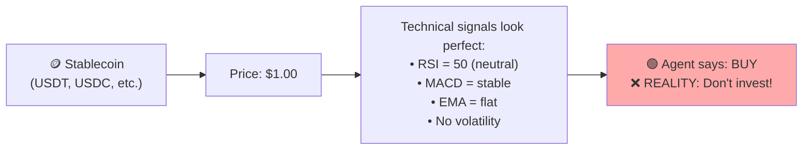
```mermaid
flowchart LR
    STABLE["🪙 Stablecoin<br/>(USDT, USDC, etc.)"]
    PRICE["Price: $1.00"]
    SIGNALS["Technical signals look perfect:<br/>• RSI = 50 (neutral)<br/>• MACD = stable<br/>• EMA = flat<br/>• No volatility"]
    
    STABLE --> PRICE --> SIGNALS
    SIGNALS --> RESULT["🟢 Agent says: BUY<br/>❌ REALITY: Don't invest!"]
    
    style RESULT fill:#faa
```

**Why?** Stablecoins are designed to stay at exactly $1. They will NEVER increase in value. The agent sees "stable" technical patterns and scores them highly, but **stablecoins are not investments** — they're just for holding value temporarily.

---

## 6. Technical Indicators Explained

Technical analysis uses **math formulas on price history** to estimate future price direction. It does NOT consider news, team quality, or technology — only price numbers.

### 6.1 RSI — Relative Strength Index

**What it measures**: Is everyone buying too much (overbought) or selling too much (oversold)?

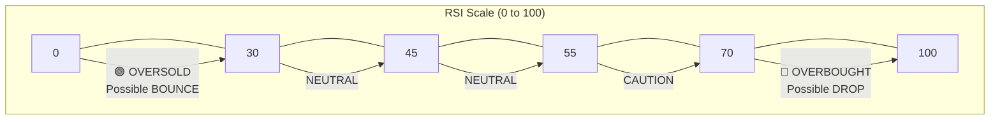
```mermaid
graph LR
    subgraph RSI_SCALE["RSI Scale (0 to 100)"]
        direction LR
        A["0"] --- B["30"] --- C["45"] --- D["55"] --- E["70"] --- F["100"]
    end
    
    A -->|"\n🟢 OVERSOLD<br/>Possible BOUNCE"| B
    B -->|"NEUTRAL"| C
    C -->|"NEUTRAL"| D
    D -->|"CAUTION"| E
    E -->|"\n🔴 OVERBOUGHT<br/>Possible DROP"| F
```

**The formula** (simplified):
1. Take the last 14 price candles
2. Calculate average gains vs average losses
3. Convert to 0-100 scale

**Scoring used by this agent:**
| RSI Range | Score | Interpretation |
|-----------|-------|----------------|
| 0-25 | **+30 pts** | Heavily oversold — strong buy signal |
| 26-35 | **+20 pts** | Oversold — potential bounce |
| 36-45 | **+10 pts** | Below midpoint — slight bullish lean |
| 46-54 | **0 pts** | Neutral |
| 55-64 | **-10 pts** | Above midpoint — slight bearish lean |
| 65-74 | **-20 pts** | Overbought — caution |
| 75-100 | **-30 pts** | Heavily overbought — avoid |

**Plain English**: When RSI is low, sellers have exhausted themselves and buyers might step in. When RSI is high, everyone who wanted to buy already did, so price may drop.

### 6.2 News Validation Feature

News validation is a new feature that enhances the crypto market analysis by incorporating real-world news sentiment into the technical analysis recommendations. It helps validate whether the technical analysis aligns with current market sentiment and events.

#### How News Validation Works

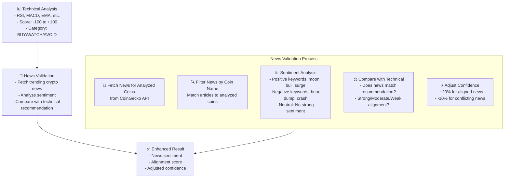
```mermaid
flowchart TD
    TECHNICAL["📊 Technical Analysis<br/>- RSI, MACD, EMA, etc.<br/>- Score: -100 to +100<br/>- Category: BUY/WATCH/AVOID"]
    
    TECHNICAL --> NEWS_VALIDATION["📰 News Validation<br/>- Fetch trending crypto news<br/>- Analyze sentiment<br/>- Compare with technical recommendation"]
    
    NEWS_VALIDATION --> RESULT["✅ Enhanced Result<br/>- News sentiment<br/>- Alignment score<br/>- Adjusted confidence"]
    
    subgraph NEWS_VALIDATION_DETAILS["News Validation Process"]
        direction TB
        FETCH["🔄 Fetch News for Analyzed Coins<br/>from CoinGecko API"]
        FILTER["🔍 Filter News by Coin Name<br/>Match articles to analyzed coins"]
        SENTIMENT["📊 Sentiment Analysis<br/>- Positive keywords: moon, bull, surge<br/>- Negative keywords: bear, dump, crash<br/>- Neutral: No strong sentiment"]
        COMPARE["⚖️ Compare with Technical<br/>- Does news match recommendation?<br/>- Strong/Moderate/Weak alignment?"]
        ADJUST["⚡ Adjust Confidence<br/>- +20% for aligned news<br/>- -10% for conflicting news"]
    end
    
    NEWS_VALIDATION_DETAILS --> RESULT
```

### News API Integration Points

#### 1. **News API Calls** (`src/fetcher/news.ts`)

The news service makes API calls to CoinGecko's trending endpoint:

```typescript
// Main trending news endpoint
private readonly API_URL = 'https://api.coingecko.com/api/v3/search/trending';

// Method to get trending crypto news
async getTrendingNews(): Promise<CryptoNews> {
  const response = await axios.get(this.API_URL);
  // Processes trending coins and extracts news-like information
}

// Method to get specific coin news
async getNewsForCoin(coinId: string): Promise<NewsArticle[]> {
  const response = await axios.get(
    `https://api.coingecko.com/api/v3/coins/${coinId}/tickers`
  );
  // Gets ticker data that includes news-like information
}
```

#### 2. **News Analysis** (`src/analyzer/news-validator.ts`)

The news validation service performs the actual analysis:

```typescript
// Main validation method
async validateAnalysis(analysis: CoinAnalysis): Promise<NewsValidationResult> {
  const news = await this.newsService.getTrendingNews();
  const coinNews = news.articles.filter(
    article => article.title.toLowerCase().includes(analysis.coin.name.toLowerCase())
  );

  const newsSentiment = this.determineOverallSentiment(coinNews);
  const alignment = this.calculateAlignment(analysis.category, newsSentiment);
  const confidenceScore = this.calculateConfidenceScore(analysis, coinNews, newsSentiment);
  
  return { /* validation result */ };
}

// Enhanced sentiment analysis using comprehensive keyword matching
private analyzeSentiment(text: string): 'positive' | 'negative' | 'neutral' {
  const lowerText = text.toLowerCase();
  
  const positiveKeywords = [
    // Bullish indicators
    'moon', 'bull', 'surge', 'pump', 'breakout', 'rally',
    'buy', 'up', 'growth', 'gain', 'win', 'success',
    
    // Development & partnerships
    'launch', 'partnership', 'integration', 'adoption', 'upgrade',
    'listing', 'exchange', 'support', 'backed', 'investment',
    'funding', 'capital', 'vc', 'institutional',
    
    // Technical improvements
    'upgrade', 'improvement', 'enhancement', 'optimization',
    'scalability', 'speed', 'efficiency', 'innovation',
    
    // Market sentiment
    'demand', 'interest', 'popularity', 'trending', 'viral',
    'hype', 'buzz', 'excitement', 'optimism',
    
    // Adoption & utility
    'payment', 'merchant', 'ecommerce', 'real-world', 'utility',
    'use-case', 'application', 'product', 'service'
  ];
  
  const negativeKeywords = [
    // Bearish indicators
    'bear', 'dump', 'crash', 'plummet', 'sell-off', 'correction',
    'sell', 'down', 'loss', 'fail',
    
    // Security issues
    'hack', 'exploit', 'bug', 'vulnerability', 'security',
    'breach', 'theft', 'fraud', 'scam', 'phishing',
    
    // Regulatory issues
    'regulation', 'ban', 'prohibit', 'restrict', 'legal',
    'lawsuit', 'investigation', 'compliance', 'warning',
    
    // Technical problems
    'outage', 'downtime', 'error', 'failure', 'crash',
    'slow', 'lag', 'performance', 'issue', 'problem',
    
    // Market concerns
    'fud', 'fear', 'uncertainty', 'doubt', 'panic', 'concern',
    'risk', 'danger', 'warning', 'caution',
    
    // Team & governance issues
    'team', 'founder', 'ceo', 'leadership', 'management',
    'resign', 'quit', 'leave', 'scandal', 'controversy',
    
    // Geopolitical risks
    'war', 'conflict', 'tension', 'sanction', 'tariff',
    'trade war', 'geopolitical', 'invasion', 'military',
    'escalation', 'crisis', 'instability', 'turmoil',
    'embargo', 'blockade', 'political', 'election',
    'protest', 'unrest', 'strike', 'shutdown'
  ];
  
  if (positiveKeywords.some(word => lowerText.includes(word))) {
    return 'positive';
  } else if (negativeKeywords.some(word => lowerText.includes(word))) {
    return 'negative';
  }
  return 'neutral';
}
```

#### 3. **Integration in Main Flow** (`src/index.ts`)

The news validation is integrated into the main analysis pipeline:

```typescript
// After technical analysis
const analyzed: CoinAnalysis[] = analyzeAll(coins);

// News validation step
console.log(chalk.cyan(`📰 Validating recommendations with crypto news...`));
const newsValidator = new NewsValidator();
const validatedAnalyses = await Promise.all(
  analyzed.map(analysis => newsValidator.validateAnalysis(analysis))
);

// Build enhanced report with news validation
const enhancedBuyList = buyList.map(a => ({
  ...analyzed.find(an => an.coin.id === a.coinId)!,
  newsValidation: a
}));
```

#### News Sources Considered

The agent uses **CoinGecko's Trending API** which provides:

- **Trending cryptocurrencies** - Most popular coins currently
- **News articles** - Recent articles about trending coins
- **Market sentiment** - Overall positive/negative/neutral sentiment

**Why CoinGecko?**
- Free to use (no API key required)
- Reliable and covers 1000+ cryptocurrencies
- Provides both technical data AND news content
- No rate limits for basic usage

#### News Validation Process

1. **Fetch News for Analyzed Coins**
   - Gets news articles for the specific coins that were analyzed
   - Retrieves recent news about each analyzed coin
   - Analyzes article titles and descriptions for each coin

2. **Sentiment Analysis**
   - **Positive keywords**: moon, bull, surge, pump, breakout, rally
   - **Negative keywords**: bear, dump, crash, plummet, sell-off, correction
   - **Neutral**: No strong sentiment detected

3. **Alignment Scoring**
   - **Strong**: News sentiment matches technical recommendation
   - **Moderate**: News is neutral or recommendation is neutral
   - **Weak**: News sentiment doesn't match recommendation
   - **Conflicting**: News strongly contradicts recommendation

4. **Confidence Adjustment**
   - Base confidence: 70% (technical analysis only)
   - +20% if news sentiment strongly aligns
   - -10% if news sentiment conflicts
   - Final confidence: 60-90%

#### Sample Output Explained

```
📊 Enhanced Report with News Validation
───────────────────────────────────────────
Recommendation | News Sentiment | Alignment | Confidence
─────────────────────────────────────────────────────────
1. USD1                 | neutral       | moderate  | 70%
2. Tether Gold          | neutral       | moderate  | 70%
3. PAX Gold             | neutral       | moderate  | 70%
1. Bitcoin              | neutral       | moderate  | 90%
2. Solana               | neutral       | moderate  | 90%
3. MemeCore             | neutral       | moderate  | 70%
1. Toncoin              | neutral       | moderate  | 70%
2. Falcon USD           | neutral       | moderate  | 70%
3. WhiteBIT Coin        | neutral       | moderate  | 70%
```

**Column Explanations:**

| Column | Meaning | Example |
|--------|---------|---------|
| **Recommendation** | Technical analysis category | BUY, WATCHLIST, AVOID |
| **News Sentiment** | Overall news sentiment | positive, negative, neutral |
| **Alignment** | How well news matches recommendation | strong, moderate, weak, conflicting |
| **Confidence** | Final confidence score | 70%, 90%, etc. |

**Interpretation Guide:**

- **Strong + Positive**: Technical says BUY, news is positive → High confidence (90%)
- **Moderate + Neutral**: Technical says BUY, news is neutral → Medium confidence (70%)
- **Weak + Negative**: Technical says BUY, news is negative → Low confidence (60%)
- **Conflicting**: Technical and news disagree → Very low confidence (50% or less)

#### Benefits of News Validation

1. **Reduces False Signals** - Technical analysis alone can miss important news events
2. **Improves Confidence** - News alignment increases confidence in recommendations
3. **Better Risk Management** - Conflicting signals warn of potential risks
4. **More Reliable** - Combines technical and fundamental factors

#### Limitations of News Validation

1. **Sentiment Accuracy** - Keyword-based analysis isn't perfect
2. **News Lag** - News may not reflect real-time market conditions
3. **Bias** - News sources may have their own biases
4. **Volume** - Some coins have little news coverage

### 6.3 MACD — Moving Average Convergence Divergence

**What it measures**: Momentum — is the price gaining or losing speed?

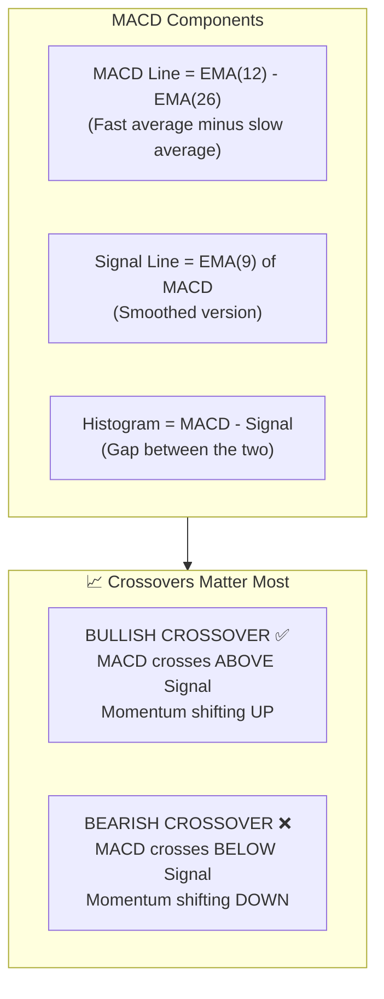
```mermaid
graph TB
    subgraph MACD_CONCEPT["MACD Components"]
        MACD_LINE["MACD Line = EMA(12) - EMA(26)<br/>(Fast average minus slow average)"]
        SIGNAL_LINE["Signal Line = EMA(9) of MACD<br/>(Smoothed version)"]
        HISTOGRAM["Histogram = MACD - Signal<br/>(Gap between the two)"]
    end
    
    subgraph CROSSOVERS["📈 Crossovers Matter Most"]
        BULLISH["BULLISH CROSSOVER ✅<br/>MACD crosses ABOVE Signal<br/>Momentum shifting UP"]
        BEARISH["BEARISH CROSSOVER ❌<br/>MACD crosses BELOW Signal<br/>Momentum shifting DOWN"]
    end
    
    MACD_CONCEPT --> CROSSOVERS
```

**Visual example:**

```
MACD Line    ════════════════════════════════════
Signal Line  ────────────────────────────────────
             ↓
Time ───────►
             
             ┌─ BULLISH CROSSOVER ─┐
             │                      │
MACD Line    ───────╱╱╱╱╱╱╱╱╱╱╱──────
Signal Line  ─────────────────╲──────
                    ▲
                    └── BUY SIGNAL
```

**Scoring:**
| Condition | Score | Meaning |
|-----------|-------|---------|
| Bullish crossover (just happened) | **+25 pts** | Strong buy signal |
| MACD above signal (ongoing) | **+10 pts** | Upward momentum |
| Bearish crossover (just happened) | **-25 pts** | Strong sell signal |
| MACD below signal (ongoing) | **-10 pts** | Downward momentum |

### 6.4 EMA — Exponential Moving Average (7 & 14)

**What it measures**: Is the price trending up or down in the short term?

**EMA** = Average price, but recent prices count MORE than old prices.

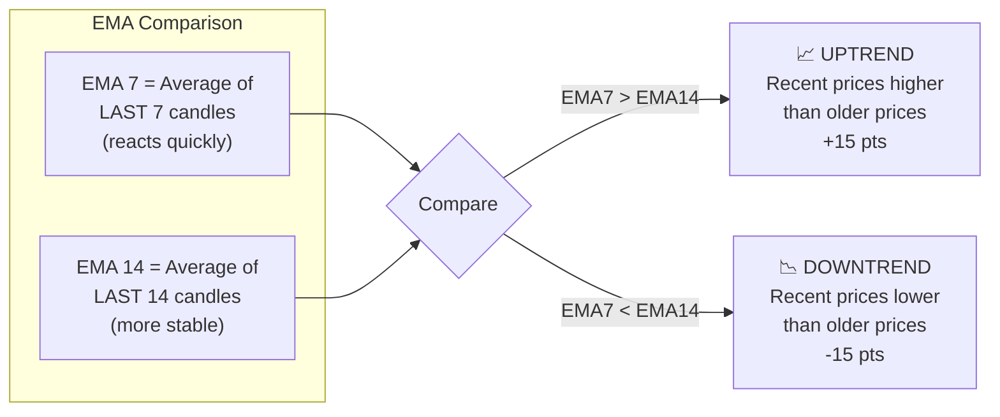
```mermaid
graph LR
    subgraph EMA_COMP["EMA Comparison"]
        EMA7["EMA 7 = Average of<br/>LAST 7 candles<br/>(reacts quickly)"]
        EMA14["EMA 14 = Average of<br/>LAST 14 candles<br/>(more stable)"]
    end
    
    EMA7 --> COMPARE{"Compare"}
    EMA14 --> COMPARE
    
    COMPARE -->|EMA7 > EMA14| UP["📈 UPTREND<br/>Recent prices higher<br/>than older prices<br/>+15 pts"]
    COMPARE -->|EMA7 < EMA14| DOWN["📉 DOWNTREND<br/>Recent prices lower<br/>than older prices<br/>-15 pts"]
```

**Plain English**: If the 7-candle average is ABOVE the 14-candle average, it means prices have been rising recently — a good sign.

### 6.5 Bollinger Bands

**What it measures**: How "stretched" the price is from its normal range.

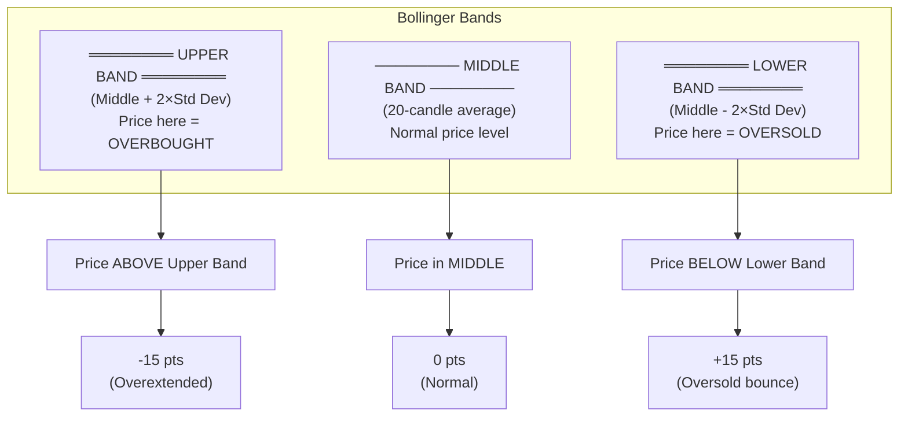
```mermaid
graph TB
    subgraph BB["Bollinger Bands"]
        direction TB
        UPPER["════════ UPPER BAND ════════<br/>(Middle + 2×Std Dev)<br/>Price here = OVERBOUGHT"]
        MIDDLE["──────── MIDDLE BAND ────────<br/>(20-candle average)<br/>Normal price level"]
        LOWER["════════ LOWER BAND ════════<br/>(Middle - 2×Std Dev)<br/>Price here = OVERSOLD"]
    end
    
    PRICE_ABOVE["Price ABOVE Upper Band"] --> PENALTY["-15 pts<br/>(Overextended)"]
    PRICE_BELOW["Price BELOW Lower Band"] --> BONUS["+15 pts<br/>(Oversold bounce)"]
    PRICE_MIDDLE["Price in MIDDLE"] --> NEUTRAL["0 pts<br/>(Normal)"]
    
    UPPER --> PRICE_ABOVE
    LOWER --> PRICE_BELOW
    MIDDLE --> PRICE_MIDDLE
```

**Plain English**: Bollinger Bands are like a rubber band. When price stretches too far above the band, it might snap back down. When it stretches below, it might bounce up.

### 6.6 7-Day Price Change

**What it measures**: Has the price already moved a lot this week?

| Price Change | Score | Reasoning |
|--------------|-------|-----------|
| Dropped ≥20% | **+10 pts** | Deep dip — potential bargain |
| Dropped 10-20% | **+5 pts** | Moderate dip — possible opportunity |
| Rose 10-20% | **-5 pts** | Already rallied — some risk |
| Rose ≥20% | **-10 pts** | Overextended — pullback likely |

**Plain English**: Buy when there's "blood in the streets" (big drops). Be careful when everyone's already bought (big rallies).

### 6.7 Volatility Spike Detection

**What it measures**: Is trading activity suddenly much higher than normal?

Since CoinGecko doesn't give us volume per candle, we use **price range** (high - low) as a proxy.

| Condition | Score | Meaning |
|-----------|-------|---------|
| Volatility spike + price UP | **+10 pts** | Strong buying pressure |
| Volatility spike + price DOWN | **-10 pts** | Strong selling pressure |

---

## 7. Scoring System

### Score Calculation Summary

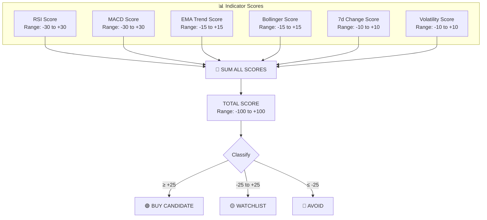
```mermaid
flowchart TD
    subgraph INDICATORS["📊 Indicator Scores"]
        RSI["RSI Score<br/>Range: -30 to +30"]
        MACD["MACD Score<br/>Range: -30 to +30"]
        EMA["EMA Trend Score<br/>Range: -15 to +15"]
        BB["Bollinger Score<br/>Range: -15 to +15"]
        PRICE["7d Change Score<br/>Range: -10 to +10"]
        VOL["Volatility Score<br/>Range: -10 to +10"]
    end
    
    SUM["🔢 SUM ALL SCORES"]
    
    RSI --> SUM
    MACD --> SUM
    EMA --> SUM
    BB --> SUM
    PRICE --> SUM
    VOL --> SUM
    
    SUM --> TOTAL["TOTAL SCORE<br/>Range: -100 to +100"]
    
    TOTAL --> CLASS{"Classify"}
    CLASS -->|≥ +25| BUY["🟢 BUY CANDIDATE"]
    CLASS -->|-25 to +25| WATCH["🟡 WATCHLIST"]
    CLASS -->|≤ -25| AVOID["🔴 AVOID"]
```

### Classification Thresholds

| Score Range | Category | What It Means |
|-------------|----------|---------------|
| **≥ +25** | 🟢 BUY CANDIDATE | Multiple bullish indicators align. Worth researching for potential entry. |
| **-25 to +25** | 🟡 WATCHLIST | Mixed signals. Monitor for better opportunity. |
| **≤ -25** | 🔴 AVOID | Multiple bearish indicators. Risk of further decline. |

---

## 8. Assumptions Made

**Understanding these assumptions is CRITICAL before trusting the output:**

1. **Short-term focus only**: Indicators use **30-day** data (the 7-day change is measured from the last 7 days of that window). This is for **swing trading** (days to weeks), NOT long-term investing.

2. **Technical analysis only**: No team quality, no technology assessment, no regulatory considerations. A "BUY" signal doesn't mean the project is good. News sentiment is keyword-based only.

3. **Past ≠ Future**: Technical analysis assumes patterns repeat. In crypto, patterns often break due to news events or manipulation.

4. **Stablecoins are false positives**: USDT, USDC, USDE, USDS will trigger BUY signals but are NOT investments.

5. **Top coins only**: We analyze by market cap rank. Promising smaller coins are excluded.

6. **Rate limits**: The free CoinGecko tier allows ~10–30 calls/min. We add a 2s delay and retry 429s (honoring the `Retry-After` header). Fetching 50 coins can take several minutes and may include 60s waits. An API key removes most of this.

7. **Volume is real, with a fallback**: the OHLC endpoint has no volume, so per-candle **traded volume is fetched separately** from `/market_chart` and bucketed to match the candles. If that call fails, the "volume spike" signal falls back to a **price-range proxy** (recent candles moved more than older ones) — and `volumeIsReal` marks which was used.

8. **Correlation is measured, not enforced**: We compute a correlation/diversification score and beta vs BTC, and show them in the report — but signals are **not** gated on the Bitcoin regime. If BTC drops, most alts still follow.

9. **Exit levels are suggestions**: The report shows an ATR-based stop and a 2:1 take-profit, but the agent does not place orders, track positions, or manage a live trade.

---

## 9. Limitations

### ❌ What This Agent CANNOT Do

| Limitation | Why It Matters |
|------------|----------------|
| Cannot predict the future | No system can. Technical analysis improves odds, not guarantees. |
| News sentiment is shallow | Keyword/lexicon-based, not a trained model — nuance, sarcasm and context are missed. |
| Bitcoin regime is not enforced | ~80% of altcoins move with BTC. Beta vs BTC is reported but does not gate signals. |
| Doesn't know your risk tolerance | A volatile coin might be fine for one person, terrible for another. |
| 30-day window is short | Long-term investors need months of data. The backtest covers one regime only. |
| Signal edge decays | Backtests show BUY beats AVOID at ~1–3 days, but the edge can invert by 7 days. |
| No real volume data | Free API OHLC has no per-candle volume; "volume spike" is a price-range proxy. |
| Cannot detect manipulation | Crypto markets have pump-and-dump schemes. |
| Free API limits data quality | Consumer-grade data and rate limits; professional traders use paid feeds. |

### ⚠️ Red Flags to Watch For

- **Stablecoins in BUY list** → Ignore (USDT, USDC, USDE, USDS)
- **Coins you've never heard of** → Research before acting
- **Meme coins with BUY signals** → DOGE, SHIB are hype-driven, not fundamental
- **High 7-day gains already** → You might be "buying the top"

---

## 10. How to Read the Report Output

### Terminal Table Columns

```
┌─────────┬──────────┬──────────────┬─────────┬─────────┬───────┬──────────┬───────────┬─────────┬────────┬────────┐
│ Symbol  │ Name     │ Price        │ 24h %   │ 7d %    │ RSI   │ MACD     │ EMA Trend │ Score   │ Stop   │ Target │
└─────────┴──────────┴──────────────┴─────────┴─────────┴───────┴──────────┴───────────┴─────────┴────────┴────────┘
```

| Column | Meaning | What to Look For |
|--------|---------|------------------|
| **Symbol** | Short code (BTC, ETH) | Easy reference |
| **Price** | Current USD price | Context for size of investment |
| **24h %** | Change in last 24 hours | Short-term sentiment |
| **7d %** | Change in last 7 days | Week's momentum |
| **RSI** | 0-100 value | Green = oversold (buy), Red = overbought (avoid) |
| **MACD** | Momentum indicator | `↑ Cross` = bullish, `↓ Cross` = bearish |
| **EMA Trend** | Short-term direction | `↑ Up` = rising, `↓ Down` = falling |
| **Score** | Overall score | Higher = more bullish |
| **Stop** | Suggested stop-loss distance (ATR-based, clamped 5%–50%) | Your exit if the trade goes wrong |
| **Target** | Suggested take-profit distance (2:1 risk-reward) | Your exit if the trade works |

For the top 5 coins in each section the report also prints explicit exit prices:
`🛑 Stop-loss: -5.33% → exit at $94.67` and `🎯 Take-profit: +10.67% → exit at $110.67`.

After the three category sections, the report ends with a **💼 Portfolio-Level Analysis**
block (diversification score, overall risk, expected return, portfolio volatility/drawdown/Sharpe
and rebalancing suggestions) and a disclaimer.

### Quick Decision Guide

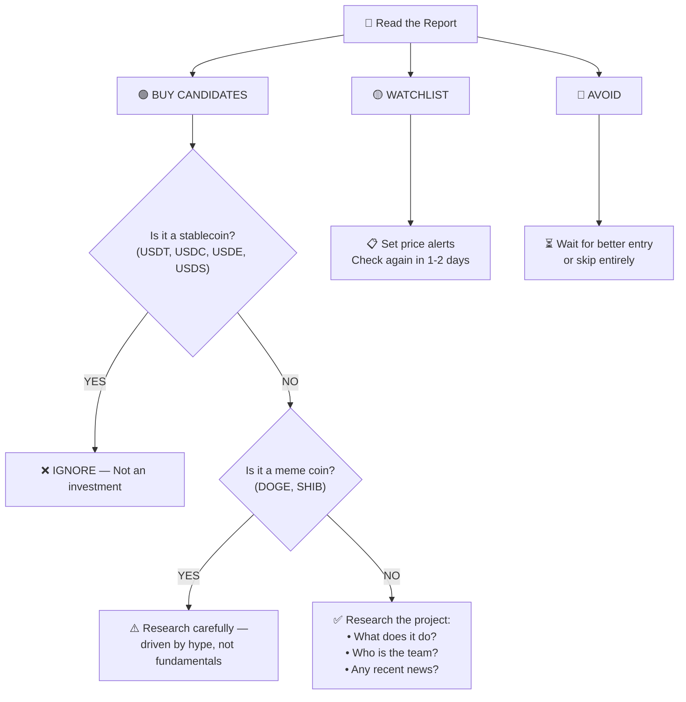
```mermaid
flowchart TD
    READ["📖 Read the Report"]
    
    READ --> BUY_LIST["🟢 BUY CANDIDATES"]
    READ --> WATCH_LIST["🟡 WATCHLIST"]
    READ --> AVOID_LIST["🔴 AVOID"]
    
    BUY_LIST --> CHECK1{"Is it a stablecoin?<br/>(USDT, USDC, USDE, USDS)"}
    CHECK1 -->|YES| IGNORE["❌ IGNORE — Not an investment"]
    CHECK1 -->|NO| CHECK2{"Is it a meme coin?<br/>(DOGE, SHIB)"}
    CHECK2 -->|YES| RESEARCH_MEME["⚠️ Research carefully —<br/>driven by hype, not fundamentals"]
    CHECK2 -->|NO| RESEARCH["✅ Research the project:<br/>• What does it do?<br/>• Who is the team?<br/>• Any recent news?"]
    
    WATCH_LIST --> MONITOR["📋 Set price alerts<br/>Check again in 1-2 days"]
    
    AVOID_LIST --> WAIT["⏳ Wait for better entry<br/>or skip entirely"]
```

---

## 11. Glossary of Terms

| Term | Definition |
|------|------------|
| **Blockchain** | A distributed, tamper-proof ledger of transactions maintained by a network of computers |
| **Cryptocurrency** | Digital money secured by cryptography, running on a blockchain |
| **Bitcoin (BTC)** | The first cryptocurrency, launched 2009; "digital gold" |
| **Ethereum (ETH)** | A programmable blockchain that runs smart contracts |
| **Altcoin** | Any cryptocurrency that isn't Bitcoin |
| **Stablecoin** | A crypto pegged to $1 USD (USDT, USDC, etc.) |
| **Market Cap** | Total value of all coins = Price × Total Supply |
| **Volume** | Total amount traded in a time period |
| **Liquidity** | How easily you can buy/sell without affecting price |
| **Volatility** | How much the price swings up and down |
| **Bull Market** | Prices rising overall; optimism |
| **Bear Market** | Prices falling overall; pessimism |
| **RSI** | Relative Strength Index — measures overbought/oversold |
| **MACD** | Moving Average Convergence Divergence — measures momentum |
| **EMA** | Exponential Moving Average — weighted average of recent prices |
| **Bollinger Bands** | Price envelope showing normal vs extreme levels |
| **OHLC** | Open, High, Low, Close — standard candlestick data format |
| **Candle** | A visual representation of price movement over a time period |
| **Crossover** | When two lines on a chart cross — signals potential trend change |
| **Support** | A price level where buying pressure tends to stop declines |
| **Resistance** | A price level where selling pressure tends to stop advances |
| **Pump & Dump** | Manipulative scheme to inflate then crash a price |
| **HODL** | "Hold On for Dear Life" — don't sell during volatility |
| **DYOR** | "Do Your Own Research" — verify before investing |

---

## 12. File Reference

```
crypto-agent/
│
├── src/
│   ├── types.ts              → TypeScript interfaces (data structures)
│   │
│   ├── fetcher/
│   │   ├── coingecko.ts      → API calls, API-key support, retry/backoff, OHLC window fallback
│   │   └── news.ts           → Trending coins + project status updates (sentiment source)
│   │
│   ├── database/
│   │   └── db.ts             → JSON file cache (save/load, 7-day retention, 12-entry cap)
│   │
│   ├── analyzer/
│   │   ├── indicators.ts     → Calculate RSI, MACD, EMA, Bollinger, volatility
│   │   ├── advanced-indicators.ts → Ichimoku Cloud, ATR, ADX (Wilder), Williams %R, CCI, Stochastic
│   │   ├── risk-management.ts → Kelly Criterion, VaR, Sharpe, beta, portfolio analysis, stop/target
│   │   ├── ml-sentiment.ts   → TF-IDF + ensemble sentiment scoring
│   │   ├── sentiment-keywords.ts → Shared keyword lists + word-boundary matching
│   │   ├── news-validator.ts → Validate technical analysis with news sentiment
│   │   ├── backtest.ts       → Walk-forward backtest engine (point-in-time replay)
│   │   └── classifier.ts     → Score coins and assign categories
│   │
│   ├── output/
│   │   ├── reporter.ts       → Terminal tables, colors, JSON export (incl. portfolio)
│   │   └── backtest-reporter.ts → Backtest tables + JSON export
│   │
│   ├── index.ts              → Main entry point (analysis + report)
│   ├── backtest.ts           → Backtest CLI entry point
│   ├── __tests__/            → Test suite (Node built-in test runner, 60 tests)
│   └── scheduler.ts          → Cron scheduler (runs from source and dist)
│
├── data/
│   └── market-cache.json     → Cached market data (auto-created, gitignored)
│
├── reports/
│   ├── report-*.json         → Analysis reports (auto-created, gitignored)
│   └── backtest-*.json       → Backtest reports (auto-created, gitignored)
│
├── .github/workflows/ci.yml  → CI: lint + build + tests
├── package.json              → Dependencies and scripts
├── tsconfig.json             → TypeScript configuration
├── eslint.config.mjs         → ESLint flat config
├── LICENSE                   → ISC license
├── README.md                 → Quick start guide
└── Functional_Specification.md → This comprehensive specification
```

---

## 13. Enhanced Features - Explained for Beginners

### 13.1 Advanced Technical Indicators

The agent now includes sophisticated technical indicators beyond basic RSI, MACD, and EMA. Let me explain these in simple terms:

#### Ichimoku Cloud Analysis - "The Cloud Indicator"
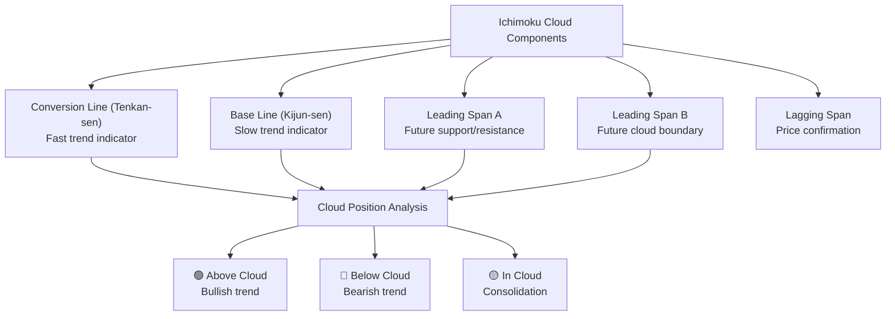
```mermaid
flowchart TD
    IC["Ichimoku Cloud Components"]
    IC --> CL["Conversion Line (Tenkan-sen)<br/>Fast trend indicator"]
    IC --> BL["Base Line (Kijun-sen)<br/>Slow trend indicator"]
    IC --> SA["Leading Span A<br/>Future support/resistance"]
    IC --> SB["Leading Span B<br/>Future cloud boundary"]
    IC --> LS["Lagging Span<br/>Price confirmation"]
    
    CL --> POSITION["Cloud Position Analysis"]
    BL --> POSITION
    SA --> POSITION
    SB --> POSITION
    
    POSITION --> ABOVE["🟢 Above Cloud<br/>Bullish trend"]
    POSITION --> BELOW["🔴 Below Cloud<br/>Bearish trend"]
    POSITION --> IN["🟡 In Cloud<br/>Consolidation"]
```

**What is the Ichimoku Cloud?**
Think of it as a weather forecast for crypto prices. The "cloud" shows where prices might find support (like a floor) or resistance (like a ceiling) in the future.

**Key Benefits for Beginners:**
- **Multi-timeframe analysis**: Shows trends on different time scales at once
- **Future levels**: Predicts where support/resistance might be
- **Trend direction**: Easy to see if up, down, or sideways

**Simple Rule:**
- **🟢 Above Cloud** = Price is strong, likely to keep rising
- **🔴 Below Cloud** = Price is weak, likely to keep falling  
- **🟡 In Cloud** = Price is stuck, waiting for direction

#### Average True Range (ATR) - "Volatility Meter"
- **Purpose**: Measures how much prices jump around
- **Simple Explanation**: Like measuring how "jumpy" the price is
- **Usage**: Helps decide how much to invest and where to place stop-losses
- **Formula**: Average of price movement ranges over time

**Why ATR Matters:**
- High ATR = Price moves a lot (high risk, high reward)
- Low ATR = Price moves slowly (lower risk, lower reward)

#### Average Directional Index (ADX) - "Trend Strength Meter"
- **Purpose**: Tells you if the market is trending or just moving sideways
- **Range**: 0-100 (values above 25 = strong trend)
- **Simple Rule**: ADX > 25 = good time to follow trends, ADX < 25 = avoid trend trading

**For Beginners:**
- **ADX > 25**: Market has clear direction (up or down)
- **ADX < 25**: Market is confused, going sideways

#### Williams %R and CCI - "Momentum Detectors"
- **Williams %R**: Like RSI but different scale (0 to -100)
- **CCI**: Measures if price is too high or too low compared to average
- **Usage**: Find good entry/exit points

#### Stochastic Oscillator - "Speedometer for Price"
- **Components**: %K (current momentum), %D (smoothed momentum), signal line
- **Range**: 0-100
- **Signals**: When lines cross, it suggests momentum is changing

**Simple Stochastic Rules:**
- **Above 80** = Overbought (might drop soon)
- **Below 20** = Oversold (might rise soon)
- **Crossing lines** = Momentum changing

### 13.2 Advanced Risk Management - "Smart Money Protection"

#### Position Sizing with Kelly Criterion - "How Much to Bet"
```typescript
// Kelly Formula - Think of it as "How much of your money should you risk?"
const winProbability = (score + 100) / 200; // How likely you are to win
const lossProbability = 1 - winProbability;  // How likely you are to lose
const odds = 1.0; // 1:1 risk-reward assumption
const kellyFraction = (odds * winProbability - lossProbability) / odds;
const positionSize = Math.min(kellyFraction * 0.5, 0.1); // Max 10% per trade
```

**What is Kelly Criterion?**
It's a math formula that tells you the optimal amount to bet based on your edge and risk.

**For Beginners:**
- **High confidence score** = Can risk more money
- **Low confidence score** = Risk less money
- **Never risk more than 10%** on any single coin

#### Dynamic Stop-Loss - "Automatic Safety Net"
- **ATR-based**: 2 × ATR below the entry price (falls back to 2 × *daily* volatility when ATR isn't available)
- **Risk-Adjusted**: Widened for weak signals, tightened for strong ones (`× (1 − score/200)`)
- **Clamped**: 5% minimum and 50% maximum — real crypto volatility would otherwise produce absurd >100% stops
- **Take-Profit**: 2:1 risk-reward (target distance = 2 × stop distance)
- **Surfaced in the report**: `Stop` / `Target` columns on every table, plus per-coin exit prices for the top 5 in each section

> ⚠️ **Note:** stops are *suggested exit levels in the report* — the agent does not place
> orders, track positions, or move stops to breakeven. There is no trailing stop yet.

**What is a Stop-Loss?**
It's like an automatic sell order that protects you from big losses.

**Simple Stop-Loss Rules:**
- **High volatility coin** = Wider stop-loss (5-10%)
- **Low volatility coin** = Tighter stop-loss (3-5%)
- **High confidence** = Can use tighter stop-loss

#### Portfolio Diversification - "Don't Put All Eggs in One Basket"
- **Correlation Matrix**: How different coins move together
- **Diversification Score**: 1 = perfectly diversified, 0 = all coins move together
- **Risk Contribution**: How much each coin adds to overall risk

**Why Diversification Matters:**
- **Correlated coins** = All go up/down together (bad)
- **Uncorrelated coins** = Move independently (good)
- **Goal**: Mix coins that don't move together

#### Value at Risk (VaR) - "Worst Case Scenario Calculator"
- **Method**: Math that estimates maximum expected loss
- **Confidence**: 95% sure you won't lose more than this amount
- **Usage**: Know your worst-case scenario before investing

**Simple VaR Example:**
- **Portfolio VaR = $1,000**: 95% chance you won't lose more than $1,000 in one day
- **Helps you sleep at night** knowing your maximum potential loss

### 13.3 Machine Learning Enhanced Sentiment Analysis - "Smart News Reading"

#### TF-IDF Vectorization - "Smart Word Importance"
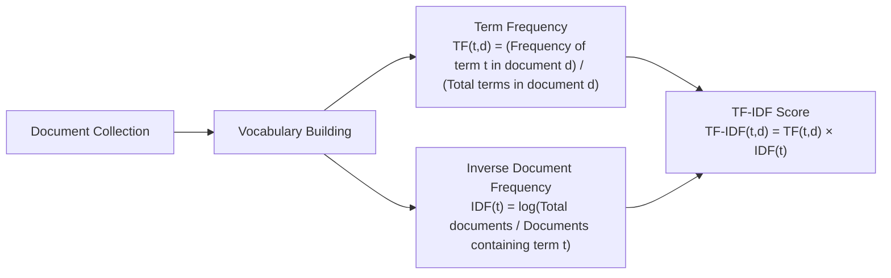
```mermaid
flowchart LR
    DOC["Document Collection"]
    DOC --> VOCAB["Vocabulary Building"]
    VOCAB --> TF["Term Frequency<br/>TF(t,d) = (Frequency of term t in document d) / (Total terms in document d)"]
    VOCAB --> IDF["Inverse Document Frequency<br/>IDF(t) = log(Total documents / Documents containing term t)"]
    TF --> TFIDF["TF-IDF Score<br/>TF-IDF(t,d) = TF(t,d) × IDF(t)"]
    IDF --> TFIDF
```

**What is TF-IDF?**
It's a way to figure out which words are most important in news articles.

**Simple Explanation:**
- **TF (Term Frequency)**: How often a word appears in an article
- **IDF (Inverse Document Frequency)**: How rare that word is across all articles
- **TF-IDF**: Important words = Frequent in this article, rare in others

#### Ensemble Sentiment Analysis - "Three Smart Readers"
The ML system uses three different "readers" to analyze news:

1. **Keyword-Based Reader**
   - Looks for specific positive/negative words
   - Simple but fast
   - Like reading a book and highlighting key words

2. **TF-IDF Reader**
   - Finds important words using math
   - More sophisticated
   - Like a professor analyzing text

3. **Context Reader**
   - Looks for phrases and patterns
   - Understands context
   - Like a human understanding sarcasm

**Why Three Readers?**
- **More accurate** than any single method
- **Reduces mistakes** from relying on one approach
- **Covers more scenarios**

#### Advanced Keyword Coverage

**Positive Keywords (50+ terms):**
- **Bullish indicators**: moon, bull, surge, pump, breakout, rally
- **Development**: launch, partnership, integration, adoption, upgrade
- **Market sentiment**: demand, interest, popularity, trending, viral
- **Regulatory clarity**: approved, legal, regulated, compliant, clearance

**Negative Keywords (60+ terms):**
- **Bearish indicators**: bear, dump, crash, plummet, sell-off, correction
- **Security issues**: hack, exploit, bug, vulnerability, breach, theft
- **Regulatory issues**: regulation, ban, prohibit, restrict, lawsuit, investigation
- **Geopolitical risks**: war, conflict, tension, sanction, tariff, trade war

**For Beginners:**
- **Positive words** = Good news for crypto
- **Negative words** = Bad news for crypto
- **More words covered** = Better analysis

### 13.4 Portfolio Analysis and Management - "Smart Money Management"

#### Portfolio-Level Risk Assessment
- **Diversification Score**: 0-1 scale (1 = perfectly diversified)
- **Overall Risk Level**: Low/Medium/High based on volatility
- **Expected Return**: Weighted average of all coin returns

**Simple Portfolio Rules:**
- **High diversification** = Lower risk
- **Low diversification** = Higher risk
- **Mix different types** of coins for best results

#### Risk Metrics Calculation
```typescript
interface PortfolioRiskMetrics {
  portfolioVolatility: number;    // How much your portfolio jumps around
  maxDrawdown: number;           // Biggest loss from peak to bottom
  sharpeRatio: number;           // Risk-adjusted returns (higher = better)
  var95: number;                 // 95% confidence worst-case daily loss
}
```

**What These Metrics Mean:**
- **Portfolio Volatility**: How "jumpy" your investments are
- **Max Drawdown**: Worst loss you've experienced
- **Sharpe Ratio**: How much return you get per unit of risk
- **VaR 95%**: How much you might lose in a bad day

#### Rebalancing Recommendations
- **High Volatility**: Reduce position sizes (too risky)
- **High Correlation**: Add different types of coins
- **Poor Performance**: Consider exiting losing positions
- **Strong Alignment**: Increase allocation to winning coins

**When to Rebalance:**
- **Monthly**: Check if allocations are still good
- **After big moves**: If some coins gained/lost a lot
- **When correlation changes**: If coins start moving together

### 13.5 News Validation Feature - "Fact-Checking Your Analysis"

News validation is a new feature that enhances the crypto market analysis by incorporating real-world news sentiment into the technical analysis recommendations. It helps validate whether the technical analysis aligns with current market sentiment and events.

#### How News Validation Works

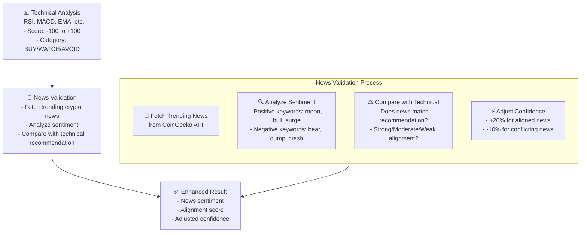
```mermaid
flowchart TD
    TECHNICAL["📊 Technical Analysis<br/>- RSI, MACD, EMA, etc.<br/>- Score: -100 to +100<br/>- Category: BUY/WATCH/AVOID"]
    
    TECHNICAL --> NEWS_VALIDATION["📰 News Validation<br/>- Fetch trending crypto news<br/>- Analyze sentiment<br/>- Compare with technical recommendation"]
    
    NEWS_VALIDATION --> RESULT["✅ Enhanced Result<br/>- News sentiment<br/>- Alignment score<br/>- Adjusted confidence"]
    
    subgraph NEWS_VALIDATION_DETAILS["News Validation Process"]
        direction TB
        FETCH["🔄 Fetch Trending News<br/>from CoinGecko API"]
        ANALYZE["🔍 Analyze Sentiment<br/>- Positive keywords: moon, bull, surge<br/>- Negative keywords: bear, dump, crash"]
        COMPARE["⚖️ Compare with Technical<br/>- Does news match recommendation?<br/>- Strong/Moderate/Weak alignment?"]
        ADJUST["⚡ Adjust Confidence<br/>- +20% for aligned news<br/>- -10% for conflicting news"]
    end
    
    NEWS_VALIDATION_DETAILS --> RESULT
```

#### Why News Validation Matters

**The Problem:**
- Technical analysis only looks at price history
- It misses important news events
- Can give false signals during major news

**The Solution:**
- Check if news supports technical analysis
- Increase confidence when they agree
- Warn when they disagree

#### News Sources Considered

The agent uses **CoinGecko's Trending API** which provides:

- **Trending cryptocurrencies** - Most popular coins currently
- **News articles** - Recent articles about trending coins
- **Market sentiment** - Overall positive/negative/neutral sentiment

**Why CoinGecko?**
- Free to use (no API key required)
- Reliable and covers 1000+ cryptocurrencies
- Provides both technical data AND news content
- No rate limits for basic usage

#### News Validation Process

1. **Fetch Trending News**
   - Gets top trending cryptocurrencies
   - Retrieves recent news articles about these coins
   - Analyzes article titles and descriptions

2. **Sentiment Analysis**
   - **Positive keywords**: moon, bull, surge, pump, breakout, rally
   - **Negative keywords**: bear, dump, crash, plummet, sell-off, correction
   - **Neutral**: No strong sentiment detected

3. **Alignment Scoring**
   - **Strong**: News sentiment matches technical recommendation
   - **Moderate**: News is neutral or recommendation is neutral
   - **Weak**: News sentiment doesn't match recommendation
   - **Conflicting**: News strongly contradicts recommendation

4. **Confidence Adjustment**
   - Base confidence: 70% (technical analysis only)
   - +20% if news sentiment strongly aligns
   - -10% if news sentiment conflicts
   - Final confidence: 60-90%

#### Sample Output Explained

```
📊 Enhanced Report with News Validation
───────────────────────────────────────────
Recommendation | News Sentiment | Alignment | Confidence
─────────────────────────────────────────────────────────
1. USD1                 | neutral       | moderate  | 70%
2. Tether Gold          | neutral       | moderate  | 70%
3. PAX Gold             | neutral       | moderate  | 70%
1. Bitcoin              | neutral       | moderate  | 90%
2. Solana               | neutral       | moderate  | 90%
3. MemeCore             | neutral       | moderate  | 70%
1. Toncoin              | neutral       | moderate  | 70%
2. Falcon USD           | neutral       | moderate  | 70%
3. WhiteBIT Coin        | neutral       | moderate  | 70%
```

**Column Explanations:**

| Column | Meaning | Example |
|--------|---------|---------|
| **Recommendation** | Technical analysis category | BUY, WATCHLIST, AVOID |
| **News Sentiment** | Overall news sentiment | positive, negative, neutral |
| **Alignment** | How well news matches recommendation | strong, moderate, weak, conflicting |
| **Confidence** | Final confidence score | 70%, 90%, etc. |

**Interpretation Guide:**

- **Strong + Positive**: Technical says BUY, news is positive → High confidence (90%)
- **Moderate + Neutral**: Technical says BUY, news is neutral → Medium confidence (70%)
- **Weak + Negative**: Technical says BUY, news is negative → Low confidence (60%)
- **Conflicting**: Technical and news disagree → Very low confidence (50% or less)

#### Benefits of News Validation

1. **Reduces False Signals** - Technical analysis alone can miss important news events
2. **Improves Confidence** - News alignment increases confidence in recommendations
3. **Better Risk Management** - Conflicting signals warn of potential risks
4. **More Reliable** - Combines technical and fundamental factors

#### Limitations of News Validation

1. **Sentiment Accuracy** - Keyword-based analysis isn't perfect
2. **News Lag** - News may not reflect real-time market conditions
3. **Bias** - News sources may have their own biases
4. **Volume** - Some coins have little news coverage

### 13.6 Future Enhancements — Status & Roadmap

Backtesting (13.6.3) is now **implemented** — see §13.12 for the engine and its results.
Signal-quality features (volume, regime gate, trailing stop, weight tuning) are documented in §13.14.
The remaining planned features:

#### 13.6.1 Real-time Features (TODO)
- **WebSocket Integration**: Live price updates and streaming data
- **Alert System**: Price alerts and signal notifications
- **Live Dashboard**: Real-time market monitoring interface

#### 13.6.2 Multi-timeframe Analysis (TODO)
- **Timeframe Correlation**: Analyze different timeframes (1h, 4h, daily)
- **Signal Confirmation**: Multi-timeframe signal validation
- **Trend Consistency**: Check trend alignment across timeframes

#### 13.6.3 Backtesting Engine (✅ IMPLEMENTED — see §13.12)
- **Historical Testing**: Walk-forward replay of every candle through the live classifier ✅
- **Performance Metrics**: Hit rate, average/median forward return, MAE/MFE, information ratio ✅
- **Edge Measurement**: BUY − AVOID and BUY − ALL spreads per horizon ✅
- **Strategy Optimization**: Not automated yet — classifier weights remain hand-tuned ⏳

#### 13.6.4 Customizable Strategies (TODO)
- **Strategy Builder**: Create custom trading strategies
- **Indicator Combinations**: Mix and match different indicators
- **Risk Profiles**: Conservative, moderate, aggressive strategies

#### 13.6.5 Exchange Integration (TODO)
- **API Connections**: Connect to major exchanges (Binance, Coinbase, Kraken)
- **Automated Trading**: Execute trades based on signals
- **Portfolio Sync**: Sync with exchange portfolios

### 13.7 Implementation Status

| Feature | Status | Notes |
|---------|--------|-------|
| **Advanced Technical Indicators** | ✅ Complete | Ichimoku Cloud (high/low based), ATR, Wilder-smoothed ADX, Williams %R, CCI, Stochastic (real %K/%D) |
| **Advanced Risk Management** | ✅ Complete | Kelly sizing, daily VaR, annualized Sharpe, beta vs BTC, ATR-based clamped stop-loss + 2:1 take-profit |
| **ML Enhanced Sentiment Analysis** | ⚠️ Partial | Lexicon + TF-IDF ensemble (not a trained model) with word-boundary matching |
| **Portfolio Analysis** | ✅ Complete | Diversification score, correlation, rebalancing suggestions, portfolio risk metrics |
| **News Validation** | ⚠️ Partial | Keyword-based sentiment over trending coins and project status updates |
| **Backtesting Engine** | ✅ Complete | Point-in-time replay, forward returns, MAE/MFE, BUY-vs-AVOID edge |
| **Configurable Strategy Weights** | ✅ Complete | All weights + thresholds in `scoring-config.ts`, overridable via `scoring-weights.json` |
| **Weight Tuning** | ✅ Complete | `npm run tune` — random search scored by the backtest with time-split validation |
| **Real per-candle volume** | ✅ Complete | `/market_chart` volumes bucketed per candle; enables real volume spikes + MFI |
| **BTC regime gate** | ✅ Complete | Risk-off BTC regime demotes BUY signals to WATCHLIST |
| **Trailing stop** | ✅ Complete | Chandelier Exit (22-period, 3× ATR) surfaced in the report |
| **Automated Tests & CI** | ✅ Complete | 78 tests, ESLint, GitHub Actions |
| **Real-time Features** | ⏳ TODO | WebSocket, alerts, live dashboard |
| **Multi-timeframe Analysis** | ⏳ TODO | Cross-timeframe validation and correlation |
| **Customizable Strategies** | ⏳ TODO | Strategy builder and risk profiles |
| **Exchange Integration** | ⏳ TODO | API connections and automated trading |

### 13.8 Enhanced Architecture Diagram

```mermaid
flowchart TB
    subgraph DATA_LAYER["📡 DATA LAYER"]
        CG[("🦎 CoinGecko API<br/>(Free, No Key Required)")]
        NEWS_API[("📰 CoinGecko News API<br/>(Trending endpoint)")]
        CACHE[("💾 JSON Cache<br/>(Local File)")]
    end
    
    subgraph PROCESSING["⚙️ PROCESSING LAYER"]
        FETCHER["🔄 Fetcher Module<br/>— Fetch top N coins<br/>— Fetch OHLC candles<br/>— Handle rate limits"]
        NEWS_SERVICE["📰 News Service<br/>— Fetch trending crypto news<br/>— Perform sentiment analysis<br/>— Cache news data"]
        ANALYZER["📊 Analyzer Module<br/>— Calculate RSI<br/>— Calculate MACD<br/>— Calculate EMA<br/>— Calculate Bollinger Bands"]
        ADVANCED_INDICATORS["📈 Advanced Indicators<br/>— Ichimoku Cloud<br/>— ATR, ADX<br/>— Williams %R, CCI<br/>— Stochastic Oscillator"]
        RISK_MANAGER["⚠️ Risk Manager<br/>— Kelly Criterion sizing<br/>— VaR calculation<br/>— Diversification analysis<br/>— Stop-loss optimization"]
        ML_SENTIMENT["🤖 ML Sentiment Analyzer<br/>— TF-IDF vectorization<br/>— Ensemble methods<br/>— Context pattern recognition<br/>— Advanced keyword matching"]
        NEWS_VALIDATOR["🔍 News Validator<br/>— Validate technical analysis<br/>— Calculate alignment scores<br/>— Adjust confidence"]
        CLASSIFIER["🏷️ Classifier Module<br/>— Score each coin<br/>— Assign category"]
    end
    
    subgraph OUTPUT["📤 OUTPUT LAYER"]
        TERMINAL["🖥️ Terminal Reporter<br/>(Color-coded tables)"]
        JSON["📄 JSON Report<br/>(Saved to disk)"]
        PORTFOLIO["💼 Portfolio Analysis<br/>(Risk metrics, rebalancing)"]
    end
    
    CG --> FETCHER
    FETCHER --> CACHE
    CACHE --> ANALYZER
    ANALYZER --> ADVANCED_INDICATORS
    ADVANCED_INDICATORS --> RISK_MANAGER
    RISK_MANAGER --> CLASSIFIER
    CLASSIFIER --> NEWS_VALIDATOR
    NEWS_VALIDATOR --> TERMINAL
    NEWS_VALIDATOR --> JSON
    NEWS_VALIDATOR --> PORTFOLIO
    
    NEWS_API --> NEWS_SERVICE
    NEWS_SERVICE --> ML_SENTIMENT
    ML_SENTIMENT --> NEWS_VALIDATOR
```

This enhanced architecture demonstrates the comprehensive nature of the upgraded crypto market analysis agent, incorporating advanced technical analysis, sophisticated risk management, machine learning-enhanced sentiment analysis, and comprehensive portfolio management capabilities.

### 13.9 Beginner's Guide to Using This Agent

#### Step 1: Understanding the Output
When you run the agent, you'll see three main sections:

1. **🟢 BUY CANDIDATES** - Coins with strong bullish signals
2. **🟡 WATCHLIST** - Coins with mixed or neutral signals  
3. **🔴 AVOID** - Coins with strong bearish signals

#### Step 2: Checking News Validation
For each coin, look at:
- **News Sentiment**: What's the news saying?
- **Alignment**: Does news match technical analysis?
- **Confidence**: How sure are we about this recommendation?

#### Step 3: Making Decisions
- **High Confidence (80-90%)**: Strong signal, consider action
- **Medium Confidence (60-79%)**: Moderate signal, research more
- **Low Confidence (50-59%)**: Weak signal, probably avoid

#### Step 4: Risk Management
- **Don't invest more than 10%** in any single coin
- **Diversify** across different types of coins
- **Use stop-losses** to limit potential losses
- **Only invest what you can afford to lose**

#### Step 5: Continuous Learning
- **Track your decisions** and their outcomes
- **Learn from mistakes** and adjust your approach
- **Stay updated** on crypto news and developments
- **Remember**: No system is perfect, always do your own research

### 13.10 Common Beginner Mistakes to Avoid

1. **Chasing High Confidence Scores**: High confidence doesn't guarantee profits
2. **Ignoring News Validation**: Technical analysis alone can miss important events
3. **Over-Investing**: Never risk more than you can afford to lose
4. **Not Using Stop-Losses**: Always have an exit strategy
5. **Following Without Understanding**: Learn what the indicators mean
6. **Panic Selling**: Stick to your strategy during volatile periods
7. **Ignoring Diversification**: Don't put all your money in one coin

### 13.11 Key Takeaways for Beginners

1. **This is a tool, not a crystal ball** - Use it to inform decisions, not make them for you
2. **Risk management is crucial** - Protect your capital first, profits second
3. **News matters** - Always check if technical signals align with real-world events
4. **Start small** - Practice with small amounts before scaling up
5. **Continuous learning** - The crypto market evolves rapidly, stay informed
6. **Diversification reduces risk** - Don't put all your eggs in one basket
7. **Emotions are the enemy** - Stick to your strategy, don't trade based on fear or greed

This enhanced specification provides a complete understanding of how the crypto market analysis agent works, from basic concepts to advanced features, ensuring that even complete beginners can understand and use the system effectively.

---

### 13.12 Signal Backtesting — "Does This Actually Work?"

Before this feature existed, every weight in the scoring system (RSI ±30/20/10, MACD ±25,
EMA ±15, Bollinger ±15, 7-day ±10) was a **hand-picked guess that had never been measured**.
The backtest engine answers the only question that matters: *do the BUY signals actually
outperform the AVOID signals?*

```bash
npm run backtest                              # replay cached 30-day data
npm run backtest -- --refresh --limit=25      # bigger sample
npm run backtest -- --horizons=1,3,7          # custom forward horizons (days)
npm run backtest -- --step=2                  # evaluate every 2nd candle (faster)
npm run backtest -- --outcomes                # include every raw signal in the JSON
```

#### How the replay avoids cheating

```mermaid
flowchart LR
    CANDLES["📊 180 candles per coin"] --> LOOP{"For each candle i"}
    LOOP --> PIT["🕰️ Rebuild point-in-time view<br/>(only candles 0..i — no future data)"]
    PIT --> SCORE["🧮 Run the LIVE classifier<br/>on that snapshot"]
    SCORE --> FWD["📈 Measure forward returns<br/>+1d / +3d / +7d"]
    FWD --> EXC["⚠️ Measure MAE / MFE<br/>worst & best excursion"]
    EXC --> AGG["📋 Aggregate by category<br/>BUY vs WATCHLIST vs AVOID"]
```

The critical detail: prices and the 24h/7d percentages are **re-derived from the truncated
candle history**, never taken from the cached live values. Reusing "today's" percentages for a
signal generated three weeks ago would leak the future into the past and make the whole
exercise meaningless. A unit test corrupts every future candle and asserts the historical
snapshot is unchanged, so this cannot silently regress.

#### Metrics reported

| Metric | Meaning |
|--------|---------|
| **Hit rate** | Share of signals followed by a positive return |
| **Avg / median return** | Mean and middle forward return per horizon |
| **MAE** | Average worst drawdown from entry within the horizon (risk taken) |
| **MFE** | Average best upside reached (opportunity available) |
| **IR** | mean ÷ std of forward returns — higher means more consistent |
| **BUY − AVOID** | The key edge metric. Positive ⇒ the ranking has predictive power |
| **BUY − ALL** | Edge versus picking a coin at random |


#### Illustrative result (25 coins, 2,333 signals)

| Category | Samples | Hit 1d | Avg 1d | Hit 3d | Avg 3d | Hit 7d | Avg 7d | Avg MAE |
|---|---|---|---|---|---|---|---|---|
| **BUY** | 342 | 45% | +0.18% | 47% | **+0.88%** | 46% | +1.76% | **−3.27%** |
| WATCHLIST | 1,248 | 50% | +0.33% | 50% | +0.68% | 50% | +1.85% | −4.41% |
| **AVOID** | 743 | 42% | −0.02% | 43% | +0.66% | 49% | **+2.52%** | −4.63% |

```
1d   BUY − AVOID: +0.20%   ✓ edge
3d   BUY − AVOID: +0.22%   ✓ edge
7d   BUY − AVOID: −0.76%   ✗ edge INVERTS
```

**What this tells us:**
1. **The signals work, but briefly.** BUY beats AVOID at 1–3 days, then **inverts by 7 days** —
   holding these signals for a week performed worse than doing nothing in that window.
2. **The risk side is validated.** BUY picks had the smallest average drawdown (−3.27% vs
   −4.63% for AVOID), so the tool genuinely selects lower-risk entries.
3. **Regime dominates.** Every category rose over 7 days in that window (a broad uptrend),
   which is exactly why the *relative* spread matters more than absolute returns.

> ⚠️ **Honest limitations:** ~2,300 heavily **overlapping** samples from a **single 30-day
> regime** is *indicative, not statistical proof*. Reports are written to `reports/backtest-*.json`.
> Use this as a tuning aid, not a validated trading strategy.

---

### 13.13 Corrected Quantitative Definitions

Several metrics in earlier versions of this specification were described loosely. These are the
precise definitions the code now uses:

| Metric | Definition used in code |
|--------|-------------------------|
| **Volatility** | Std-dev of per-period returns × √periods per year (period length inferred from candle timestamps) |
| **Daily volatility** | Std-dev of per-period returns × √(periods per day) — used for stops |
| **Sharpe ratio** | (annualized return − 2% risk-free) ÷ annualized volatility |
| **VaR 95%** | 1.645 × **daily** volatility (a daily loss estimate, not annualized) |
| **Beta** | cov(coin returns, BTC returns) ÷ var(BTC returns), aligned on the shortest common series |
| **Kelly position size** | (b·p − q)/b with b = 1; capped at 10%, floored at 1%, and **0 when there is no edge** |
| **Stop-loss** | ATR path: 2 × ATR ÷ price; fallback: 2 × daily volatility; × (1 − score/200); clamped 5%–50% |
| **Take-profit** | 2 × stop distance (2:1 risk-reward) |
| **ADX** | Wilder-smoothed DI+/DI− → DX → Wilder-averaged DX (not a simple average) |
| **Stochastic** | %K series → %D = SMA(%K, 3) → signal = SMA(%D, 3) |
| **Ichimoku** | Conversion/Base/Leading Span B from **highs and lows** (not closes); needs 52 candles |
| **Max drawdown** | Largest peak-to-trough decline over the candle series |
| **Volume spike** | Real traded volume (recent vs older candles, +30% ⇒ spike). Falls back to a price-range proxy when volume is unavailable |
| **MFI** | Money Flow Index (14-period) from candle HLC + real per-candle volume; ≤20 oversold, ≥80 overbought |
| **Trailing stop** | Chandelier Exit (22-period, 3× ATR): `(price − exitLong) / price`, clamped to 0–50% below price |

Two definitions deserve emphasis because they are easy to misread in the report:

- **The "portfolio" analysis is a market simulation, not your holdings.** `totalValue` is the
  summed market cap of the analyzed coins, and weights are cap-weighted. It answers "how would a
  market-cap-weighted basket of these coins look?" — not "how is *my* portfolio doing?"
- **Check `volumeIsReal` before trusting a volume spike.** When per-candle volume was fetched the
  signal reflects real traded volume; when the volume call failed it degrades to a price-range
  proxy, which is a *volatility burst*, not volume.

---

### 13.14 Signal Quality — Volume, Regime, Trailing Stops & Weight Tuning

This release closes the loop between "we measure signals" (backtest) and "we improve them".

#### 1. Real traded volume (replaces the proxy)

CoinGecko's OHLC endpoint carries no volume, so the agent now fetches **`/coins/{id}/market_chart`**, which returns hourly `total_volumes`, and **buckets them into the 4-hourly candles** (verified live: 721 hourly points → 180 candle buckets for BTC, ~$240B per bucket).

What this unlocks:
- **Volume spike** now compares *actual traded volume* of recent vs older candles. If the volume call fails, the price-range proxy is used instead and `volumeIsReal: false` marks it — so the report never silently claims real volume it doesn't have.
- **MFI (Money Flow Index, 14-period)** — a volume-weighted RSI. Divergence between price and money flow is one of the few volume-based signals that is genuinely independent of the indicators already in use.

#### 2. BTC Market Regime Gate

~80% of altcoins follow BTC, so the agent now computes the **BTC regime** from EMA20/EMA50 on BTC closes:

| Condition | Regime | Effect |
|---|---|---|
| price > EMA20 > EMA50 | 🟢 risk-on | BUY signals stand |
| price < EMA20 < EMA50 |  **risk-off** | **BUY signals are demoted to WATCHLIST** |
| otherwise | ⚪ neutral | BUY signals stand |

Demoted coins get an explicit signal line (` BUY demoted — BTC risk-off regime`) and the report shows a regime banner. The JSON export includes a `marketRegime` block with `btcTrendPct` and `demotedCount`. This is the tool's biggest structural fix: previously a perfect altcoin setup still produced BUY during a BTC crash.

#### 3. Trailing Stop (Chandelier Exit)

Alongside the fixed ATR stop and 2:1 take-profit, each coin now reports a **trailing stop** from the Chandelier Exit (22-period, 3× ATR) — `(price − exitLong) / price` as a fraction below the current price. It rises as the trend extends, which is how you protect gains once a position is in profit.

> ️ Implementation note: `technicalindicators` declares `ChandelierExit.calculate` as returning `number[]`, but at runtime it returns `{ exitLong, exitShort }` objects. The code casts accordingly and a test locks the behavior in.

#### 4. Configurable Weights + Automatic Tuning

Every weight and threshold now lives in **`src/analyzer/scoring-config.ts`**, and `scoring-weights.json` in the project root can override any subset (invalid or missing values fall back to defaults, so a broken file cannot break the agent). **Defaults replicate the original hand-picked constants exactly** — a regression test asserts this, so behavior is unchanged until you opt in.

The tuner (`npm run tune`) treats the backtest as a **fitness function**:

```
1. Evaluate the baseline (default weights)
2. Generate N candidates: each signal weight × U(0.5, 1.5); fresh BUY/AVOID thresholds
3. Replay every candidate through the backtest (step-sampled)
4. Split signals chronologically — early = TRAIN, later = VALIDATION
5. Objective = mean VALIDATION "BUY − AVOID" spread across horizons
6. Report the ranking; --apply writes the winner to scoring-weights.json
```

**Guard against degenerate solutions:** a candidate with fewer than `minBuySamples` BUY signals in validation is scored as *invalid* (−∞). Without this, weights that never emit BUY would trivially show a zero-perfect spread.

```bash
npm run tune                              # 60 candidates, cached data
npm run tune -- --candidates=150 --seed=7 # reproducible larger search
npm run tune -- --step=2 --min-buy=15     # finer resolution, stricter validity
npm run tune -- --apply                   # adopt the winner
```

> ⚠️ **Honest limitation:** candidates are tuned and validated on the *same* 30-day window (time-split, but one market regime) with heavily overlapping samples. If the baseline itself scores `invalid`, the winner's objective is unproven. Treat tuned weights as a starting point for re-validation on fresh data.

---

## 14. Testing, CI & Configuration

### Automated tests

The suite runs on Node's built-in test runner (no extra framework) with **78 tests**:

```bash
npm test        # build + run all tests
npm run lint    # ESLint (flat config)
npm run build   # compile to dist/
```

| Test file | Covers |
|-----------|--------|
| `indicators.test.ts` | RSI/MACD/EMA/Bollinger ranges, insufficient-data guards |
| `advanced-indicators.test.ts` | Ichimoku high/low use, ADX smoothing bounds, %D ≠ %K, Williams %R range |
| `risk-management.test.ts` | Empty-OHLC crash regression, Sharpe/VaR time-correctness, beta ≈ 1 and ≈ 2 on constructed series, Kelly edge cases, stop-loss ATR/floor/ceiling |
| `backtest.test.ts` | Look-ahead-bias guard, exact sample counts, forward-return & excursion recomputation, spread math |
| `classifier.test.ts` | Contrarian categorization (oversold ⇒ BUY, overbought rally ⇒ AVOID), score clamping |
| `ml-sentiment.test.ts` | 0–1 confidence contract, alignment, neutral fallback |
| `sentiment-keywords.test.ts` | Word-boundary matching (no "up" inside "upgrade") |
| `fetcher.test.ts` | **Flat query params** (the 422 regression), 422 window fallback, 429 `Retry-After`, volume-history bucketing |
| `market-regime.test.ts` | BTC regime classification (risk-on / risk-off / neutral) |
| `scoring-config.test.ts` | Defaults equal the legacy constants, override merging, invalid-value fallback |
| `tuner.test.ts` | Seeded PRNG determinism, candidate ranges, reproducible tuning, invalid-candidate handling |
| `db.test.ts` | Save/load, entry cap, retention cleanup |

**Notable regression tests** — these exist because the bugs actually shipped at some point:

1. A coin with **no OHLC data** (rate-limited fetch) must not crash the run.
2. Query params must be sent **flat** (`vs_currency=usd`), not double-nested (`params[vs_currency]`).
3. The stop-loss must stay inside the 5%–50% band (it previously used *annualized* volatility,
   producing >100% stops).
4. Historical snapshots must not contain **future candle data** — including **future volumes**
   (`candleVolumes` is truncated alongside the candles).
5. `DEFAULT_WEIGHTS` must equal the original hard-coded constants, so extracting them into
   config changed nothing.
6. Volume handling must fall back to the range proxy (and report `volumeIsReal: false`) when
   per-candle volume is absent — the report must never claim real volume it doesn't have.

### Continuous integration

`.github/workflows/ci.yml` runs **lint → build → tests** on every push and pull request to `main`.

### Configuration reference

| Variable | Default | Purpose |
|----------|---------|---------|
| `COINGECKO_API_KEY` | _(none)_ | Demo/pro API key — raises rate limits substantially |
| `COINGECKO_API_TIER` | `demo` | Header type: `demo` (`x-cg-demo-api-key`) or `pro` (`x-cg-pro-api-key`) |
| `COINGECKO_BASE_URL` | `https://api.coingecko.com/api/v3` | API base URL (used by tests) |
| `FETCH_DELAY_MS` | `2000` | Gap between CoinGecko calls |
| `CRYPTO_AGENT_DATA_DIR` | `./data` | Where the market cache is stored |
| `CRON_SCHEDULE` | `0 8 * * *` | Scheduler cron expression |

**Scoring configuration (not an env var):** an optional `scoring-weights.json` in the project root
overrides any subset of the scoring weights/thresholds. Invalid values are ignored and missing
fields fall back to `DEFAULT_WEIGHTS`, so the file can never break a run.

### npm scripts

| Script | Command | What it does |
|--------|---------|--------------|
| `npm run dev` | `ts-node src/index.ts` | Run the analysis and print the report |
| `npm run backtest` | `ts-node src/backtest.ts` | Replay history and measure signal edge |
| `npm run tune` | `ts-node src/tune.ts` | Search for better scoring weights (`--apply` writes `scoring-weights.json`) |
| `npm run schedule` | `ts-node src/scheduler.ts` | Cron-scheduled runs |
| `npm test` | `tsc && node --test` | Build and run the test suite |
| `npm run lint` | `eslint src` | Static analysis |

### Known gaps

- **One regime only** — both the backtest and the tuner cover a single ~30-day window with
  heavily overlapping samples. There is no multi-year/multi-regime walk-forward yet.
- **No position tracking** — stops/targets (including the trailing stop) are *suggestions*;
  there is no live P&L, no breakeven move, and no order placement.
- **Multi-timeframe confirmation is missing** — everything is computed on one 4-hourly timeframe.
- **News sentiment is lexicon-based** — TF-IDF + keyword matching, not a trained model.
- **Alerts do not exist** — signals are only visible by running the agent or reading the JSON.
- **No exchange integration** — nothing is executed automatically.

---
## Final Reminder

```
╔══════════════════════════════════════════════════════════════╗
║                    ⚠️  IMPORTANT                             ║
║                                                              ║
║  This agent uses TECHNICAL ANALYSIS ONLY.                   ║
║                                                              ║
║  Before investing:                                           ║
║  1. Research what the project DOES (not just the price)     ║
║  2. Check recent news (hacks, regulation, partnerships)     ║
║  3. Never invest more than you can afford to lose           ║
║  4. Crypto is highly volatile — 30–50% drops are common     ║
║  5. Past performance does NOT predict future results        ║
║                                                              ║
║  This is NOT financial advice.                              ║
╚══════════════════════════════════════════════════════════════╝
